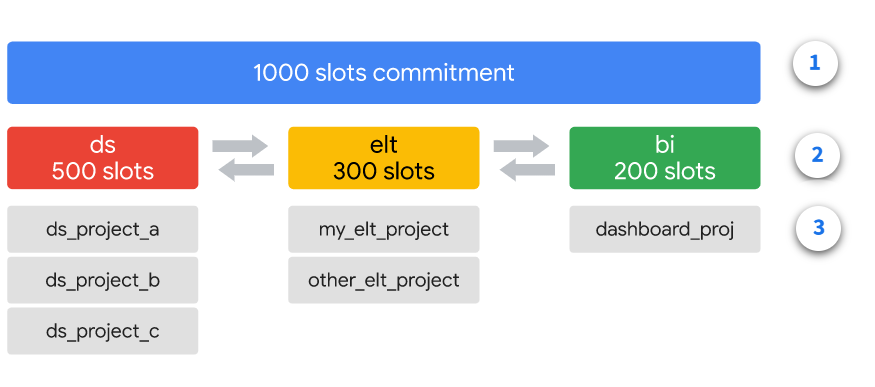

# <https§§§storage.googleapis.com§cloud-training§cls-html5-courses§T-BQRS-I§M1§index.html>

> [https://storage.googleapis.com/cloud-training/cls-html5-courses/T-BQRS-I/M1/index.html](https://storage.googleapis.com/cloud-training/cls-html5-courses/T-BQRS-I/M1/index.html)

# BigQuery Architecture and Resource Provisioning

Welcome to the "BigQuery Architecture and Resource Provisioning" module. This introductory module summarizes the key details of BigQuery architecture and resource provisioning including how BigQuery utilizes slots to execute SQL queries and workload management in BigQuery. Drawing upon your knowledge of Redshift, this module also provides a high-level overview of the similarities and differences between Redshift and BigQuery architecture and resource provisioning to help you get started with BigQuery

## INTRODUCTION

### BigQuery Architecture and Resource Provisioning

- bq architecture
- how rs architecture and bq differs
- slot usage in bq to  run sql
- monitoy and manage workloads

## REDSHIFT ARCHITECTURE AND RESOURCE PROVISIONING

### Lesson introduction

### Similarities and differences

both use col storage and ssas to manage data and query processing
bq is fully managed
rs has snapshot while bq automatic recovery and HA and durability

both fully managed API
bq omni ofers cross cloud solution and replicate data
bq does automatic bkp and table snapshots
[https://cloud.google.com/bigquery/docs/table-snapshots-intro](https§§§cloud.google.com§bigquery§docs§table-snapshots-intro/readme.md)

### BigQuery and Redshift

## OVERVIEW OF BIGQUERY ARCHITECTURE AND RESOURCE PROVISIONING

### Lesson introduction

you will learn about BigQuery's serverless and fully managed architecture for building cost-effective enterprise data warehouses
how its separation of compute and storage help you to manage your workflows and costs, and the lifecycle of a BigQuery query.

### What is BigQuery?

BigQuery is a serverless enterprise data warehouse that is scalable, multicloud, and optimized for running analytic queries over large datasets. It also supports high-throughput streaming ingestion and high-throughput reads, and has built-in machine learning, business intelligence (BI), and geospatial capabilities.

- no need to reshuffle and vacuum data
- sla 99.99% 7 days travelling windows and table snapshots
- expiration flag

### Resource provisioning in BigQuery

BigQuery allocates storage and query resources dynamically based on your usage patterns

Query resources are allocated according to *query type and complexity*.

### Architecture design principles

BigQuery's architecture decouples compute and storage.

BigQuery is also **serverless and multi-tentant**

BigQuery very **efficient** and **optimized for analytics** because it **reads only the columns required for each query**

resources will be colocated to minimize latency

BigQuery can also **connect seamlessly to other Google Cloud services.**

### Query processing

1. BigQuery generates an **execution tree** that breaks the query into stages
2. Stages communicate with one another by using a fast, distributed **shuffle tier** that stores intermediate data produced by the workers of a stage
3. When BigQuery has all the information that it needs to run a query, it generates a **query plan**
4. As the query progresses,additional workers **monitor** and direct the overall progress and BigQuery might **dynamically adjust the query plan** to adapt to the results of the various stages.
5. BigQuery writes the results to persistent storage and returns them to you. This design lets BigQuery **serve cached results**

**Lifecycle of a query**

bq is most efficient when working with data contained in BigQuery's storage service.

### References

[https://cloud.google.com/bigquery/docs/query-overview#query_processing](https§§§cloud.google.com§bigquery§docs§query-overview#query_processing/readme.md)
[https://cloud.google.com/bigquery/docs/sandbox](https§§§cloud.google.com§bigquery§docs§sandbox/readme.md)
[https://cloud.google.com/bigquery/docs/quickstarts/query-public-dataset-console](https§§§cloud.google.com§bigquery§docs§quickstarts§query-public-dataset-console/readme.md)

## HOW TO UTILIZE BIGQUERY SLOTS

### Lesson introduction

you will learn how slots are used by BigQuery to execute SQL queries
how to estimate BigQuery slot allocation
BigQuery automatically calculates how many slots are required by each query

### Definition of a slot

**slots** are units of computing resources (i.e. virtual CPUs) that are consumed when a query is run.
BigQuery exposes many details about slots to help you manage resource consumption and costs

> additional slot capacity might improve performance

### How BigQuery uses slots

A query consists of stages, which consist of tasks, which execute on slots.

A slot commitment is similar to the idea of reserving a dedicated portion of BigQuery virtual CPUs.

A BigQuery slot is a unit of computational capacity (in terms of CPU, memory, and networking resources).
To help with slot estimation, Google recommends setting up BigQuery monitoring using Cloud Monitoring and analyzing your audit logs using BigQuery.

### Slot allocation

A flat-rate pricing model is available

### Internal processing of BigQuery's SQL engine

it is useful to understand at a high level how the scheduling and shuffling are initiated and executed for BigQuery queries

1

2

3
 

### Job queuing

The primary queuing of queries occurs in the job server.

### Stages of a query

In BigQuery, a query is broken up and executed as a series of stages. Each stage requires different amounts of slots and consumes different amounts of slot time.  A single BigQuery slot runs a single unit of work in a single stage.

You can also see the different stages of the query
ex

### Estimating data loading slots

consider these factors to estimate the number of slots needed.

you can use the Load Slot Estimator to estimate the number of slots
you can identify whether you might need a dedicated load reservation of slots (the second level of the decision tree), depending your organization's data loading SLAs

> Running a test load job may also be able to help you
> 

### Looking for signals

How do you know if you need more slots? What should you look for?

Monitor temporal trends
Monitor user growth

### References

Load Slot Estimator

[https://lookerstudio.google.com/reporting/c30ea9f1-31d4-401a-8ab7-b3f869b75d29/page/8Qi4B](https§§§lookerstudio.google.com§reporting§c30ea9f1-31d4-401a-8ab7-b3f869b75d29§page§8Qi4B/readme.md)

[https://github.com/GoogleCloudPlatform/bigquery-utils/tree/master/dashboards/system_tables](https§§§github.com§GoogleCloudPlatform§bigquery-utils§tree§master§dashboards§system_tables/readme.md)

[https://cloud.google.com/bigquery/quotas#query_jobs](https§§§cloud.google.com§bigquery§quotas#query_jobs/readme.md)

## WORKLOAD MANAGEMENT IN BIGQUERY

### Lesson introduction

you will learn about workload management in BigQuery, including how to manage BigQuery on-demand and flat-rate slots. You will also explore different BigQuery pricing models to identify the BigQuery pricing plans

### Decoupled pricing for compute and storage

separate pricing for

- Streaming inserts for streaming analytics
- BigQuery Omni for multicloud data analytics
- BigQuery ML for machine learning
- BigQuery BI Engine for data caching

### Active storage versus long-term storage pricing

Storage pricing is based on the amount of data stored in your tables.
The size of the data is calculated based on the data types of the individual columns.

If a table is edited, the long-term storage price reverts back to the active storage pricing, and the 90-day timer starts counting from zero

### On-demand versus flat-rate pricing for compute

****pricing model for compute****
For flexible pricing, choose on-demand pricing to pay per query.

For predictable pricing, choose monthly or annual flat-rate plans, or flex slots for shorter term commitments.

### Pay per query

benefits

* based on number of bytes
* ideal for small workloads
* set user level and prj level cost controls
* > Query exceeded limit for bytes billed” error, without incurring any charges.

**Estimating costs**

1) Estimate the amount of data that will be processed

2) Estimate the cost with Google Cloud Pricing Calculator to generate an estimate of how much running the query will cost.

You aren't charged for queries that return an error, or for queries that retrieve results from the cache
Charges are rounded to the nearest MB, with a minimum 10 MB data processed
Partitioning and clustering tables can help reduce the amount of data processed by queries
When querying an external data source from BigQuery, you are charged for the number of bytes read by the query

### Flat rate

Offers enterprise customers a fixed and predictable pricing model for slots that can be shared across the entire organization.
Gives you the control to limit the number of slots used at any time. If your query demand exceeds your committed flat-rate capacity, queries are automatically queued until the flat-rate resources become available.
The flat-rate cost depends on both the number of slots and the region in which the slots are purchased

### Flex slots

Provides flexibility to respond to rapid demand without sacrificing cost predictability or control.
Can be combined with existing annual and monthly commitments for bursty use cases
It usually takes just a few minutes to deploy Flex Slots in BigQuery Reservations. Once deployed, you can cancel after just 60 seconds. You will only be billed for the seconds in which Flex Slots were deployed.

### Workload management

**Commitments** ,  **Reservations** , and **Assignments**
A commitment is a set of dedicated BigQuery slots with flat-rate pricing.

With a commitment, you are purchasing flat-rate slots at the organization level using one of three plan types: annual, monthly, or flex slot. Commitments are purchased in 100-slot increment

A reservation in BigQuery is an isolated pool of slots from a commitment. With reservations, you can allocate a specific number of the purchased slots for different teams or use cases

Assignments
As an optional step, you can create assignments.
Once a reservation is created, projects, folders, or organizations can be assigned to use the slots from those reservations.

ex
In this case, the customer has three workloads: Data Science, periodic ELT, and a BI dashboard.

1

2

3

Use reservations to split up your purchased slots into isolated pools of slots for workload management.

### Decoupled costs of compute and storage

You can **separate** the **cost of storage** and the **cost of queries.**

ex
By separating projects A and B, it becomes possible to share data without giving access to run jobs.

Users 1 and 2 have access to run jobs and access the datasets in their own respective Projects. If they run a query, that job is billed to their own project.

 

In summary, the cost of a query is always assigned to the active project from where the query is executed. The active project for a user is displayed at the top of the Cloud Console or set by an environmental variable in the Cloud Shell or client tools.

[
### References

[https://cloud.google.com/bigquery/pricing#storage](https§§§cloud.google.com§bigquery§pricing#storage/readme.md)
[https://cloud.google.com/bigquery/docs/reservations-intro](https§§§cloud.google.com§bigquery§docs§reservations-intro/readme.md)
[https://cloud.google.com/products/calculator](https§§§cloud.google.com§products§calculator/readme.md)

