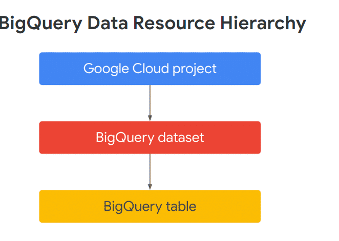

# <https§§§storage.googleapis.com§cloud-training§cls-html5-courses§T-BQRS-I§M2§index.html>

> [https://storage.googleapis.com/cloud-training/cls-html5-courses/T-BQRS-I/M2/index.html](https://storage.googleapis.com/cloud-training/cls-html5-courses/T-BQRS-I/M2/index.html)

# BigQuery Data Definition Model

## **INTRODUCTION**


## **RESOURCE HIERARCHY IN REDSHIFT**

### Lesson introduction

you will examine the similarities and differences between the Redshift and BigQuery resource hierarchies and data definition models.

### Resource hierarchy in BigQuery and Redshift

Redshift uses schemas to store tables in a database; BigQuery tables are stored in a dataset created within a Google Cloud project.



### Data definition models in BigQuery and Redshift

data definition models


https://cloud.google.com/bigquery/docs/reference/standard-sql/data-types

## **OVERVIEW OF BIGQUERY RESOURCE HIERARCHY**

it's time to examine how BigQuery organizes your data. In this lesson, you will learn about the Google Cloud resource hierarchy, including how policies are inherited

### Organizing BigQuery resources

**Datasets** are top-level containers that are used to organize and control access to your tables and views in BigQuery. A dataset is contained within a specific  **project** . A table or view must belong to a dataset, so you need to create at least one dataset before loading data into BigQuery.

When you run a query in your own Google Cloud project on BigQuery data in other projects, **the query charges are billed to your project but the storage costs are not**

Access control to run a query is through Identity and Access Management (IAM); different access policies can be set at the Project, Dataset, Table, View, Column or Row levels. To query data in a table or view, you need at least read permissions on the Table or View.


the table schema provides structure to the data such as the names, data types, and specific requirements of the columns.


### Google Cloud resource hierarchy

In Google Cloud, all resources (except for the highest resource in a specific hierarchy) have exactly one parent


Organization Administrators have central control to view and manage all of your company's project resources, and you can use IAM to easily assign the Organization Administrator role to specific users or groups.

The IAM policy hierarchy follows the same path as the Google Cloud resource hierarchy. If you change the resource hierarchy, the policy hierarchy changes as well.

Similarly, **moving a project resource from one folder resource to another will change the inherited permissions**

https://cloud.google.com/bigquery/docs/resource-hierarchy#organizations
https://cloud.google.com/resource-manager/docs/cloud-platform-resource-hierarchy

## **CREATING DATASETS AND TABLES IN BIGQUERY**

you will learn the basics of how to create and manage datasets and tables in BigQuery. You will also learn how the storage location of a BigQuery dataset impacts the compute jobs

### Dataset location

BigQuery datasets can be regional or multi-regional


**Why does location matter?**
BigQuery processes your queries in the same regional or multi-regional location as the dataset that contains the tables you're querying


### Dataset management

BigQuery provides many options for managing your datasets including creating, copying, updating, and deleting datasets.

 

https://cloud.google.com/bigquery/docs/datasets#create-dataset

```
To create a dataset, you need the IAM permission named *`bigquery.datasets.create,`* which is in many predefined IAM roles for BigQuery, including **`roles/bigquery.user` **and  **`roles/bigquery.dataEditor`** .
```


### Table management

BigQuery provides many options for managing your tables, including creating, copying, updating, deleting, and restoring tables.


https://cloud.google.com/bigquery/docs/tables#create-table

```
To create a table within a BigQuery dataset, you need the following specific IAM permissions:  *`bigquery.tables.create`* ,*`bigquery.tables.updateData`* and *`bigquery.jobs.create`* . 

These permissions are included in many predefined IAM roles for BigQuery, including **`roles/bigquery.user`** and  **`roles/bigquery.dataEditor`** .
```


### References

https://cloud.google.com/bigquery/docs/datasets-intro
https://cloud.google.com/bigquery/docs/tables
https://cloud.google.com/bigquery/docs/views

## **MAPPING DATA TYPES FROM REDSHIFT TO BIGQUERY**

you will examine data types in Redshift and BigQuery

### Key points about data types

There are some similarities
 

**some of the differences**


* Redshift supports TRUE and FALSE for Boolean values.
* BigQuery supports the NULL value in addition to TRUE and FALSE for Boolean values.
* Redshift's column limit per table is [1,600. (opens in a new tab)](https://docs.aws.amazon.com/redshift/latest/dg/r_CREATE_TABLE_usage.html)
* BigQuery's column limit per table is [10,000(opens in a new tab)](https://cloud.google.com/bigquery/quotas#:~:text=A%20table%2C%20query%20result%2C%20or%20view%20definition%20can,have%20up%20to%2010%2C000%20columns.&text=The%20total%20query%20result%20sizes,information%2C%20see%20BigQuery%20Omni%20limitations.).
* Redshift requires user input for a [data-specific schema(opens in a new tab)](https://docs.aws.amazon.com/redshift/latest/dg/r_Schemas_and_tables.html).
* BigQuery offers [schema auto-detection(opens in a new tab)](https://cloud.google.com/bigquery/docs/schema-detect#auto-detect) when loading data or querying an external data source.
* Redshift uses a set of schemaless array and structure values to tag data locations.
* BigQuery uses canonicalization to format JSON data such as preserving Booleans, strings, and nulls exactly but not preserving whitespace characters.
* Redshift's nested depth limit is [100(opens in a new tab)](https://docs.aws.amazon.com/redshift/latest/dg/nested-data-restrictions.html).
* BigQuery's nested depth limit is [15(opens in a new tab)](https://cloud.google.com/bigquery/quotas#all_tables) for the RECORD type and [500(opens in a new tab)](https://cloud.google.com/bigquery/docs/reference/standard-sql/data-types#json_type) for JSON.

### Map of data types in BigQuery and Redshift

https://cloud.google.com/bigquery/docs/migration/redshift-sql


https://cloud.google.com/bigquery/docs/reference/standard-sql/data-types#struct_type
https://cloud.google.com/bigquery/docs/reference/standard-sql/data-types#array_type
https://cloud.google.com/bigquery/docs/reference/standard-sql/data-types#struct_type

