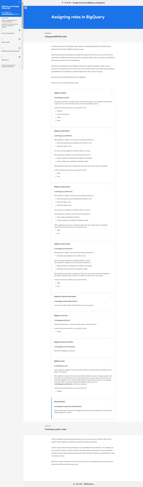

# <https§§§storage.googleapis.com§cloud-training§cls-html5-courses§T-BQRS-I§M3§index.html>

> [https://storage.googleapis.com/cloud-training/cls-html5-courses/T-BQRS-I/M3/index.html](https://storage.googleapis.com/cloud-training/cls-html5-courses/T-BQRS-I/M3/index.html)

# BigQuery and Google Cloud IAM

### BigQuery and Google Cloud IAM

## ROLES AND PERMISSIONS MODELS IN REDSHIFT AND BIGQUERY

### Lesson introduction

will examine the key similarities and differences between Redshift and BigQuery regarding the roles and permissions that are used to control access to data

### Key points about roles and permissions

Redshift and BigQuery both have fine-grained access controls that let you control access down to the row and column level

Redshift and BigQuery both have encryption for data at rest

* BigQuery uses [Google Cloud IAM(opens in a new tab)](https://cloud.google.com/bigquery/docs/access-control) to authenticate third party providers.
* To run jobs in BigQuery, you need the permission [bigquery.jobs.create.(opens in a new tab)](https://cloud.google.com/bigquery/docs/jobs-overview#required_permissions) If you are using on-demand billing, you do not have to manually allocate slot resources; if you are using a different billing plan such as flat-rate, then you need additional permissions to be able to allocate slots.
* Permissions in BigQuery are managed using IAM and inheritance from higher levels in the resource hierarchy, including the [BigQuery Data Owner(opens in a new tab)](https://cloud.google.com/bigquery/docs/access-control#bigquery.dataOwner) role.

### BigQuery and Redshift

summary of access control, encryption, and network security options

[https://cloud.google.com/bigquery/docs/data-governance](https§§§cloud.google.com§bigquery§docs§data-governance/readme.md)

[https://cloud.google.com/bigquery/docs/control-access-to-resources-iam#grant_access_to_a_table_or_view](https§§§cloud.google.com§bigquery§docs§control-access-to-resources-iam#grant_access_to_a_table_or_view/readme.md)

[https://cloud.google.com/bigquery/docs/column-level-security-intro](https§§§cloud.google.com§bigquery§docs§column-level-security-intro/readme.md)

[https://cloud.google.com/bigquery/docs/row-level-security-intro](https§§§cloud.google.com§bigquery§docs§row-level-security-intro/readme.md)

[https://cloud.google.com/bigquery/docs/column-key-encrypt](https§§§cloud.google.com§bigquery§docs§column-key-encrypt/readme.md)

[https://cloud.google.com/vpc/docs/private-access-options](https§§§cloud.google.com§vpc§docs§private-access-options/readme.md)

## OVERVIEW OF THE GOOGLE CLOUD IAM MODEL AND OTHER SECURITY FEATURES

### Lesson introduction

you will learn how you can use Google Cloud's Identity and Access Management (IAM) to start securing your resources and data and learn about other Google Cloud security features for authentication, encryption, and network connectivity

### What is IAM?

IAM is a tool and framework for fine-grained access control and visibility for centrally managing cloud resources

IAM empowers you adopt the **security principle of least privilege** ,

**IAM follows a model of access management composed of three main parts: Principal, Role, and Policy.**

ex

When you want to define who (principal) has what type of access (role) on a resource, you create an *allow* policy and attach it to the resource such as a BigQuery dataset.

* `principal`
  
  * A principal can be a Google Account (for end users), a service account (for applications and compute workloads), a Google group, a Google Workspace account, or Cloud Identity domain that can access a resource. Each principal has its own identifier, which is typically an email address.
* `role`
  
  * A role is a collection of permissions. Permissions determine which operations are allowed on a resource.  When you grant a role to a principal, you grant all the permissions that the role contains.
* `policy`
  
  * The *allow* policy is a collection of role bindings that bind one or more principals to individual roles.

In IAM, permission to access a resource is not granted directly to the end user. Instead, permissions are grouped into roles, and roles are granted to authenticated principals.

### Additional security features

By default, all data stored within Google Cloud is encrypted at rest and when in transit to and from outside of Google Cloud, using the same key management systems that Google uses for its own encrypted data

Google Cloud includes [private access methods(opens in a new tab)](https://cloud.google.com/vpc/docs/private-access-options) for virtual machines (VMs) that are supported by [Cloud Virtual Private network (VPN)(opens in a new tab)](https://cloud.google.com/network-connectivity/docs/vpn/concepts/overview) or [Cloud Interconnect(opens in a new tab)](https://cloud.google.com/network-connectivity/docs/interconnect/concepts/overview)

### References

[https://cloud.google.com/resource-manager/docs/cloud-platform-resource-hierarchy#inheritance](https§§§cloud.google.com§resource-manager§docs§cloud-platform-resource-hierarchy#inheritance/readme.md)
[https://cloud.google.com/bigquery/docs/data-governance#security_framework](https§§§cloud.google.com§bigquery§docs§data-governance#security_framework/readme.md)
[https://cloud.google.com/docs/authentication](https§§§cloud.google.com§docs§authentication/readme.md)

## GOOGLE CLOUD IAM ROLES AND PERMISSIONS FOR BIGQUERY

### Lesson introduction

you will learn more about Google Cloud IAM roles and permissions for BigQuery, including how identity and access management policies are inherited by BigQuery resources and how to leverage predefined roles for BigQuery

### IAM policies and permission inheritance

in cases where there is not, it is possible to create a custom role and to assign that role the specific permissions needed.

to perform an operation on a BigQuery resource, a user needs both the relevant permissions on the resource, and also permission to execute a BigQuery job. The permission to run a job needs to be assigned within the project that is used to run that job

### Google Cloud and BigQuery integration

in BigQuery, access control derives from Google Cloud IAM roles. Permissions are inherited from the organization, folder, and project levels, in addition to any specific BigQuery roles that are applied.

To support authentication from a third-party provider, you must configure the provider as an identity in Google Cloud, and create and assign an IAM role for it with the appropriate permissions.

Access control roles can be applied in BigQuery at the level of datasets, tables, views, or columns. Row level access can also be secured through row-level permissions in BigQuery.

Auditability is based on immutable BigQuery logs available within Google's Cloud Operations suite of tools such as Cloud Monitoring and Cloud Logging. BigQuery admin activities and system events such as table expirations are also logged.

### Assigning roles in BigQuery

Many traditional data warehouses accomplish this using row-level security. You can achieve the same results in BigQuery with access control to datasets, tables, views, or columns, or by defining authorized views and row-level permissions.

IAM provides predefined roles for BigQuery that can be applied to datasets, tables, views, or columns for fine-grained access control. You can also create custom Cloud IAM roles consisting of your defined set of permissions, and then assign those roles to users or groups.

Here are a few key predefined IAM roles for BigQuery.

details:

Custom roles provide access according to a user-specified list of permissions.  For example, you may consider creating a custom role when a principal needs a permission, but each predefined role that includes that permission also includes other permissions that the principal does not need and should not have.

[https://cloud.google.com/iam/docs/roles-overview#custom](https§§§cloud.google.com§iam§docs§roles-overview#custom/readme.md)

### References

[https://cloud.google.com/bigquery/docs/access-control#bigquery](https§§§cloud.google.com§bigquery§docs§access-control#bigquery/readme.md)
[https://cloud.google.com/bigquery/docs/reference/auditlogs](https§§§cloud.google.com§bigquery§docs§reference§auditlogs/readme.md)

## FINE-GRAINED ACCESS CONTROLS FOR BIGQUERY

### Lesson introduction

you will learn about fine-grained access control for BigQuery including how you can leverage data classification and policies at the column and row levels to secure your BigQuery data.

### Overview of fine-grained access control

What are your options if you want admins or super users to see all the data in a table, and others to see only a subset of the data?

[https://cloud.google.com/bigquery/docs/authorized-datasets](https§§§cloud.google.com§bigquery§docs§authorized-datasets/readme.md)
[https://cloud.google.com/bigquery/docs/authorized-routines](https§§§cloud.google.com§bigquery§docs§authorized-routines/readme.md)

An authorized view lets you share query results with particular users and groups without giving them access to the underlying source data. You can also use the view's SQL query to restrict the columns (fields) the users are able to query.

### Securing data with classification

Data classification is the process of categorizing data into types, forms, or categories by using their distinct characteristics

### Column-level security

Column-level permissions provide fine-grained access to sensitive columns using policy tags, or type-based classification, of data. Using BigQuery column-level security, you can create policies that check, at query time, whether a user has proper access.

### Row-level security

Row-level security lets you filter data and enable access to specific rows in a table based on qualifying user conditions. Row-level security extends the principle of least privilege by enabling fine-grained access control to a subset of data in a BigQuery table by means of row-level access policies.

These policies act as filters to hide or display certain rows of data, depending on whether a user or group is in an allowed list.

Choosing between row-level security and other methods of securing data

Authorized views, row-level access policies, and storing data in separate tables all provide different levels of security, performance, and convenience. Selecting the right mechanism for your use case is important to ensure the proper level of security for your data

[https://cloud.google.com/bigquery/docs/best-practices-row-level-security#use_the_filtered_data_viewer_role_with_caution](https§§§cloud.google.com§bigquery§docs§best-practices-row-level-security#use_the_filtered_data_viewer_role_with_caution/readme.md)

### References

[https://cloud.google.com/bigquery/docs/scan-with-dlp](https§§§cloud.google.com§bigquery§docs§scan-with-dlp/readme.md)
[https://cloud.google.com/bigquery/docs/authorized-datasets](https§§§cloud.google.com§bigquery§docs§authorized-datasets/readme.md)
[https://cloud.google.com/bigquery/docs/authorized-views](https§§§cloud.google.com§bigquery§docs§authorized-views/readme.md)
[https://cloud.google.com/bigquery/docs/column-level-security-intro](https§§§cloud.google.com§bigquery§docs§column-level-security-intro/readme.md)

