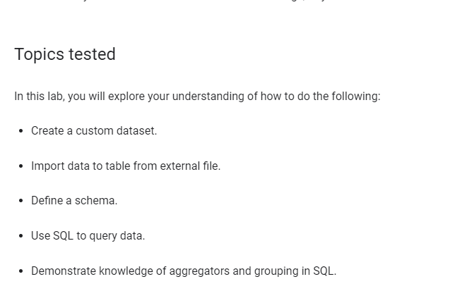
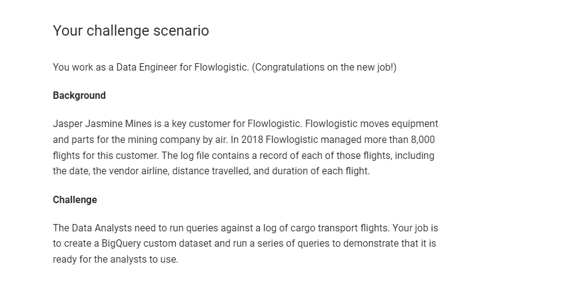
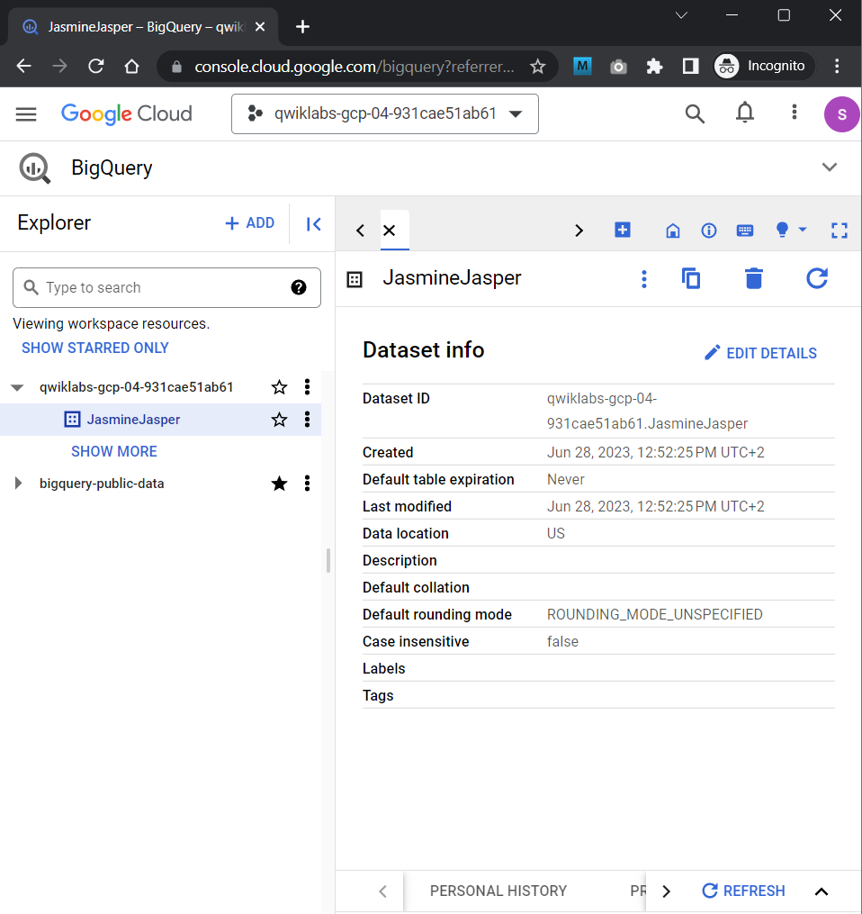
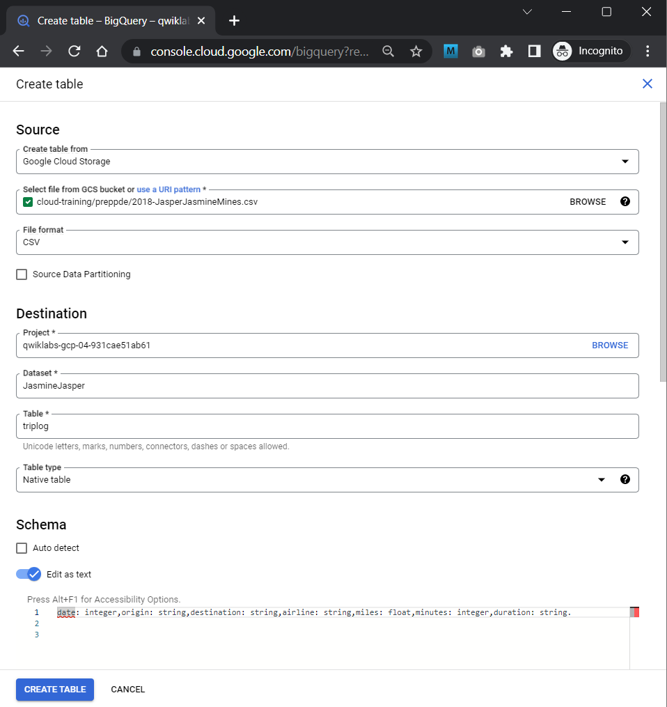
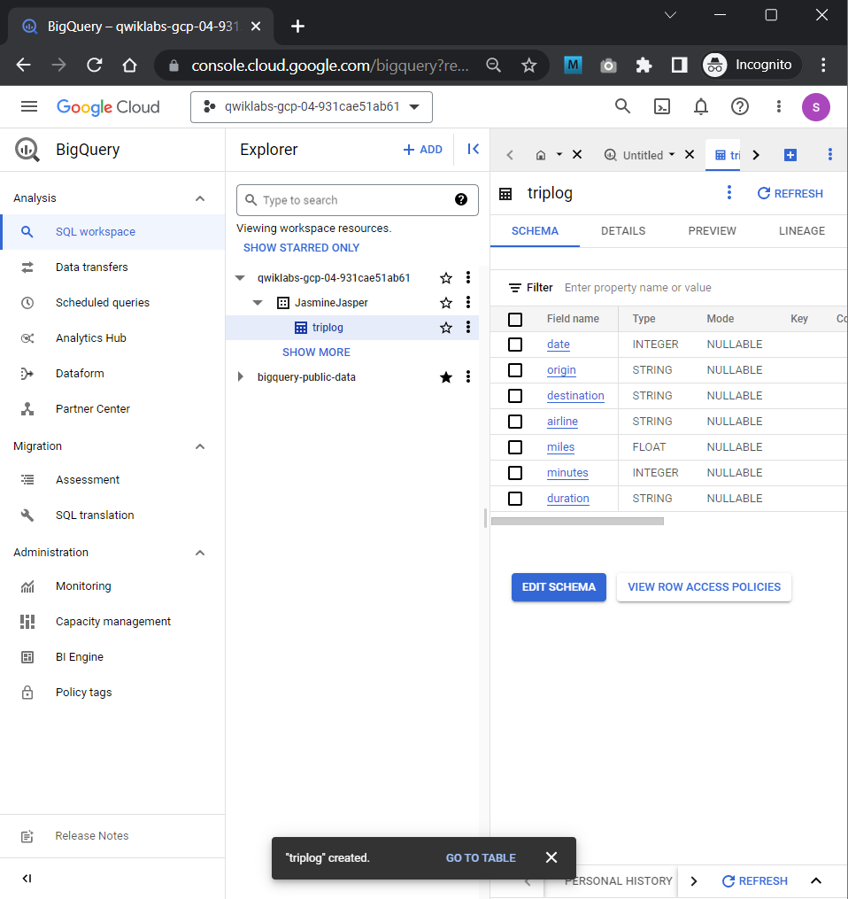
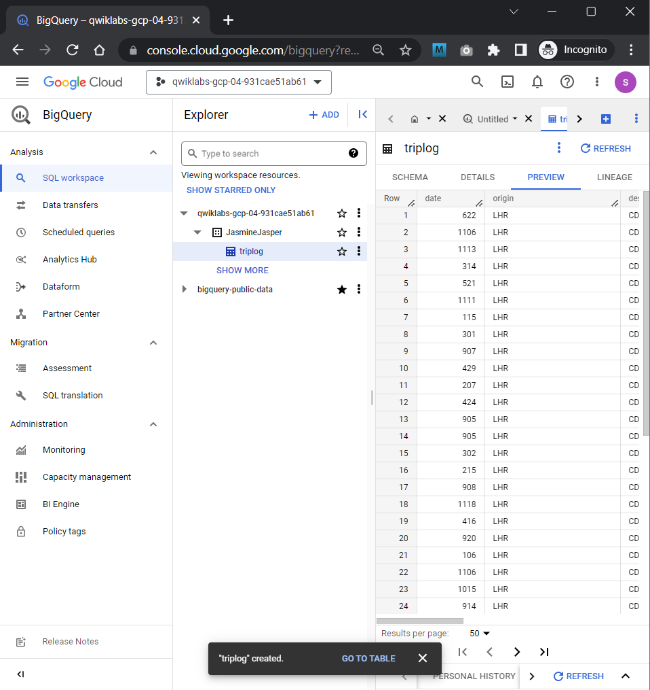
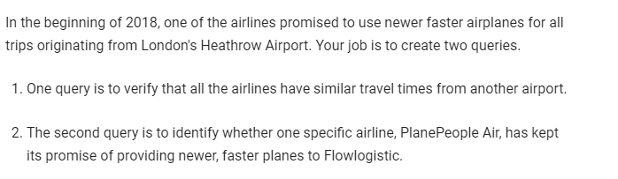
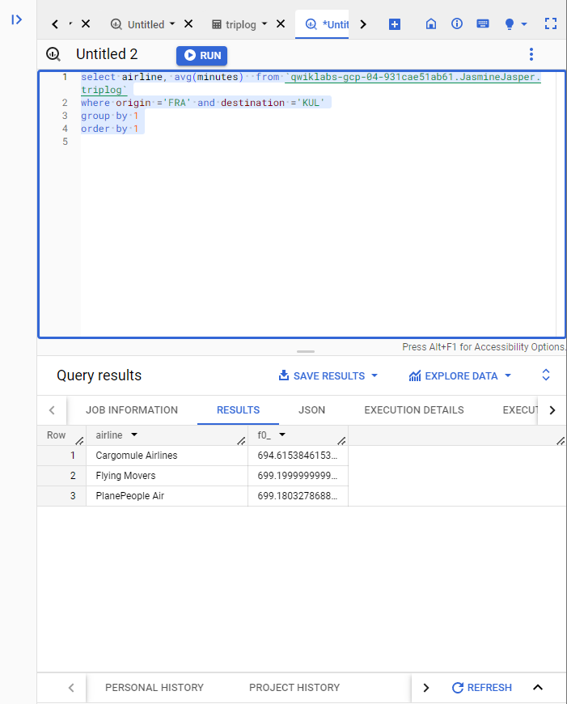
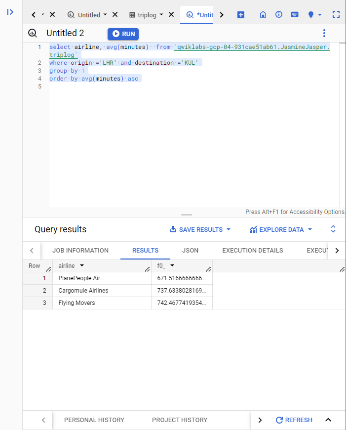

# <https§§§www.cloudskillsboost.google§course_sessions§3062553§labs§343580>

> [https://www.cloudskillsboost.google/course_sessions/3062553/labs/343580](https://www.cloudskillsboost.google/course_sessions/3062553/labs/343580)

# PDE Prep: BigQuery Essentials

## Overview





## Task 1. Create a custom dataset







preview:




## Task 2. Query the dataset

 


```sql
--  CHECK VALUES
select distinct  origin, destination from `qwiklabs-gcp-04-931cae51ab61.JasmineJasper.triplog`

-- all data 
select *  from `qwiklabs-gcp-04-931cae51ab61.JasmineJasper.triplog`
where origin ='FRA' and destination ='KUL'

-- ast query
select airline, avg(minutes)  from `qwiklabs-gcp-04-931cae51ab61.JasmineJasper.triplog`
where origin ='FRA' and destination ='KUL'
group by 1
order by 1


```

 


 
