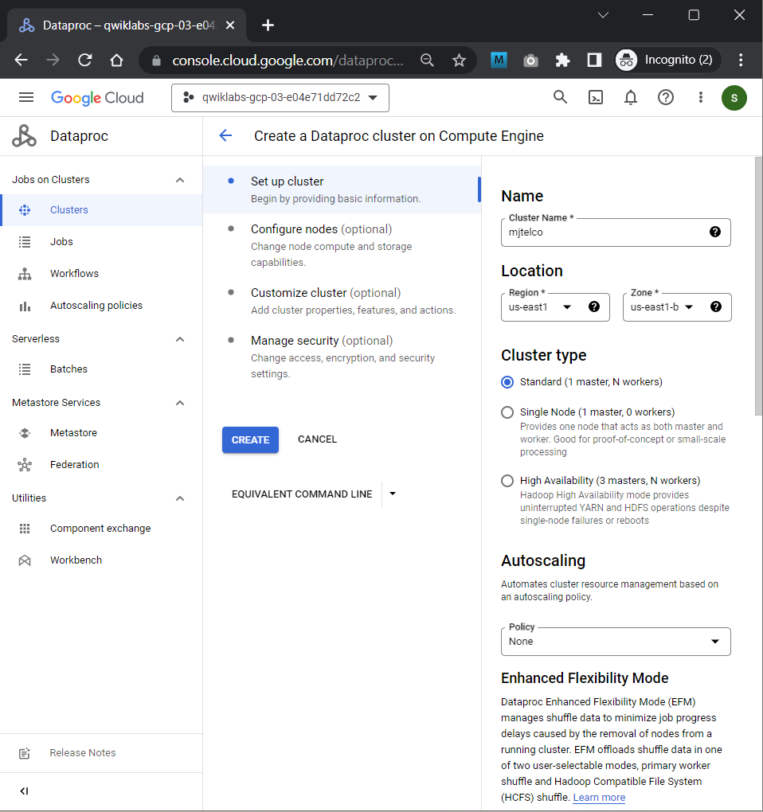

# <https§§§www.cloudskillsboost.google§course_sessions§3062553§labs§343602>

> [https://www.cloudskillsboost.google/course_sessions/3062553/labs/343602](https://www.cloudskillsboost.google/course_sessions/3062553/labs/343602)

# PDE Prep: Cloud Dataproc Cluster Operations and Maintenance

## Overview


## Challenge scenario


## Objective 1

Your first job is to duplicate the cluster that the Data Scientists are using and then run the benchmark job.

## Task 1. Stage the benchmark PySpark application

```bash
gcloud storage buckets create gs://qwiklabs-gcp-03-e04e71dd72c2

gsutil cp -r gs://cloud-training/preppde/benchmark.py gs://qwiklabs-gcp-03-e04e71dd72c2
```

## Task 2. Create a Cloud Dataproc Cluster that matches the Data Analyst's configuration




```bash
gcloud dataproc clusters create mjtelco --bucket qwiklabs-gcp-03-e04e71dd72c2 --region us-east1 --zone us-east1-b --master-machine-type n1-standard-2 --master-boot-disk-size 500 --num-workers 2 --worker-machine-type n1-standard-2 --worker-boot-disk-size 500 --image-version 2.0-debian10 --project qwiklabs-gcp-03-e04e71dd72c2
```

## Task 3. Demonstrate the successful benchmark job without the required input value


## Task 4. Demonstrate the slower benchmark job with the required input value


## Objective 2

Your second job is to improve the performance of the cluster and to reduce the time it takes to run the benchmark job.

## Task 5. Upgrade the master node

Upgrade the master node to a 4-CPU instance,  **n1-standard-4**  and worker too

> delete the cluster


## Task 7. Grow the cluster


```json
POST /v1/projects/qwiklabs-gcp-03-e04e71dd72c2/regions/us-east1/jobs:submit/
{
  "projectId": "qwiklabs-gcp-03-e04e71dd72c2",
  "job": {
    "placement": {
      "clusterName": "mjtelco"
    },
    "statusHistory": [],
    "reference": {
      "jobId": "job-bdb59605",
      "projectId": "qwiklabs-gcp-03-e04e71dd72c2"
    },
    "scheduling": {
      "maxFailuresPerHour": 1
    },
    "pysparkJob": {
      "mainPythonFileUri": "gs://qwiklabs-gcp-03-e04e71dd72c2/benchmark.py",
      "properties": {},
      "args": [
        "220"
      ]
    }
  }
}
```


## Task 8. Submit the job and verify improved performance


check the bucket dump :)

[here](./buckets)
