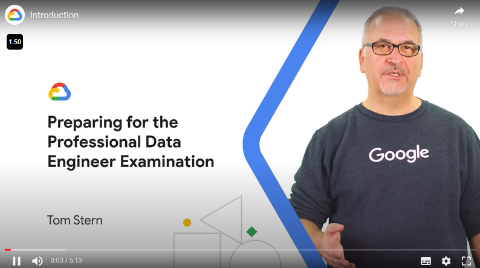
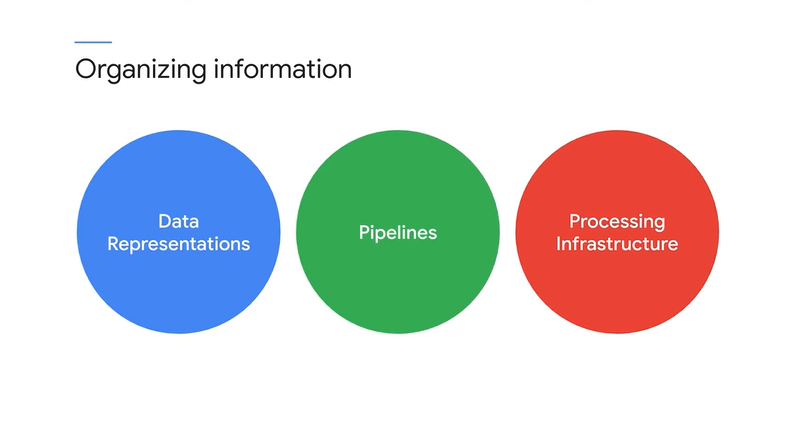

# <https§§§www.cloudskillsboost.google§course_sessions§3062553§video§343555>

> [https://www.cloudskillsboost.google/course_sessions/3062553/video/343555](https://www.cloudskillsboost.google/course_sessions/3062553/video/343555)

# Introduction

 

 

 

categories

It's the ability to perform the job, which means thinking through data engineering problems in the abstract and using these categories of abstraction

So ML isn't a subject that's tacked on or just included along with data engineering. It's a major part of data engineering

 

But what we do is highlight the skill you need to know for the job, and then you'll either know the dependent concepts on which it's based,
or you can go study them to fill in the gaps

But what you will get from this class
04:55
is a high-level overview of subject areas and tips and practice with exam-taking skills. And that will help you prepare. If you've already been studying and preparing for the exam,
05:06
this course will help you develop a good sense of what else you need to study or whether you're ready to attempt the exam.
