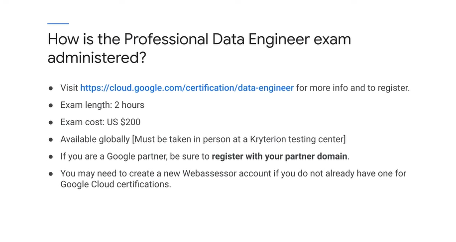

# <https§§§www.cloudskillsboost.google§course_sessions§3062553§video§343556>

> [https://www.cloudskillsboost.google/course_sessions/3062553/video/343556](https://www.cloudskillsboost.google/course_sessions/3062553/video/343556)

# Understanding the Professional Data Engineer Certification

It asks questions to see if you can think like a data engineer and solve problems like a data engineer.

data eng vs cloud eng

* A data engineer might consider how to design a cloud data cluster so it meets customer requirements.
* A cloud engineer might run jobs on the cluster and be more focused on monitoring the cluster and measuring and maintaining its performance
* A data engineer designs the solutions and implements it.
* A cloud engineer operates the solution, monitors it, maintains it, and evolves it as business circumstances change

biz req is a diff

AC is a good start

practice

peace yourself

The first approach, which is the most common, is what I call cram for the exam. That is, you start with basic information, like the information covered in our courses,
and you review that information and make sure you've mastered and can recall the majority of it. Then you research and practice and practice and practice. In formal education science, this
is called the mastery method

in the course we use this approach

biz needs and tek req is the key

> As you go through this course, note what you know and what you don't know, and that'll help you spend your time wisely studying the areas where you need to learn or learn better.

# Information about the latest Exam Guide

[here](T-GCPPDE-A-Locales-1-l3-file-en-3.pdf)

# Exam Tips #1

https://cloud.google.com/learn/certification/guides/data-engineer

[here](T-GCPPDE-A-Locales-1-l5-file-en-4.pdf)

# Quiz: Module 1 Assessment

# Exam Tips #2

[here](T-GCPPDE-A-Locales-1-l7-file-en-4.pdf)

