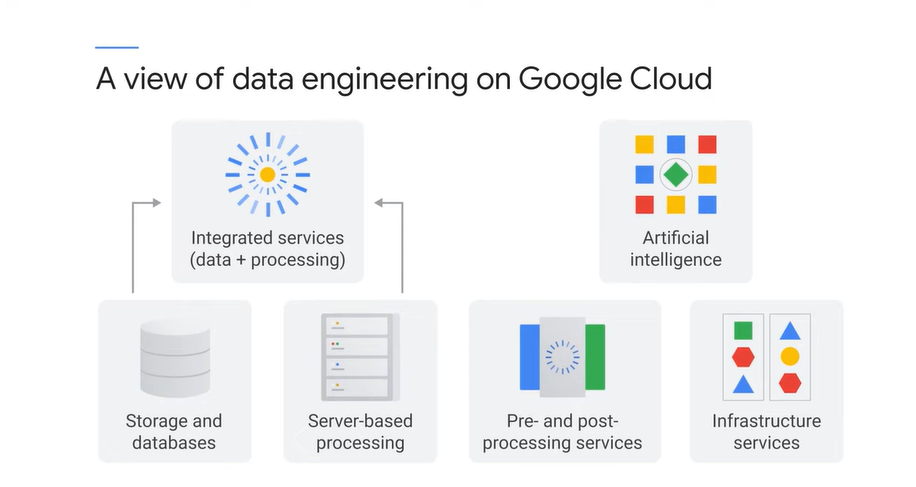
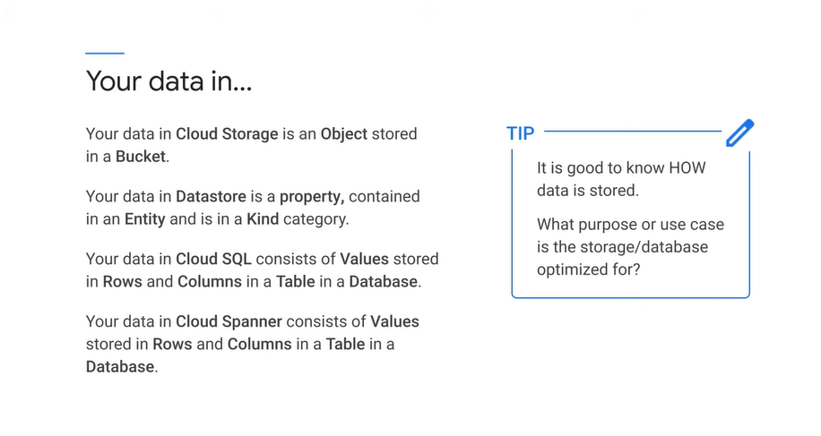
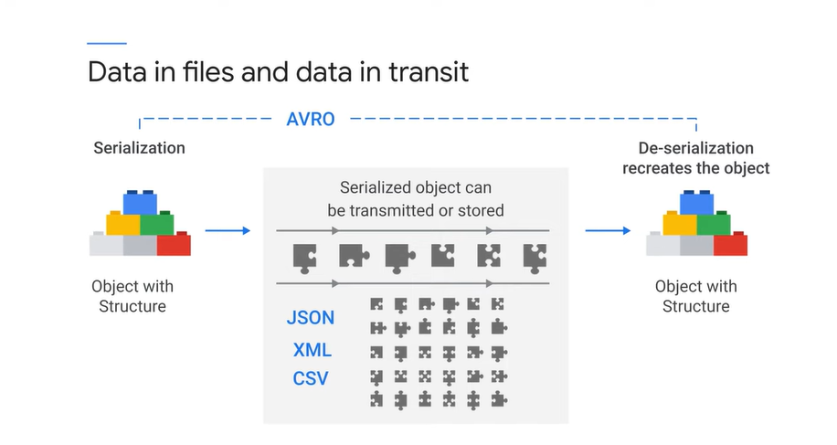
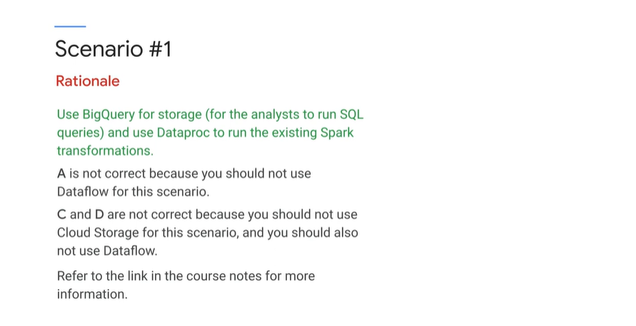

# <https§§§www.cloudskillsboost.google§course_sessions§3062553§video§343561>

> [https://www.cloudskillsboost.google/course_sessions/3062553/video/343561](https://www.cloudskillsboost.google/course_sessions/3062553/video/343561)

# Designing and building

Designing data processing systems includes designing flexible data representations, designing data pipelines, and designing data processing infrastructure

Think about data engineering in Google Cloud as a platform consisting of components that can be assembled into solutions.

gcp componetnts by area // managed and not

An exam tip, know how to identify technologies backwards from their properties

Serverless services remove more of the IT responsibility,

processing resource

data processing

ai

It's important to know what the services contribute to the data solutions and to be familiar with key features and options.

the cost of a particular instance type compared with another instance type, the actual values is not something I would expect I'd need to know as a data engineer.
09:41
I would look these details up if I needed them. However, the fact that an N4 standard instance has higher IOPS than an N1 one standard instance or that the N4 standard cost more than an N1 standard
09:54
are concepts that I would need to know as a data engineer.

# Design flexible data representations

Exam tip is that it's good to know how data is stored
01:10
and what purpose or use case is the storage or database optimized for

CSV, which stands for "comma-separated values," is a simple file format used to store tabular data.
01:36
XML, which stands for "extensible markup language," was designed to store and transport data and was designed to be self-descriptive. JSON, which stands for "JavaScript Object Notation," is a lightweight data interchange format based
01:51
on name value pairs and an ordered list of values, which maps easily to common objects in many programming languages. 

Networking transmits serial data as a stream of bits, zeros and ones, and data is stored as bits.
02:06
That means, if you have a data object with a meaningful structure to it, you need some method to flatten and serialize the data first so that it's just zeros and ones.
02:17
Then it can be transmitted and stored. And when it's retrieved, the data needs to be de-serialized to restore the structure into a meaningful data object. One example of software that does this is Avro.

Avro is a remote procedure call and data serialization framework developed within Apache's Hadoop project. It uses JSON for defining data types and protocols and serializes data in a compact binary format.

use the right types given the biz case

Exam tip, know the hierarchy of objects within a data technology and how they relate to one another.

BigQuery is called a "columnar store," meaning that it's designed for processing columns, not rows.

You treat your data and cloud Dataproc
05:33
and Spark as a single entity, but Spark knows the truth. Your data is stored in resilient distributed data sets, or RDDs. RDDs are an abstraction that hides the complicated details of how data is located
05:45
and replicated in a cluster. Spark partitions data and memory across the cluster and knows how to recover the data through an RDD's lineage, should anything go wrong. Spark has the ability to direct processing
05:58
to occur where there are processing resources available. Data partitioning, data replication, data recovery, pipelining of processing, all are automated by Spark, so you don't have to worry about them.

PCollections are immutable obj - as base as RDD in spark

Runner is what executes the datapip

The idea is to write Python or Java code
07:21
and deploy it to Cloud Dataflow, which then executes the pipeline in a scalable, serverless context. Unlike cloud Dataproc, there's no need to launch a cluster or scale the cluster.

> Cloud Dataflow is designed to use the same pipeline, the same operations, the same code for both batch and stream processing. Remember that batch data is also called "bounded data,"

So what Dataflow does is it allows
08:30
you to define a period or window and to calculate the average within that window. That's an example of how both kinds of data could be processed with the same single block of code.

Many Hadoop workloads can be run more easily and are easier to maintain with Cloud Dataflow. But PCollections and RDDs are not identical, so existing code has to be redesigned and adapted
08:57
to run in the Cloud Dataflow pipeline

A tensor is a special mathematical object that unifies scalars, vectors, and matrices. Tensor 0 is just a single value, a scalar. Tensor 1 is a vector, having direction and magnitude.
09:35
Tensor 2, is a matrix. Tensor 3 is a cube shape. Tensors are very good at representing certain kinds of math functions, such as coefficients in an equation

A tensor is a powerful abstraction, because it relates different kinds of data types.
10:00
And there are transformations in tensor algebra that apply to any dimension or rank of tensor, so it makes solving some problems much easier.

# Exam Tips #3

[here](T-GCPPDE-A-Locales-3-l18-file-en-8.pdf)

# Design data pipelines

However, the main thing you should know about Cloud Dataproc is how to use it differently from standard Hadoop. If you store your data external from the cluster,
00:42
storing HDFS-type data in cloud storage and storing HBase type data in Cloud Bigtable, then you can shut your cluster down when you're not actually processing a job. That's very important.

When you have a stateless Cloud Dataproc cluster, it typically takes only about 90 seconds for the cluster to start up and become active. Cloud Dataproc supports Hadoop, Pig, Hive, and Spark.

With a Spark pipeline you have two
01:52
different kinds of operations-- transforms and actions. Spark builds its pipeline using an abstraction called a directed graph. Each transform builds additional nodes into the graph, but Spark doesn't execute the pipeline
02:05
until it sees an action. Very simply, spark waits until it has the whole story-- all the information. This allows Spark to choose the best way to distribute the work
02:15
and run the pipeline. The process of waiting on transforms and executing on actions is called lazy execution

When Spark sees a transformation, it registers it in the directed graph, and then it waits. An action triggers Spark to process the pipeline. The output is usually a result format such as a text
02:41
file, rather than an RDD. Transformations and actions are API calls that reference the functions you want them to perform. Anonymous functions in Python, lambda functions, are commonly used to make the API calls.

If you need to modify the cluster, consider whether you have the right data processing solution

# Dataflow pipelines

loud Dataflow provides the execution framework. Parallel tasks are automatically scaled by the framework, and the same code does real-time streaming and batch processing. One great thing about Cloud Dataflow
00:26
is that you can get input from many sources and write output to many syncs, but the pipeline code in between remains the same. Cloud Dataflow supports side inputs. That's where you can take data and transform it in one way
00:39
and transform it in a different way in parallel so that the two can be used together in the same pipeline

Pipelines reveal the progression of a data processing solution and the organization of steps, which make it much easier to maintain than other code solutions

Do you know which operations are potentially computationally expensive? GroupByKey, for one, could consume resources on big data. This is one reason you might want to test your pipeline a few times on sample data to make sure you know how it scales before executing at production scale

dataflow templates

Templates create the single step of indirection that allows the two classes of users to have different access.

Dataflow templates enable a new development and execution workflow

The templates help separate the development activities and the developers from the execution activities and the users. The user environment no longer has dependencies back
02:32
to the development environment. The need for recompilation to run a job is limited.

# BigQuery and Dataflow solutions

BigQuery connects to many services for flexible ingest
00:36
and output, and it supports nested and repeated fields for efficiency and user-defined functions for extensibility

If you need more capabilities than a query engine, consider Cloud Dataproc or Cloud Data Flow.

> It's more efficient, once again, to store the data separate from the processing resources.

use and shutdown

Cloud Data Flow is an excellent ETL solution for BigQuery.
02:54
Use Cloud Data Flow to aggregate data in support of common queries.

# Design data processing infrastructure

Now that you have all the pieces, let's start looking at how to put them together into data processing infrastructure

you can use the gsutil command line tool to load files into Cloud Storage.

But if you want to load data into BigQuery, you need to be able to identify the structure. The BigQuery command line tool, bq, is good for uploading large data files
00:33
and for scheduling data file uploads

think about 3V

# Pub/Sub solutions

The Cloud Pub/Sub message broker enables complete ingest solutions.
00:04
It provides loose coupling between systems and long-lived connections between systems.

> Exam tip-- you need to know how long Cloud Pub/Sub holds messages: It's up to seven days

Pub/Sub simplifies event distribution by replacing synchronous, point-to-point connections with a single, high-availability asynchronous bus.

Cloud Pub/Sub handles exactly once delivery.
00:50
And cloud data flow handles deduplication, ordering, and windowing.

Separation of duties enables a scalable solution that surpasses bottlenecks in competing messaging systems

This mobile gaming reference architecture illustrates the pattern at work.
01:24
Popular mobile games can attract millions of players and generate terabytes of game-related data in a short burst of time.
01:31
This creates pressure on the data processing infrastructure powering to provide timely, actionable insights in a cost effective way.

# Practice exam questions 01

B

A

Why not just use the Cloud Pub/Sub service and eliminate the overhead? You need a time stamp to implement the rest of the solution, so applying it at ingest in the publisher is a good, consistent way to get
02:22
the time stamp that's required.

# Designing Data Processing Systems: Exam Guide Review

[here](T-GCPPDE-A-Locales-3-l19-file-en-15.pdf)

