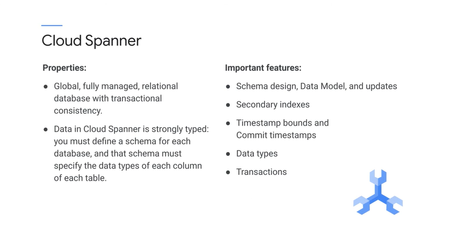
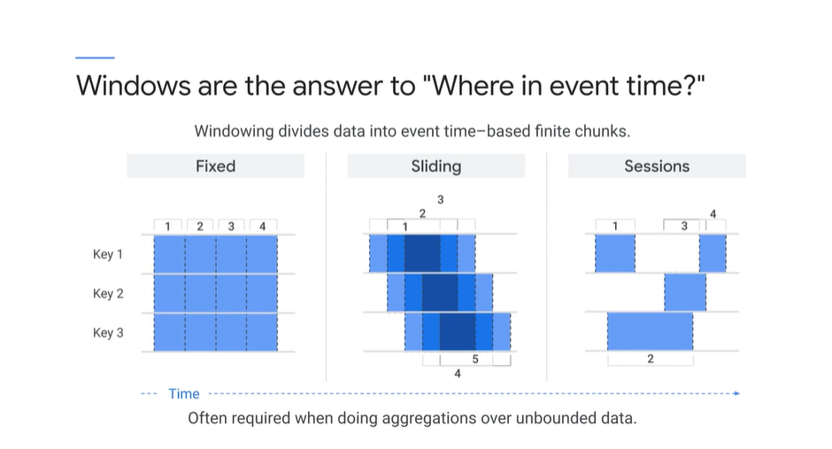
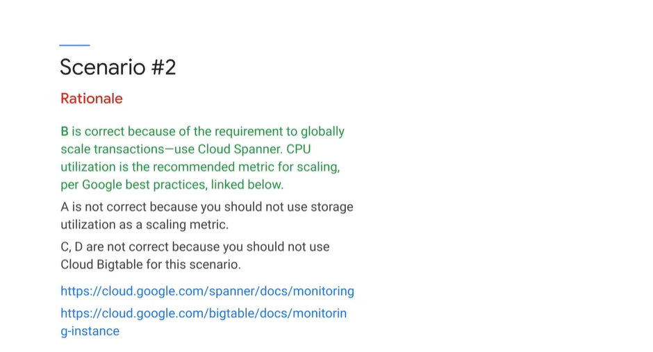

# <https§§§www.cloudskillsboost.google§course_sessions§3062553§video§343571>

> [https://www.cloudskillsboost.google/course_sessions/3062553/video/343571](https://www.cloudskillsboost.google/course_sessions/3062553/video/343571)

# Building data processing systems

he next section of the exam guide covers building data processing systems, so that includes assembling data processing from parts as well as using full services

BigQuery is the default storage for tabular data. Use Cloud Bigtable if you want low latency, high throughput.

Here's some concrete advice on flexible data representation. You want the data divided up in a way that makes the most sense for your given use case. If the data is divided up too much,
it creates additional work. In the example on the left, each data item is stored separately, making it easy to filter on a specific field and to perform updates. In the example on the right, all of the data
is stored in a single record, like a single string. Editing and updating is difficult. Filtering on a particular field would be hard

In the example on the bottom, a relation
is defined between two tables. This might make it easier to manage and report on the list of locations.

acid versus base is essential data knowledge that you will want to be familiar with

# Cloud Storage, Cloud SQL, Cloud Bigtable

Cloud Storage is persistent.

It has storage classes-- Nearline, Coldline, Regional, and Multi-regional.
There's granular access control.
You should be familiar with all the methods of access control, including IAM roles and signed URLs

I want to highlight to you that there are several ways to securely connect to a Cloud SQL instance.

Cloud Bigtable is meant for high throughput data.
It has millisecond latency.
So it's much faster than BigQuery, for example.
It's NoSQL, so this is good for columnular store.

Cloud Spanner is strongly typed and globally consistent.

Cloud Spanner can work with much larger databases than Cloud SQL.

But if your needs are such that you need multiple databases, Cloud Spanner is a great choice.

However, Spanner distributes easily, even globally and provides consistent performance to support more throughput by just adding more nodes.

Cloud Datastore is a NoSQL solution that used to be private to App Engine.

Example, if the exam question contains data warehouse, you should be thinking BigQuery as a candidate.
If the case says something about large media files, you should immediately be thinking cloud storage.

# Building and maintaining pipelines

The next section is on building and maintaining pipelines

Apache Beam is an open programming platform for
unifying batch and streaming. Before Apache Beam, you needed two pipelines to balance latency throughput and fault tolerance. Cloud Dataflow is Apache Beam as a service, a fully managed auto-scaling service that runs Beam pipelines. Continuous data can arrive out of order. Simple windowing can separate related events into independent windows, losing relationship information. Time-based windowing, or shuffling, overcomes this limitation.

Cloud Dataflow resources are deployed on demand per job, and work is constantly rebalanced across resources

Do you know the basic windowing methods, including fixed time, such as a daily window; sliding and overlapping windows, such as the last 24 hours; and session-based windows that are triggered to capture bursts of activity?

There really is no replacement for the data flow windowing capability for streaming data. Windowing creates individual results for different slices of event time

Windowing divides a PCollection up into finite chunks based on event time of each message. It can be useful in many contexts, but it's required when aggregating over infinite data.

Remember to study side inputs. If you understand side inputs, you'll necessarily understand many dependent concepts that are part of Cloud Dataflow.

# Building and maintaining processing infrastructure

You can stream unbounded data into BigQuery.
Cloud Pub/Sub guarantees delivery but might deliver the messages out of order.
If you have a timestamp, then cloud data float can remove duplicates and work out the order of messages.

BigQuery is an inexpensive data store for tabular data.
It's cost comparable with cloud storage, so it makes sense to adjust into BigQuery and leave the data there

Why Bigtable and not Cloud Spanner?

Note that we can support 100,000 queries per second with 10 nodes in Bigtable, but we would need about 150 nodes in Cloud Spanner.

# Practice exam questions 02

D

Do you know why? The clue is that the clients are read-only and the challenge is scale. Read replicas increase capacity for simultaneous reads.
Note that a high-availability configuration wouldn't help in this scenario, because it would not necessarily increase throughput

B

use Cloud Spanner, monitor CPU utilization, and increase the number of nodes
as needed. B is correct, because of the requirement to globally scale transactions. Therefore, use Cloud Spanner. CPU utilization is a recommended metric for scaling, per Google best practices

# Building and Operationalizing Data Processing Systems: Exam Guide Review

[here](T-GCPPDE-A-Locales-3-l20-file-en-21.pdf)

# Case study 01

The actual processes were much more complicated, and it took 30 hours from start to finish
to generate one report. The processes were actually more of a spiderweb with many dependencies, so one part would run and then halt, waiting until another dependent part was complete before proceeding. 

So if we developed in BigQuery, it
was going to make the solution more maintainable and usable to the group. If we developed in Dataproc, for example, they would have had to rely on another team that had Spark programmers.

To make the solution work, we needed some automation. And for that, we chose Apache Airflow.

Cloud Composer, Apache Airflow allowed
us to establish the dependencies between different queries that existed in the original reporting process. BigQuery served as both a data storage solution and the data processing query solution. We were able to implement all their processing as SQL queries
in BigQuery, and we were able to implement all the dependencies through Airflow. One of the time sinks in their original process had to do with that 30-hour start-to-finish window.
What they would do is start processing jobs, and sometimes, they would fail, because the data from a previous dependency wasn't yet available. They had a manual process for restarting those jobs.

> We were able to automate away that toil and the rework by implementing the logic in Apache Airflow.

# Challenge Lab 01 Intro

# PDE Prep: BigQuery Essentials

https://www.cloudskillsboost.google/course_sessions/3062553/labs/343580

# Exam Tips #4

[here](T-GCPPDE-A-Locales-3-l22-file-en-25.pdf)

# Quiz: Designing and Building Data Processing Systems

 

