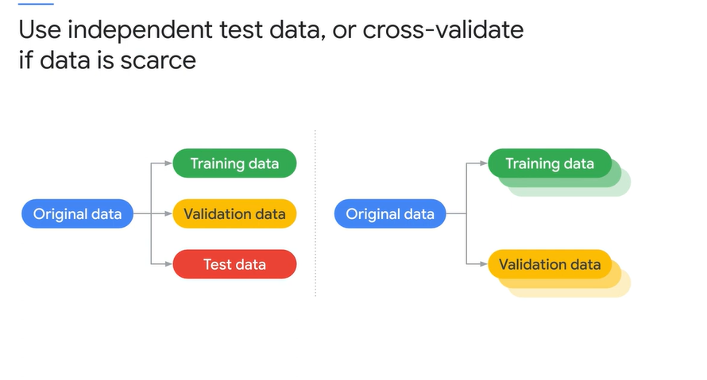
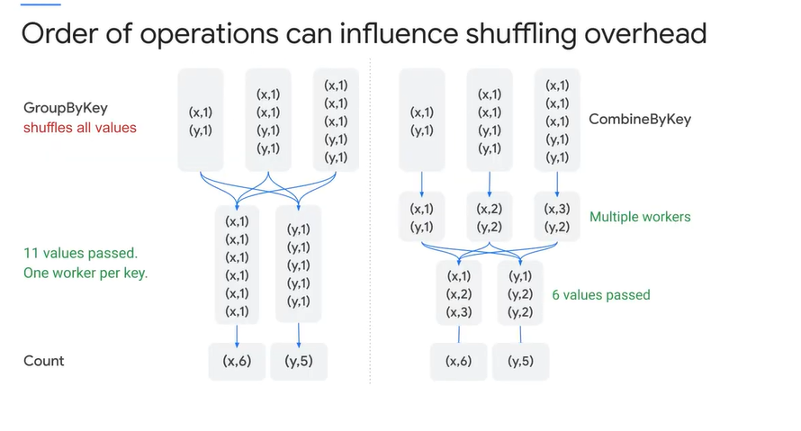
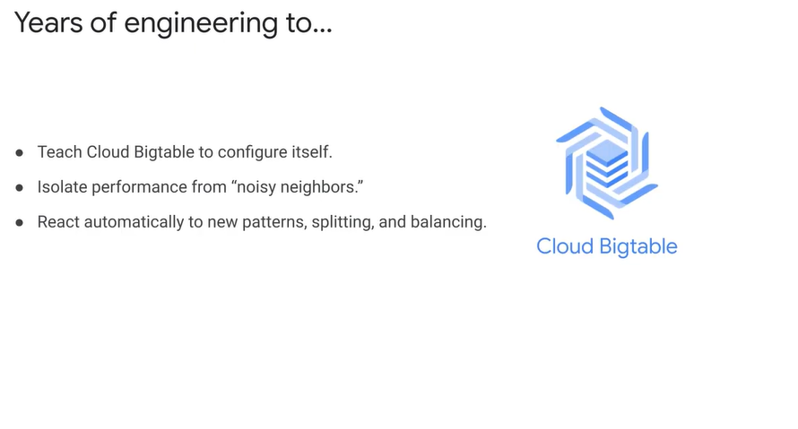

# <https§§§www.cloudskillsboost.google§course_sessions§3062553§video§343583>

> [https://www.cloudskillsboost.google/course_sessions/3062553/video/343583](https://www.cloudskillsboost.google/course_sessions/3062553/video/343583)

# Analyzing and modeling

pre-trained models

or use TF to use NN

# Analyzing data

use of notebok

colab and datalab

One of the basic concepts of machine learning is correctable error.
If you can make a guess about something like a value or a state, and if you know whether that guess was right or not, and especially if you know how far off the guess was,
you can correct it

Each time you run through the training data, it's called an epoch. You would change some parameters to help the model develop more predictive accuracy. As in this example, you can neatly connect and grow from a sample application in a notebook to Cloud ML Engine

his is the pattern for developing your own machine learning models. First, prepare the data. That means you gather the training data,
clean the data, split it into pools or groups for different purposes. Then you select features and improve them with feature engineering. Next, store the training data in an online location that
Cloud Machine Learning Engine can access, such as in Cloud storage. Then you follow these steps. You use TensorFlow to create the training application, you package it, and then you
configure and start a Cloud ML job.

# Machine learning

Machine learning is composed of an orderly set of processes.
In questions about machine learning, make sure you identify the step.
Some steps involve similar or related actions.
On GCP, we can use logging APIs, Cloud Pub/Sub, et cetera, and other real-time streaming to collect the data.
BigQuery, data flow, and ML preprocessing SDK to organize the data using different types of organization.
Use TensorFlow to create the model.
And use Cloud ML to train and deploy the model.

# Machine learning and unstructured data

you could use sentiment analysis to tag the emails
and to group them. Let the machine learning do the reading for you and sort the emails into representative groups. Now you can look at the most positive and most negative
emails to identify what behaviors to enforce or avoid. The machine learning process turn the unstructured data into structured data for your purposes. Distinguish between one-off, reasoning problems that are best solved by humans and big data problems that
can be solved by crunching a lot of data and machine learning problems that are best solved using modeling. I was once asked if a machine learning model could distinguish upside-down images
from right-side-up images

For example, recognizing the image of the cat is not really predicting it to be a cat.
It's really inferring from pixel data that a cat is represented in the image. Data engineers often focus on training the model and minimize or forget about inference

dwh as source of data

mse

gradient descent

how well the model fits reality

Categorizing produces discrete values and regression produces continuous values. Each uses different methods. Is the result you're looking for like deciding
whether an instance is in category A or category B? If so, it's a discrete value and therefore uses classification. If the result you're looking for is more like a number like the current value of a house,
if so, it's a continuous value and therefore uses regression. If the question describes cross entropy, it's a classification ML problem.

# Training and validating

trainng dta and eval data

udenfirtting and overfitting

Read these slides backwards. If the question says data is scarce, then you should be thinking independent test data or cross validate our candidate answers. Be familiar with the various methods of cross validation,
including training validation, and test and cross validation.

# Practice exam questions 03

C

Build an application that performs sentiment analysis using the Natural Language API.
Use the score and magnitude to sort the reviews.
The story here is to use a pre-trained model if it will do.
Creating models is expensive and time consuming.
Use a pre-trained model whenever possible.
In this case, the Natural Language API with sentiment analysis returns a score and a magnitude of sentiment that you can use to sort the reviews.
A and D are not correct because they require creating a model instead of using an existing one.
And B is not correct because it is using the wrong natural language feature.
Entity analysis will not determine sentiment.
It recognizes objects not opinions.

A

A is correct because it follows Google's recommended practices.
It is a best practice to use each tool for the purpose for which it was designed and built.
So a tip here is to note when recommended best practices are called out because those might be on the exam.
B is not correct because Google Kubernetes Engine is not the right tool for this circumstance.
And C and D are not correct because, in this situation, you don't need to export two copies of the trained model

# Operationalizing Machine Learning Models: Exam Guide Review

[here](T-GCPPDE-A-Locales-4-l7-file-en-32.pdf)

# Case study 02

security and compliance

A customer had this interesting business requirement-- capture data, reading, and updates events to know
who, what, when, and where

Separation of who manages the data and who can read the data. Allocate cost appropriately, cost to read process versus cost to store. Prevent exfiltration of data to other GCP projects
and to external systems

we introduced them to the concept of audit logs on GCP, and specifically, the default logs available from BigQuery.

Each group was isolated in separate projects and allowed limited access between them using VPC Service Controls. BigQuery allows separation of access by role, so we were able to limit some roles

to only loading data and others to only running queries. Some groups were able to run queries in their own project using data sets for which they only had read access,

and the data was stored in a separate repository. We made sure that, at the folder level of the resource hierarchy, we had aggregated log exports enabled.

# Case Study 2

[here](T-GCPPDE-A-Locales-4-l19-file-en-34.pdf)

# Modeling business processes for analysis and optimization

A confusion matrix classifies kinds of errors.

 

Using pre-trained models is fast and inexpensive, but it may not be tailored to your needs.

A compromise is to use an existing trained model, but to build additional capability in the model.
And this is the solution provided by AutoML.

general progression of building an ML solution; start with Big Data.
Go through Feature Engineering.
Then create the Model and deploy it.

# Feature engineering and performance

Feature engineering is a unique discipline. Selecting which feature or features to use in a model is critical. And there are a lot of things to consider, including whether the data of the feature is dense or sparse,
and if the value is numeric, whether the magnitude is meaningful or abstract. Also, a good feature needs to have enough examples available to train, validate, and evaluate the model.

correct step size

So your exam tip is better know about learning rate and hyperparameter tuning in machine learning.

and

# Schema and performance

vormliazatrion and den

And the different approaches would perform differently based on the query.

Normalizing the data means turning it into a relational system.

Denormalization is another increase in the orderliness of the data because of the repeated fields-- in the example, the name field is repeated-- the denormalized form takes more storage.

However, because it's no longer relational, queries can be processed more efficiently and, in parallel, using columnar processing.

BigQuery can use nested schemas for highly scalable queries.
In the example shown, the company field has multiple nested transactions.

# Pipeline and performance

Long-running jobs are a symptom, so you might want to measure resources and time between stages,
or to run tests on successively larger samples to verify how the pipeline is scaling.

obs

skewee data

query explanation map

# Dividing work

parition by time

There's more useful information available in the class and online, but the opposite advice is recommended for selecting training
data for machine learning. When you identify data for training ML, be careful to randomize rather than organize by time. Because you might train the model on the first part,
for example, on summer data, and test using the second part, which might be winter data, and it will appear that the model isn't working

In this example, GroupByKey can use no more than one
worker per key, which causes all the values to be shuffled, so they're all transmitted over the network. And then there's one worker for the x key and one worker for the y key, creating a bottleneck.
Combine allows Cloud Dataflow to distribute a key to multiple workers and process it in parallel. In this example, CombineByKey first aggregates values and then processes the aggregates with multiple workers.
Also, only six aggregate values need to be passed over the network.

# Bigtable performance

tablets

Rebalancing the tablets from one node to another is very fast because the actual data is not copied.

Recovery from the failure of a Cloud Bigtable node is also very fast because only metadata needs to be migrated to the replacement node.

> Bigtable has efficiency when it comes to fast-streaming ingestion, just storing data, whereas BigQuery is efficient for queries because it's optimized for SQL support

And the data is stored in the row key in ascending order.
All operations are atomic at the row level.

The question we're trying to answer is, which value should be used as the index?
If you store the data in timestamp order, the newest data will be at the bottom of the table.
If you're running queries that are based on most recent data and only use older data for some queries, this organization is the worst case

Instead, to optimize the query for the use case, you might want to consider using a reverse timestamp so the newest data is always on top.
But this doesn't work well either.
It introduces a new problem.
Because the data is stored sequentially in Bigtable, events starting with the same timestamp will all be stored on the same tablet, and that means the processing isn't distributed.

In the end, this example used the mile-marker code as the row key.
It didn't necessarily make the data easy to read or faster for a specific kind of query, but it randomized the access so the query was distributed.
Your exam tip-- know how indexes and key values influence performance and possibly introduce bias.

move ptrs

Because the data and pointers have to be reshuffled, and it takes Bigtable some time to figure out how to adjust the usage patterns to the new resources.tips

# Price estimation

Exam tip is to be suspicious of anything with Select All.

You can plug this into the pricing calculator to get an estimate of how much you'll spend before you run the query.

# Case study 03

how impl

The financial reporting applications run either daily or monthly, so we knew that all we needed to do was to set up a pipeline to handle the requirements and then
run the pipeline as required by their applications. And this is how we implemented that technical requirement. Source data is ingested in Cloud Storage-- no changes to sourcing. Output reports are generated entirely in BigQuery.
Cloud Analytics allows users to review the reports. Data is egressed on-prem, so there's no changes to the target structures, no changes downstream. And logs and controls out of the box in Stackdriver.
We ended up with a fairly simple solution

# Case Study 3

[here](T-GCPPDE-A-Locales-4-l20-file-en-43.pdf)

# Challenge Lab 02 Intro

# PDE Prep: Cloud Dataproc Cluster Operations and Maintenance

[https://www.cloudskillsboost.google/course_sessions/3062553/labs/343602](https§§§www.cloudskillsboost.google§course_sessions§3062553§labs§343602/readme.md)

# Exam Tips #5

[here](T-GCPPDE-A-Locales-4-l21-file-en-45.pdf)

# Quiz: Operationalizing Machine Learning Models

