# <https§§§www.cloudskillsboost.google§course_sessions§3062553§video§343605>

> [https://www.cloudskillsboost.google/course_sessions/3062553/video/343605](https://www.cloudskillsboost.google/course_sessions/3062553/video/343605)

# Designing for Security and Compliance

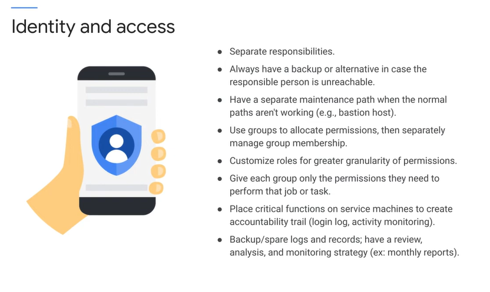

You need to be aware of the granularity of control for each service

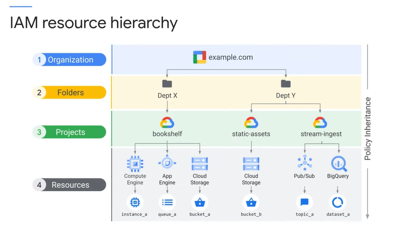

A policy is set on a resource, and each policy contains a set
01:25
of roles and role members. Resources inherit policies from parents. So a policy can be set on a resource, for example, a service, and another policy could be set on a parent, such as a project
01:38
that contains that service. The final policy is the union of the parent policy and the resource policy.

ex

What if the policy on the resource
01:50
only gives access to a single, let's say, cloud storage bucket and restricts access to all other buckets? However, at the project level, a rule exists that grants access to all buckets in the project.
02:02
Which rule wins, the more restrictive rule on the resource or the more general rule on the project? If the parent policy is less restrictive, it overrides a more restrictive resource policy.
02:14
So in this case, the project policy wins

Folders map well to organization's structure. It's a way to isolate organizations or users or products while still having them share billing
02:27
and corporate resources.

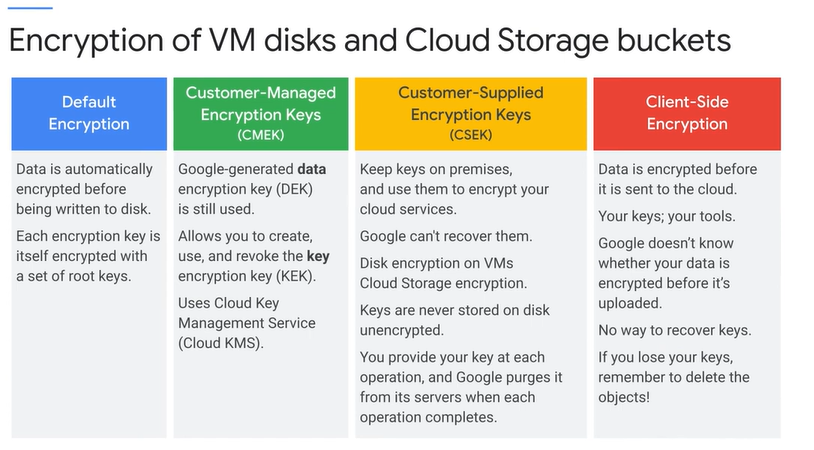

encryption options

When you use Cloud Dataproc, cluster and job data is stored on persistent disks associated with the Compute Engine VMs in your cluster and in a Cloud Storage bucket.

This PD and bucket data is encrypted using a Google-generated Data Encryption Key, the DEK, and Key Encryption Key, the KEK. Customer managed encryption keys, CMEK, is a feature that
03:11
allows you to create, use, and revoke the Key Encryption Key, the KEK

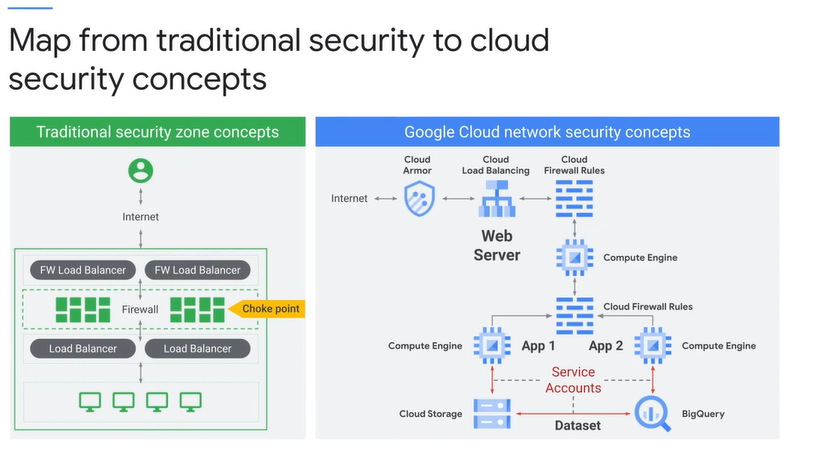

key concepts

Because of pervasive support for service accounts, you can lock down connections between components.

# Practice exam questions 04

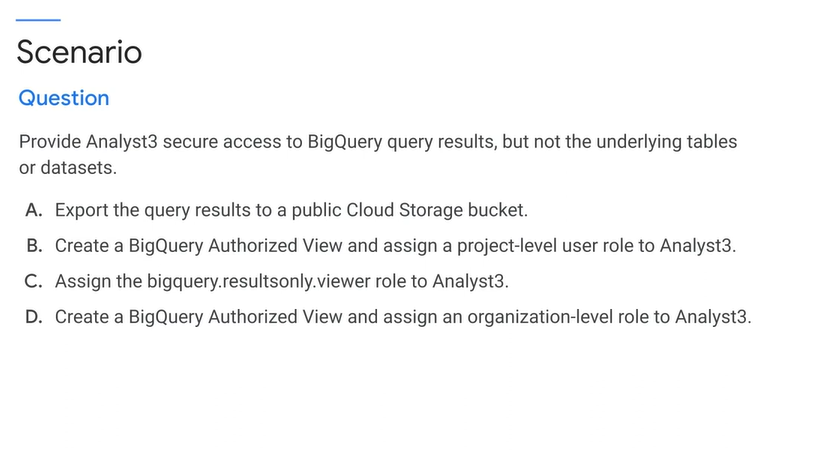

B

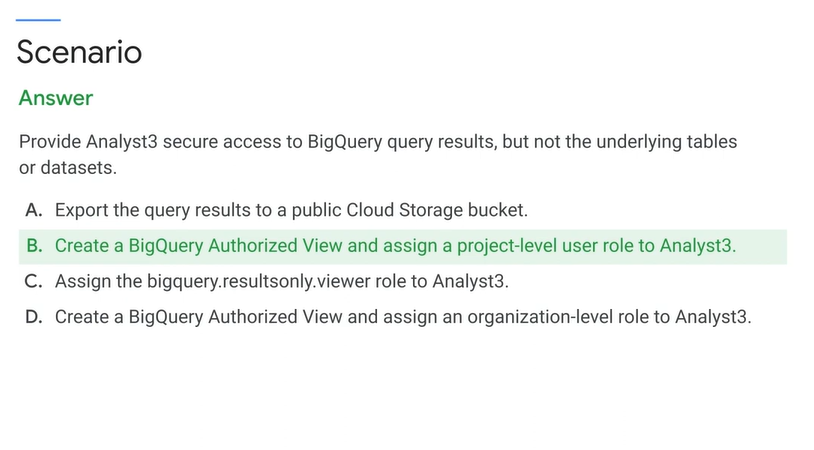

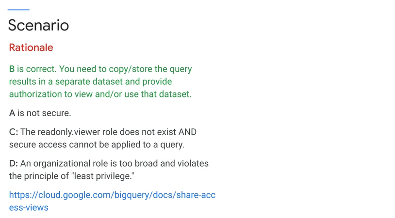

# Performing quality control

quality of the solution

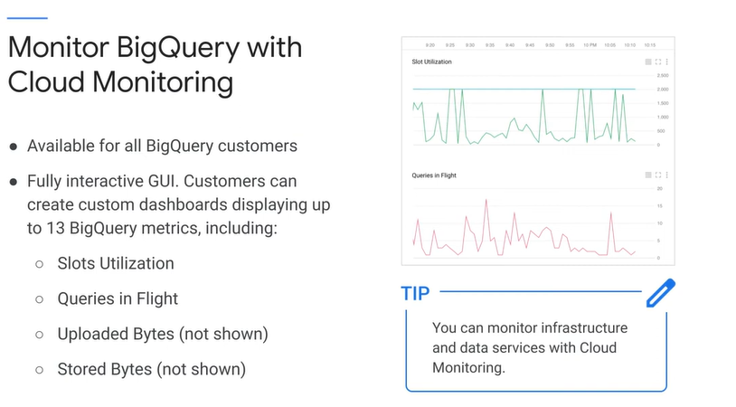

These charts show slot utilization, slots available and queries in flight for a one-hour period of BigQuery.

The exam tip here is that you can monitor infrastructure and data services with Stackdriver.

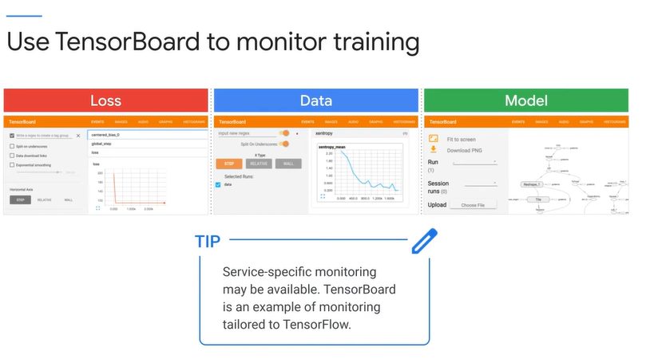

TensorBoard is a collection of visualization tools designed specifically to help you visualize TensorFlow.

And the exam tip here is that service-specific monitoring may be available.

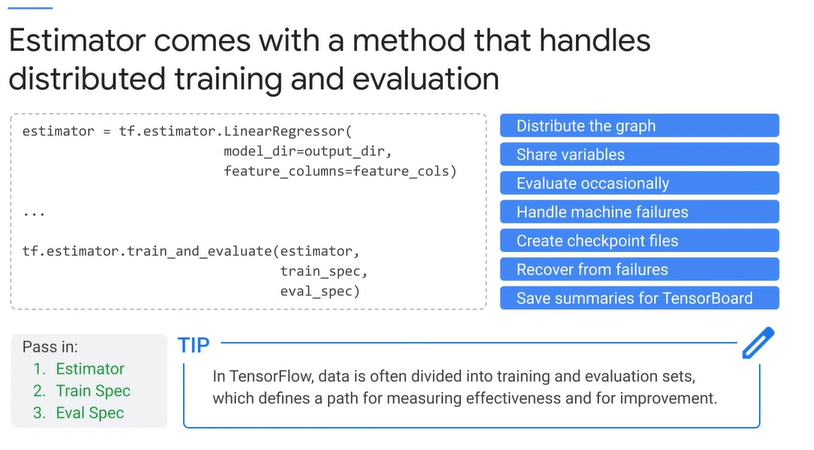

For example, you can recognize machine failures, create checkpoint files, and recover from failures.

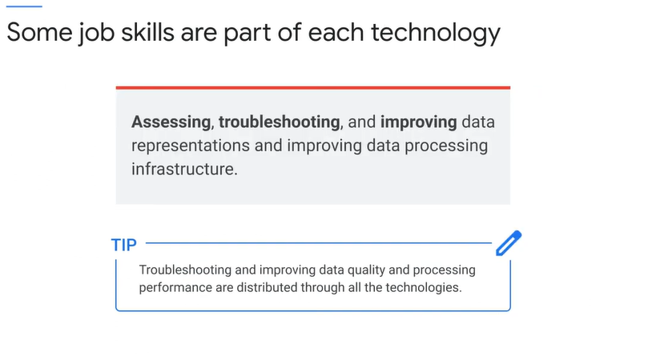

The exam tip here is that troubleshooting and improving data quality and processing performance is distributed through all the technologies.

It would be a good idea to make sure you know the main troubleshooting methods for each data engineering technology and service.

Security and troubleshooting are the lateral subjects that cut across all technologies.

> The training does cover the mechanics of generating and reports, but not explicitly how to present and advocate for policies.Nevertheless, it is part of the job and could be on the exam.

# Ensuring reliability

Reliable means that the service produces consistent outputs and operates as expected. If we were to quantify it, it would be a measure of how long the service performs its intended function.

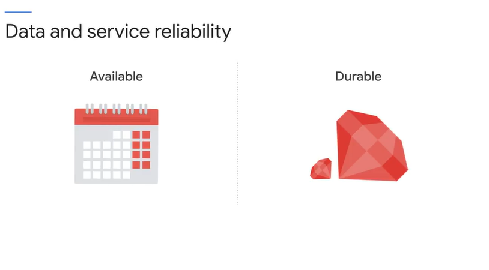

Available and durable are real-world values, and they're usually not 100%. Available means that the service is accessible on demand, a measure of the percentage of time that the item is in an operable state.

Durable has to do with data loss. It means the data does not disappear, and information is not lost over time. More accurately, it's a measure of the rate at which data is lost.

An alternate service or failover might bring the service back online and make it available again.

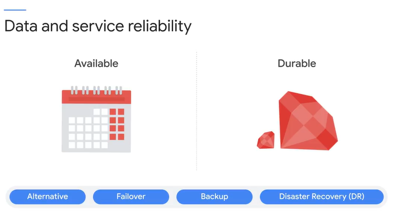

So the important thing to consider is,
01:17
what are the business requirements to recover from different kinds of problems, and how much time is allowed for each kind of recovery? For example, disaster recovery of a week
01:27
might be acceptable for flood damage to a storefront. On the other hand, loss of a financial transaction might be completely unacceptable. So the transaction itself needs to be atomic, backed up,
01:38
and redundant

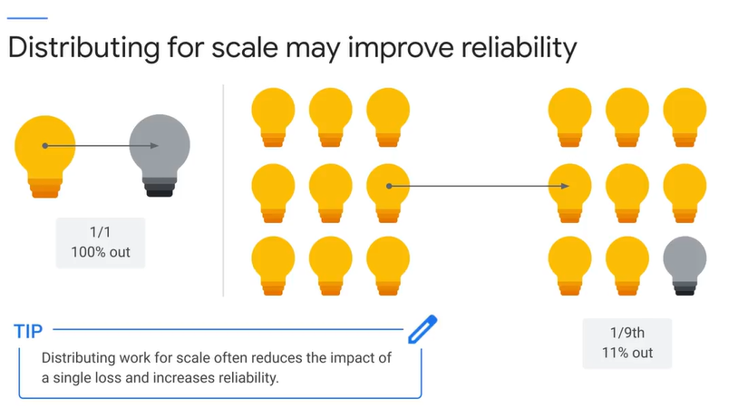

Simply scaling up may improve reliability. If the solution is designed to be fault-tolerant, increasing scale might improve reliability. In this example, if the service is running on one node
01:52
and that node goes out, the service is 100% down. On the other hand, if the service has scaled up and is running on nine nodes and one goes out,
02:01
the service is only 11% down. // `1/9 = 0.11`

# Ensuring Solution Quality: Exam Guide Review

[here](T-GCPPDE-A-Locales-5-l7-file-en-50.pdf)

# Exam Tips #6

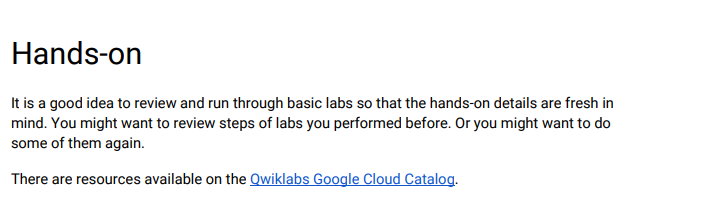

# Quiz: Preparing for Reliability, Policy, and Security

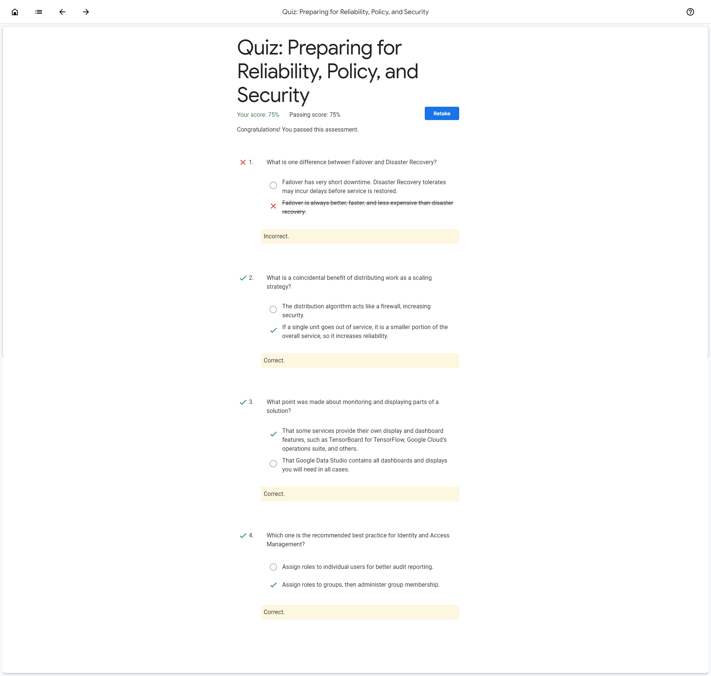

