# <https§§§www.cloudskillsboost.google§course_sessions§3062553§video§343612>

> [https://www.cloudskillsboost.google/course_sessions/3062553/video/343612](https://www.cloudskillsboost.google/course_sessions/3062553/video/343612)

# Resources and next steps

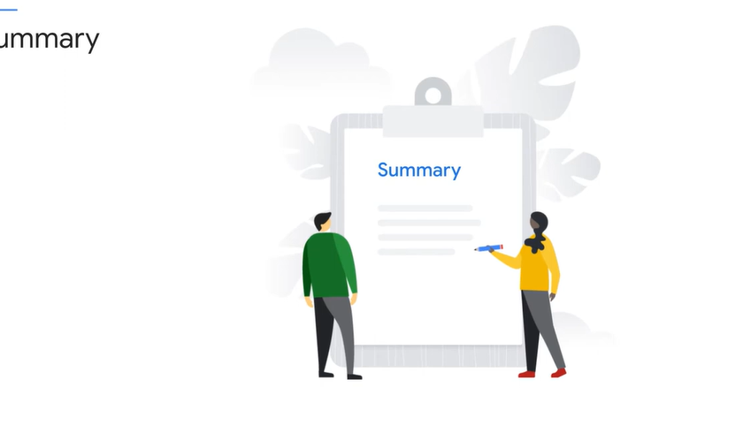

Tom: In this module, we'll discuss next steps. This course exposed you to a lot of information. There were many elements designed to help you approach preparing for the exam in different ways.
00:11
First, we described the certification and the exam itself. And you were encouraged to adopt an iterative strategy of answering the questions that you're most confident about first and bookmarking the others
00:22
and revisiting them. You also learned that the exam is designed to test practitioners who do the job. It isn't about only knowing certain information or details. It's about being able to reason through cases
00:34
and make reasoned decisions.

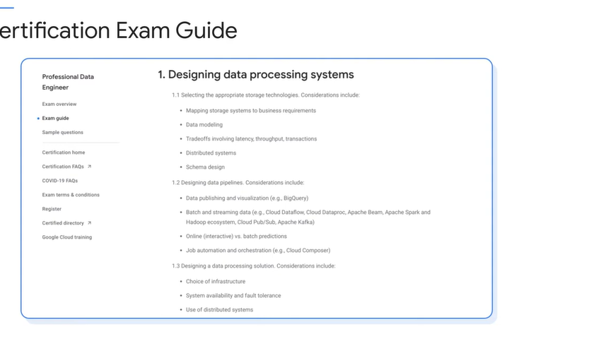

The majority of this course followed the exam guide outline. And we explored each of the parts of the exam, the concepts behind them, and mapped these to important information
00:45
to know about the technology that's taught in the data engineering courses

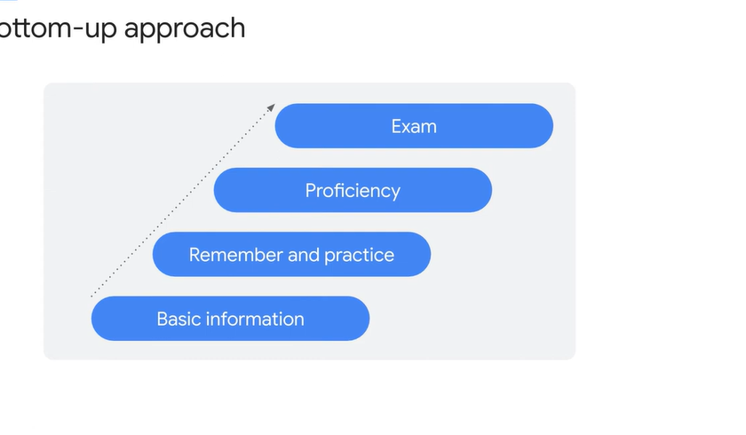

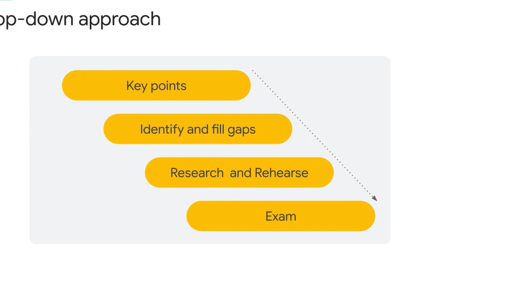

This wasn't a cram session. We were not trying to cover every detail or to build your knowledge from the ground up. In fact, the goal was to remind you of higher level, important concepts that you ought to know and understand, knowledge you probably gained from attending other courses, or from your experience.

The idea is, if you understand these touchstone concepts, you'll also need to know all the dependent basic information that they depend on and the reasoning behind them. You can still use a bottom-up mastery

approach to help prepare for the exam, if you like. The two approaches are not mutually exclusive.

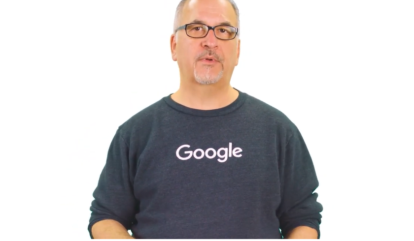

You've been exposed to information that will help you decide what to study and how to prepare. Next, you'll be given an opportunity to practice answering sample exam questions and, finally,
01:52
a list of resources for further study and preparation.

# Practice exam quiz

you'll have the opportunity to try many more practice exam questions.

# Instructions of GRADED and UNGRADED Practice Exam Quizzes

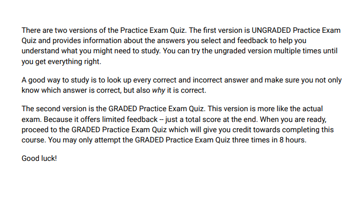

# Quiz: Ungraded Practice Exam

 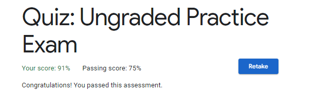

// see pdf 

# Quiz: Graded Practice Exam

// see pdf

# Resources

 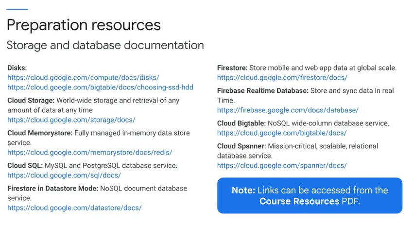

 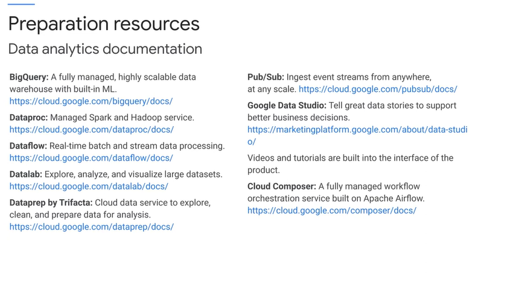

 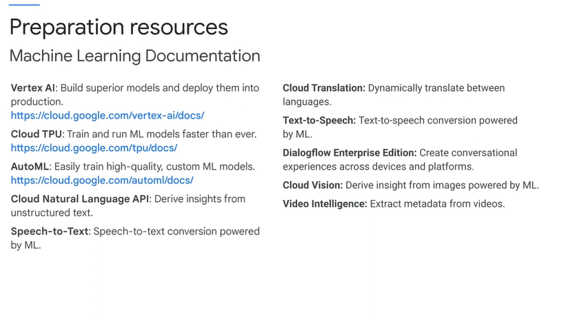

These are the links to the machine-learning documentation. Same level of detail for the pre-trained models.
00:32
Did you know that the Cloud Vision API doesn't just recognize objects and images but it can also give you back a color palette and composition information. If you didn't know that,
00:43
then it's a good indicator of something you need to study. As a professional data engineer, you need to be prepared by knowing what options are available. Machine-learning, clearly that's
00:54
going to be a component of many or most data engineering solutions in the future so you need to know quite a bit about it

 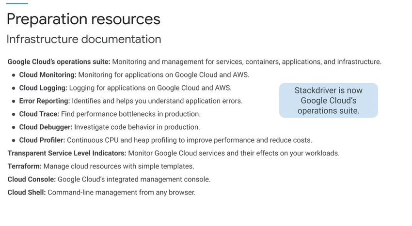

Here are some of the important infrastructure services.
01:04
You really need to know Stackdriver because every data engineering solution is going to need to be monitored and maintained.

 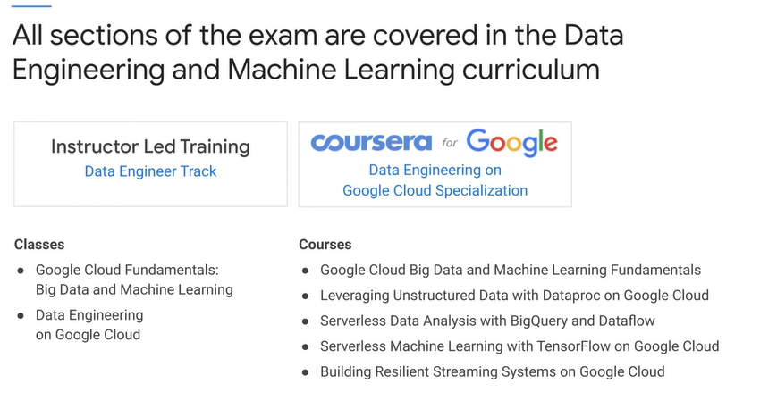

 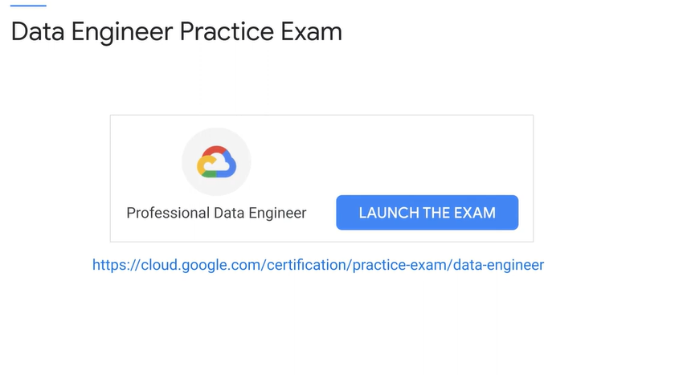

There's no time limit for the practice exam, but we recommend completion in 45 minutes or less.

 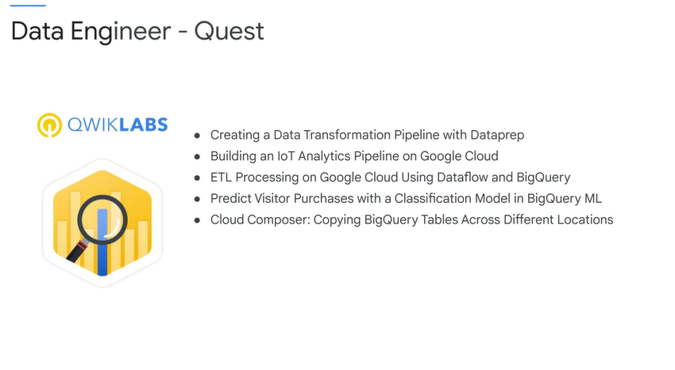

The exam is quite challenging and external studying, experience, and/or background in Cloud Data Engineering is recommended.

# Exam Tips #7

 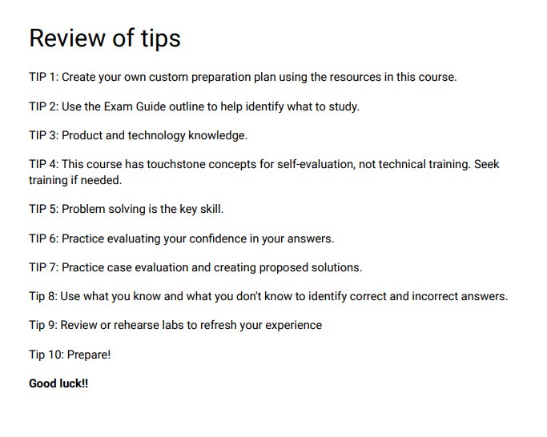

# Course Summary Quiz - Prep for the Exam

 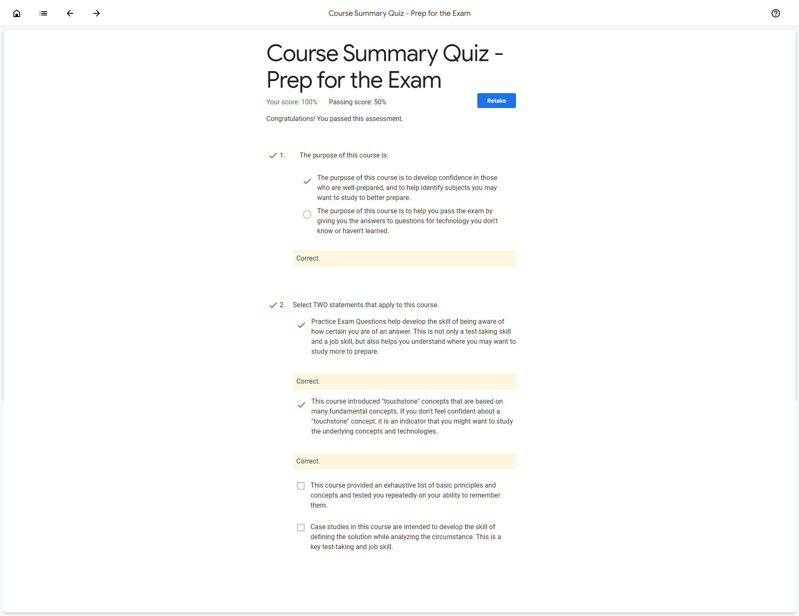

# Sample Exam Quiz Questions

[here](T-GCPPDE-A-Locales-6-l9-file-en-57.pdf)
