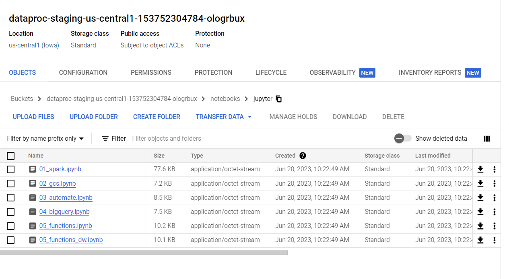

# <https§§§www.cloudskillsboost.google§course_sessions§3591643§labs§379232>

> [https://www.cloudskillsboost.google/course_sessions/3591643/labs/379232](https://www.cloudskillsboost.google/course_sessions/3591643/labs/379232)


# Running Apache Spark jobs on Cloud Dataproc

## Overview
In this lab you will learn how to migrate Apache Spark code to Cloud Dataproc. You will follow a sequence of steps progressively moving more of the job components over to GCP services:

Run original Spark code on Cloud Dataproc (Lift and Shift)

Replace HDFS with Cloud Storage (cloud-native)

Automate everything so it runs on job-specific clusters (cloud-optimized)

What you'll learn
In this lab you will learn how to:

Migrate existing Spark jobs to Cloud Dataproc

Modify Spark jobs to use Cloud Storage instead of HDFS

Optimize Spark jobs to run on Job specific clusters


### Check project permissions


qwiklabs-gcp-04-af52d548d706


## init

```bash
gcloud projects list \
--filter="$(gcloud config get-value project)" \
--format="value(PROJECT_NUMBER)"
```


or the home


## Task 1. Lift and shift

You will create a new Cloud Dataproc cluster and then run an imported Jupyter notebook that uses the cluster's default local Hadoop Distributed File system (HDFS) to store source data and then process that data just as you would on any Hadoop cluster using Spark

### Configure and start a Cloud Dataproc cluster


create on compute engine


### Clone the source repository for the lab

```bash
git -C ~ clone https://github.com/GoogleCloudPlatform/training-data-analyst

# default bucket of dataproc
export DP_STORAGE="gs://$(gcloud dataproc clusters describe sparktodp --region=us-central1 --format=json | jq -r '.config.configBucket')"
echo $DP_STORAGE

# copy in the bucket
gcloud storage cp ~/training-data-analyst/quests/sparktobq/*.ipynb $DP_STORAGE/notebooks/jupyter
```



[https://cloud.google.com/sdk/gcloud/reference/storage](https§§§cloud.google.com§sdk§gcloud§reference§storage/readme.md)

### Log in to the Jupyter Notebook


you get directly to


[here](./01_spark.ipynb)


## Task 2. Separate compute and storage

### Modify Spark jobs to use Cloud Storage instead of HDFS

decouples the storage requirements for the job from the compute requirements. In this case, all you have to do is replace the Hadoop file system calls with Cloud Storage calls by replacing hdfs:// storage references with gs:// references in the code and adjusting folder names as necessary.

```bash
export PROJECT_ID=$(gcloud info --format='value(config.project)')
gcloud storage buckets create gs://$PROJECT_ID

# copy data
wget https://storage.googleapis.com/cloud-training/dataengineering/lab_assets/sparklab/kddcup.data_10_percent.gz
gcloud storage cp kddcup.data_10_percent.gz gs://$PROJECT_ID/
```

[here](./De-couple-storage.ipynb)

## Task 3. Deploy Spark jobs

### Optimize Spark jobs to run on Job specific clusters

You now create a standalone Python file, that can be deployed as a Cloud Dataproc Job, that will perform the same functions as this notebook. To do this you add magic commands

### Test automation

You now test that the PySpark code runs successfully as a file by calling the local copy from inside the notebook, passing in a parameter to identify the storage bucket you created earlier that stores the input data for this job

[here](./PySpark-analysis-file.ipynb


### Run the Analysis Job from Cloud Shell.

```bash
gcloud storage cp gs://$PROJECT_ID/sparktodp/spark_analysis.py spark_analysis.py

nano submit_onejob.sh
```
and add
```bash
#!/bin/bash
gcloud dataproc jobs submit pyspark \
       --cluster sparktodp \
       --region us-central1 \
       spark_analysis.py \
       -- --bucket=$1
```

```bash
chmod +x submit_onejob.sh
./submit_onejob.sh $PROJECT_ID
```


contents


