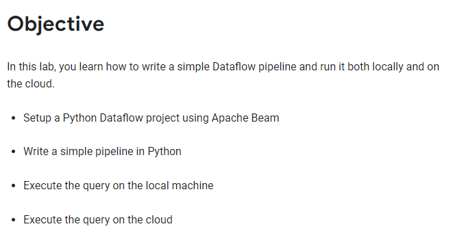
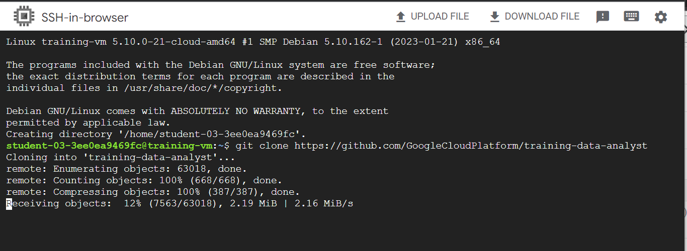
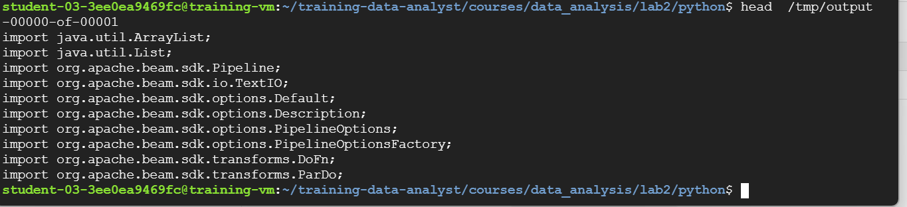
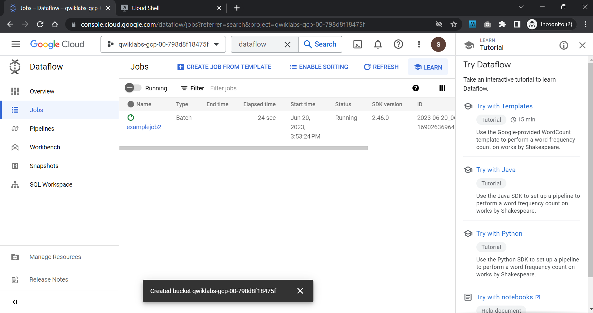
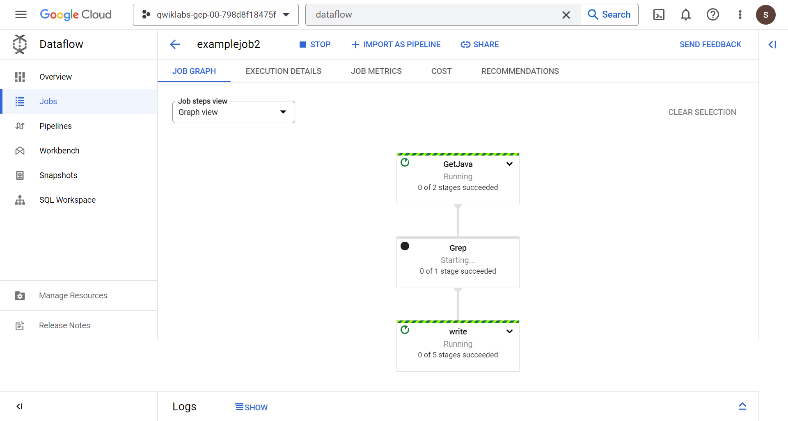
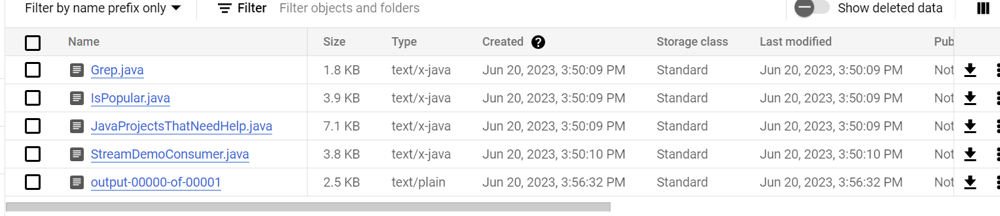

# <https§§§www.cloudskillsboost.google§course_sessions§3591643§labs§379242>
> <https://www.cloudskillsboost.google/course_sessions/3591643/labs/379242>

# A Simple Dataflow Pipeline (Python) 2.5



## Task 1. Ensure that the Dataflow API is successfully enabled
```bash
gcloud config set project qwiklabs-gcp-00-798d8f18475f

gcloud services disable dataflow.googleapis.com --force
gcloud services enable dataflow.googleapis.com
```
## Task 2. Preparation

```bash
git clone https://github.com/GoogleCloudPlatform/training-data-analyst
```

in the vm



```bash
BUCKET="qwiklabs-gcp-00-798d8f18475f"
echo $BUCKET
```

## Task 3. Pipeline filtering

in the vm
```bash
cd ~/training-data-analyst/courses/data_analysis/lab2/python
nano grep.py
```

```py
  GNU nano 5.4                                         grep.py                                                  
you may not use this file except in compliance with the License.
You may obtain a copy of the License at
http://www.apache.org/licenses/LICENSE-2.0
Unless required by applicable law or agreed to in writing, software
distributed under the License is distributed on an "AS IS" BASIS,
WITHOUT WARRANTIES OR CONDITIONS OF ANY KIND, either express or implied.
See the License for the specific language governing permissions and
limitations under the License.
"""

import apache_beam as beam
import sys

def my_grep(line, term):
   if line.startswith(term):
      yield line

if __name__ == '__main__':
   p = beam.Pipeline(argv=sys.argv)
   input = '../javahelp/src/main/java/com/google/cloud/training/dataanalyst/javahelp/*.java'
   output_prefix = '/tmp/output'
   searchTerm = 'import'

   # find all lines that contain the searchTerm
   (p
      | 'GetJava' >> beam.io.ReadFromText(input)
      | 'Grep' >> beam.FlatMap(lambda line: my_grep(line, searchTerm) )
      | 'write' >> beam.io.WriteToText(output_prefix)
   )

   p.run().wait_until_finish()

```

Can you answer these questions about the file grep.py?

What files are being read? some java text
What is the search term? import
Where does the output go? tmp folder

There are three transforms in the pipeline:

What does the transform do? yield lines with term

What does the second transform do? flatmap

Where does its input come from? files

What does it do with this input? read and filter out the lines with search tem

What does it write to its output? folder

Where does the output go? a ptranform 

What does the third transform do? beam.io.WriteToText

## Task 4. Execute the pipeline locally

```bash
python3 grep.py
```

he output file will be output.txt. If the output is large enough, it will be sharded into separate parts with names like: output-00000-of-00001.

```bash
ls -al /tmp
cat /tmp/output-*
```



## Task 5. Execute the pipeline on the cloud

```bash
# copy files text to the cloud
gcloud storage cp ../javahelp/src/main/java/com/google/cloud/training/dataanalyst/javahelp/*.java gs://$BUCKET/javahelp
```


```py
#!/usr/bin/env python

import apache_beam as beam

def my_grep(line, term):
   if line.startswith(term):
      yield line

PROJECT='cloud-training-demos'
BUCKET='cloud-training-demos'

def run():
   argv = [
      '--project={0}'.format(PROJECT),
      '--job_name=examplejob2',
      '--save_main_session',
      '--staging_location=gs://{0}/staging/'.format(BUCKET),
      '--temp_location=gs://{0}/staging/'.format(BUCKET),
      '--region=us-central1',
      '--runner=DataflowRunner'
   ]

   p = beam.Pipeline(argv=argv)
   input = 'gs://{0}/javahelp/*.java'.format(BUCKET)
   output_prefix = 'gs://{0}/javahelp/output'.format(BUCKET)
   searchTerm = 'import'

   # find all lines that contain the searchTerm
   (p
      | 'GetJava' >> beam.io.ReadFromText(input)
      | 'Grep' >> beam.FlatMap(lambda line: my_grep(line, searchTerm) )
      | 'write' >> beam.io.WriteToText(output_prefix)
   )

   p.run()

if __name__ == '__main__':
   run()

```


copy output from bucket 
```bash
gcloud storage cp gs://$BUCKET/javahelp/output* .
cat output*
```






