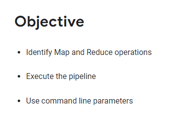
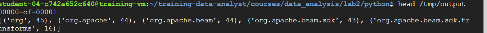
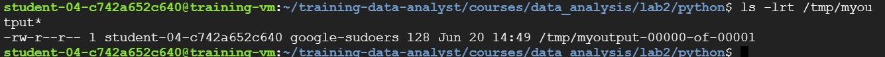

# <https§§§www.cloudskillsboost.google§course_sessions§3591643§labs§379246>
> <https://www.cloudskillsboost.google/course_sessions/3591643/labs/379246>

# MapReduce in Beam (Python) 2.5



## Task 1. Lab preparations


```bash
git clone https://github.com/GoogleCloudPlatform/training-data-analyst
```

## Task 2. Identify map and reduce operations

```bash
cd ~/training-data-analyst/courses/data_analysis/lab2/python
nano is_popular.py
```


## init

```py

import apache_beam as beam
import argparse

def startsWith(line, term):
   if line.startswith(term):
      yield line

def splitPackageName(packageName):
   """e.g. given com.example.appname.library.widgetname
           returns com
                   com.example
                   com.example.appname
      etc.
   """
   result = []
   end = packageName.find('.')
   while end > 0:
      result.append(packageName[0:end])
      end = packageName.find('.', end+1)
   result.append(packageName)
   return result

def getPackages(line, keyword):
   start = line.find(keyword) + len(keyword)
   end = line.find(';', start)
   if start < end:
      packageName = line[start:end].strip()
      return splitPackageName(packageName)
   return []

def packageUse(line, keyword):
   packages = getPackages(line, keyword)
   for p in packages:
      yield (p, 1)

if __name__ == '__main__':
   parser = argparse.ArgumentParser(description='Find the most used Java packages')
   parser.add_argument('--output_prefix', default='/tmp/output', help='Output prefix')
   parser.add_argument('--input', default='../javahelp/src/main/java/com/google/cloud/training/dataanalyst/java>

   options, pipeline_args = parser.parse_known_args()
   p = beam.Pipeline(argv=pipeline_args)

   input = '{0}*.java'.format(options.input)
   output_prefix = options.output_prefix
   keyword = 'import'

   # find most used packages
   (p
      | 'GetJava' >> beam.io.ReadFromText(input)
      | 'GetImports' >> beam.FlatMap(lambda line: startsWith(line, keyword))
      | 'PackageUse' >> beam.FlatMap(lambda line: packageUse(line, keyword))
      | 'TotalUse' >> beam.CombinePerKey(sum)
      | 'Top_5' >> beam.transforms.combiners.Top.Of(5, key=lambda kv: kv[1])
      | 'write' >> beam.io.WriteToText(output_prefix)
   )

   p.run().wait_until_finish()
```


Can you answer these questions about the file is_popular.py?

What custom arguments are defined? output prefix and output

What is the default output prefix? tmp out folder

How is the variable output_prefix in main() set? get value from options 

How are the pipeline arguments such as --runner set? by default

What are the key steps in the pipeline? read from text flatmaps combine on keys get top write to text

Which of these steps happen in parallel? flatmapas likely and combineperkey

Which of these steps are aggregations? combine per key to sum them

## Task 3. Execute the pipeline

```bash
python3 /tpm./is_popular.py
ls 
```



## Task 4. Use command line parameters

```bash
python3 ./is_popular.py --output_prefix=/tmp/myoutput
```
