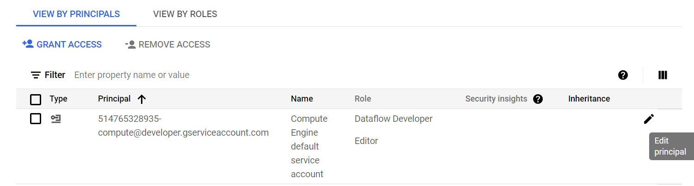
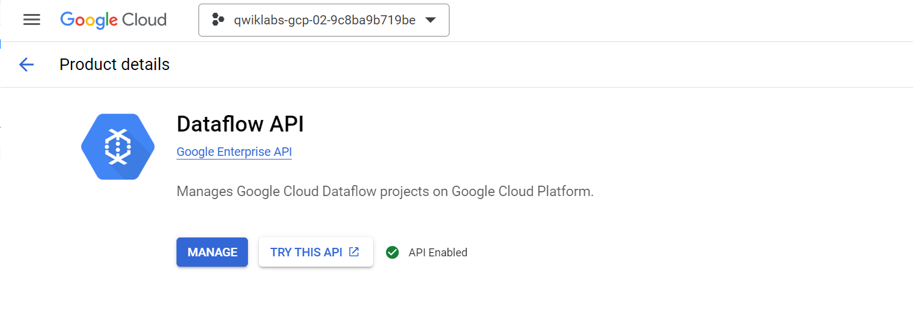
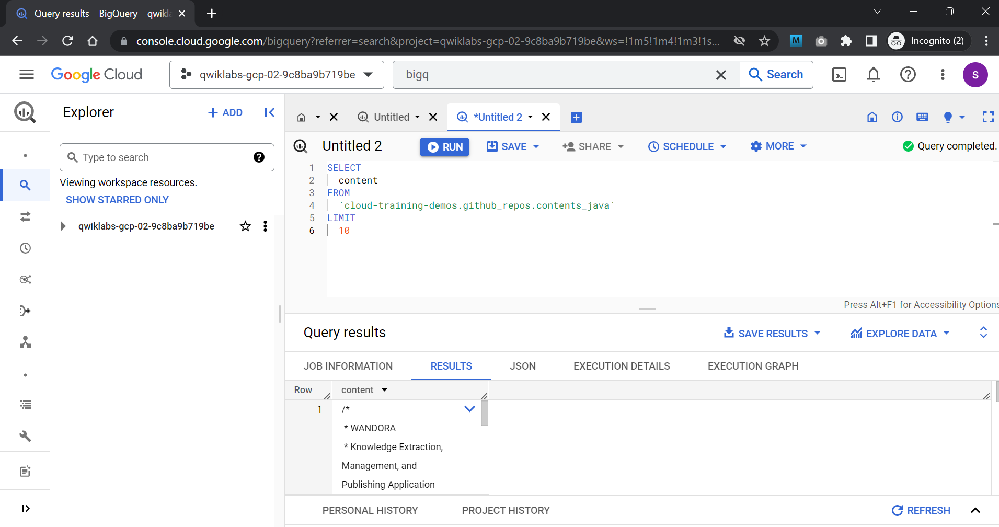
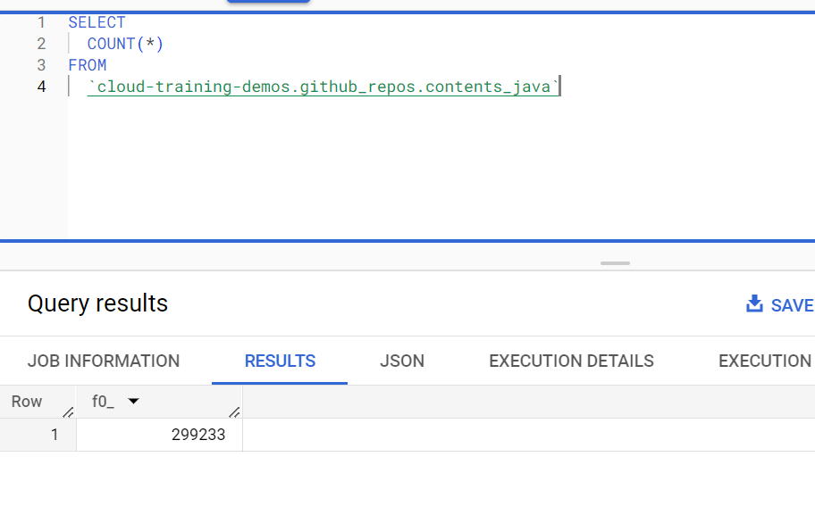
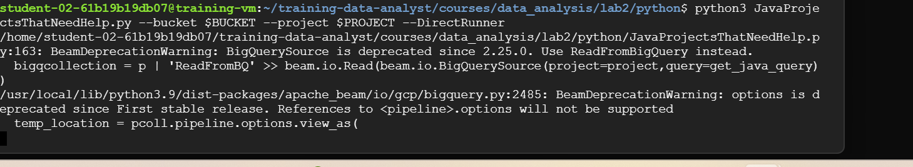
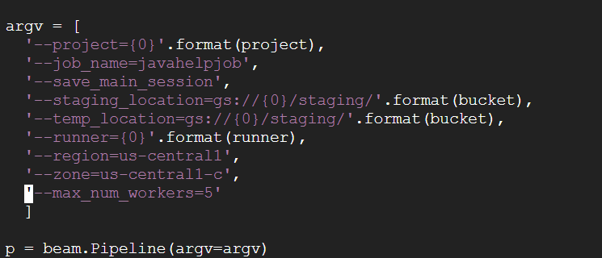

# <https§§§www.cloudskillsboost.google§course_sessions§3591643§labs§379250>
> <https://www.cloudskillsboost.google/course_sessions/3591643/labs/379250>

# Serverless Data Analysis with Dataflow: Side Inputs (Python)


## Task 1. Preparation





git clone https://github.com/GoogleCloudPlatform/training-data-analyst

BUCKET="qwiklabs-gcp-02-9c8ba9b719be"
echo $BUCKET

## Task 2. Try using BigQuery query



count


Duration
0 sec
Bytes processed
0 B
Bytes billed
0 B

## Task 3. Explore the pipeline code

cd ~/training-data-analyst/courses/data_analysis/lab2/python
nano JavaProjectsThatNeedHelp.py

```py

import argparse
import logging
import datetime, os
import apache_beam as beam
import math

'''

This is a dataflow pipeline that demonstrates Python use of side inputs. The pipeline finds Java packages
on Github that are (a) popular and (b) need help. Popularity is use of the package in a lot of other
projects, and is determined by counting the number of times the package appears in import statements.
Needing help is determined by counting the number of times the package contains the words FIXME or TODO
in its source.

@author tomstern
based on original work by vlakshmanan


python JavaProjectsThatNeedHelp.py --project <PROJECT> --bucket <BUCKET> --DirectRunner or --DataFlowRunner

'''

# Global values
TOPN=1000


# ### Functions used for both main and side inputs

def splitPackageName(packageName):
   """e.g. given com.example.appname.library.widgetname
           returns com
                   com.example
                   com.example.appname
      etc.
   """
   result = []
   end = packageName.find('.')
   while end > 0:
      result.append(packageName[0:end])
      end = packageName.find('.', end+1)
   result.append(packageName)
   return result

def getPackages(line, keyword):
   start = line.find(keyword) + len(keyword)
   end = line.find(';', start)
   if start < end:
      packageName = line[start:end].strip()
      return splitPackageName(packageName)
   return []

def packageUse(record, keyword):
   if record is not None:
     lines=record.split('\n')
     for line in lines:
       if line.startswith(keyword):
         packages = getPackages(line, keyword)
         for p in packages:
           yield (p, 1)

def is_popular(pcoll):
 return (pcoll
    | 'PackageUse' >> beam.FlatMap(lambda rowdict: packageUse(rowdict['content'], 'import'))
    | 'TotalUse' >> beam.CombinePerKey(sum)
    | 'Top_NNN' >> beam.transforms.combiners.Top.Of(TOPN, key=lambda kv: kv[1]) )

def packageHelp(record, keyword):
   count=0
   package_name=''
   if record is not None:
     lines=record.split('\n')
     for line in lines:
       if line.startswith(keyword):
         package_name=line
       if 'FIXME' in line or 'TODO' in line:
         count+=1
     packages = (getPackages(package_name, keyword) )
     for p in packages:
         yield (p,count)

def needs_help(pcoll):
 return (pcoll
    | 'PackageHelp' >> beam.FlatMap(lambda rowdict: packageHelp(rowdict['content'], 'package'))
    | 'TotalHelp' >> beam.CombinePerKey(sum)
    | 'DropZero' >> beam.Filter(lambda packages: packages[1]>0 ) )


# Calculate the final composite score
#
#    For each package that is popular
#    If the package is in the needs help dictionary, retrieve the popularity count
#    Multiply to get compositescore
#      - Using log() because these measures are subject to tournament effects
#


def compositeScore(popular, help):
    for element in popular:
      if help.get(element[0]):
         composite = math.log(help.get(element[0])) * math.log(element[1])
         if composite > 0:
           yield (element[0], composite)


# ### main

# Define pipeline runner (lazy execution)
def run():

  # Command line arguments
  parser = argparse.ArgumentParser(description='Demonstrate side inputs')
  parser.add_argument('--bucket', required=True, help='Specify Cloud Storage bucket for output')
  parser.add_argument('--project',required=True, help='Specify Google Cloud project')
  group = parser.add_mutually_exclusive_group(required=True)
  group.add_argument('--DirectRunner',action='store_true')
  group.add_argument('--DataFlowRunner',action='store_true')

  opts = parser.parse_args()

  if opts.DirectRunner:
    runner='DirectRunner'
  if opts.DataFlowRunner:
    runner='DataFlowRunner'

  bucket = opts.bucket
  project = opts.project

  #    Limit records if running local, or full data if running on the cloud
  limit_records=''
  if runner == 'DirectRunner':
     limit_records='LIMIT 3000'
  get_java_query='SELECT content FROM [cloud-training-demos:github_repos.contents_java] {0}'.format(limit_recor>


  argv = [
    '--project={0}'.format(project),
    '--job_name=javahelpjob',
    '--save_main_session',
    '--staging_location=gs://{0}/staging/'.format(bucket),
    '--temp_location=gs://{0}/staging/'.format(bucket),
    '--runner={0}'.format(runner),
    '--region=us-central1',
    '--max_num_workers=5'
    ]

  p = beam.Pipeline(argv=argv)


  # Read the table rows into a PCollection (a Python Dictionary)
  bigqcollection = p | 'ReadFromBQ' >> beam.io.Read(beam.io.BigQuerySource(project=project,query=get_java_query>

  popular_packages = is_popular(bigqcollection) # main input

  help_packages = needs_help(bigqcollection) # side input

  # Use side inputs to view the help_packages as a dictionary
  results = popular_packages | 'Scores' >> beam.FlatMap(lambda element, the_dict: compositeScore(element,the_di>

  # Write out the composite scores and packages to an unsharded csv file
  output_results = 'gs://{0}/javahelp/Results'.format(bucket)
  results | 'WriteToStorage' >> beam.io.WriteToText(output_results,file_name_suffix='.csv',shard_name_template=>

  # Run the pipeline (all operations are deferred until run() is called).


  if runner == 'DataFlowRunner':
     p.run()
  else:
     p.run().wait_until_finish()
  logging.getLogger().setLevel(logging.INFO)


if __name__ == '__main__':
  run()


```

TODO:
Answer the following questions:

Looking at the class documentation at the very top, what is the purpose of this pipeline?
Where does the content come from?
What does the left side of the pipeline do?
What does the right side of the pipeline do?
What does ToLines do? (Hint: look at the content field of the BigQuery result)
Why is the result of ReadFromBQ stored in a named PCollection instead of being directly passed to another step?
What are the two actions carried out on the PCollection generated from ReadFromBQ?
If a file has 3 FIXMEs and 2 TODOs in its content (on different lines), how many calls for help are associated with it?
If a file is in the package com.google.devtools.build, what are the packages that it is associated with?
popular_packages and help_packages are both named PCollections and both used in the Scores (side inputs) step of the pipeline. Which one is the main input and which is the side input?
What is the method used in the Scores step?
What Python data type is the side input converted into in the Scores step?

## Task 4. Execute the pipeline


```bash
export PROJECT="qwiklabs-gcp-02-9c8ba9b719be"
export BUCKET="qwiklabs-gcp-02-9c8ba9b719be"
python3 JavaProjectsThatNeedHelp.py --bucket $BUCKET --project $PROJECT --DirectRunner
```


and 
```bash
python3 JavaProjectsThatNeedHelp.py --bucket $BUCKET --project $PROJECT --DataFlowRunner
```

FIX:
