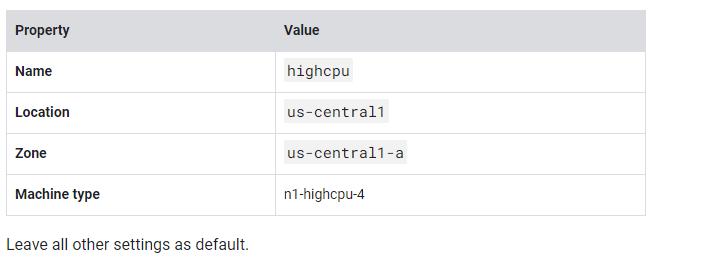

# <https§§§www.cloudskillsboost.google§course_sessions§3591643§labs§379269>

> [https://www.cloudskillsboost.google/course_sessions/3591643/labs/379269](https://www.cloudskillsboost.google/course_sessions/3591643/labs/379269)

# An Introduction to Cloud Composer 2.5

[Flexible, Easy Data Pipelines on Google Cloud with Cloud Composer (Cloud Next '18)](https://www.youtube.com/@googlecloudtech)

## Task 1. Ensure that the Kubernetes Engine API is successfully enabled

**Kubernetes Engine AP** enabled

## Task 2. Ensure that the Cloud Composer API is successfully enabled

**Cloud Composer API** enabled

## Task 3. Create Cloud Composer environment



### Create a Cloud Storage bucket

`Public access will be prevented`, click  **Confirm**

## Task 4. Airflow and core concepts

https://airflow.apache.org/

Use Airflow to author workflows as directed acyclic graphs (DAGs) of tasks. The airflow scheduler executes your tasks on an array of workers while following the specified dependencies.

### Core concepts

https://airflow.apache.org/docs/apache-airflow/stable/core-concepts/dags.html
A Directed Acyclic Graph is a collection of all the tasks you want to run, organized in a way that reflects their relationships and dependencies.

https://airflow.apache.org/docs/apache-airflow/stable/core-concepts/operators.htmlThe description of a single task, it is usually atomic. For example, the *BashOperator* is used to execute bash commands.

https://airflow.apache.org/docs/apache-airflow/stable/core-concepts/tasks.html
A parameterised instance of an Operator; a node in the DAG.

https://airflow.apache.org/docs/apache-airflow/stable/core-concepts/tasks.html

A specific run of a task; characterized as: a DAG, a Task, and a point in time. It has an indicative state:  *running* ,  *success* ,  *failed* ,  *skipped* , ...
https://airflow.apache.org/docs/apache-airflow/stable/core-concepts/index.html

## Task 5. Defining the workflow

DAGs are defined in standard Python files that are placed in Airflow's `DAG_FOLDER`

Airflow will execute the code in each file to dynamically build the `DAG` objects.

`hadoop_tutorial.py`

```py
"""Example Airflow DAG that creates a Cloud Dataproc cluster, runs the Hadoop
wordcount example, and deletes the cluster.
This DAG relies on three Airflow variables
https://airflow.apache.org/concepts.html#variables
* gcp_project - Google Cloud Project to use for the Cloud Dataproc cluster.
* gce_zone - Google Compute Engine zone where Cloud Dataproc cluster should be
  created.
* gcs_bucket - Google Cloud Storage bucket to used as output for the Hadoop jobs from Dataproc.
  See https://cloud.google.com/storage/docs/creating-buckets for creating a
  bucket.
"""
import datetime
import os
from airflow import models
from airflow.contrib.operators import dataproc_operator
from airflow.utils import trigger_rule
# Output file for Cloud Dataproc job.
output_file = os.path.join(
    models.Variable.get('gcs_bucket'), 'wordcount',
    datetime.datetime.now().strftime('%Y%m%d-%H%M%S')) + os.sep
# Path to Hadoop wordcount example available on every Dataproc cluster.
WORDCOUNT_JAR = (
    'file:///usr/lib/hadoop-mapreduce/hadoop-mapreduce-examples.jar'
)
# Arguments to pass to Cloud Dataproc job.
wordcount_args = ['wordcount', 'gs://pub/shakespeare/rose.txt', output_file]
yesterday = datetime.datetime.combine(
    datetime.datetime.today() - datetime.timedelta(1),
    datetime.datetime.min.time())
default_dag_args = {
    # Setting start date as yesterday starts the DAG immediately when it is
    # detected in the Cloud Storage bucket.
    'start_date': yesterday,
    # To email on failure or retry set 'email' arg to your email and enable
    # emailing here.
    'email_on_failure': False,
    'email_on_retry': False,
    # If a task fails, retry it once after waiting at least 5 minutes
    'retries': 1,
    'retry_delay': datetime.timedelta(minutes=5),
    'project_id': models.Variable.get('gcp_project')
}
with models.DAG(
        'composer_sample_quickstart',
        # Continue to run DAG once per day
        schedule_interval=datetime.timedelta(days=1),
        default_args=default_dag_args) as dag:
    # Create a Cloud Dataproc cluster.
    create_dataproc_cluster = dataproc_operator.DataprocClusterCreateOperator(
        task_id='create_dataproc_cluster',
        # Give the cluster a unique name by appending the date scheduled.
        # See https://airflow.apache.org/code.html#default-variables
        cluster_name='composer-hadoop-tutorial-cluster-{{ ds_nodash }}',
        num_workers=2,
        region='us-central1',
        zone=models.Variable.get('gce_zone'),
        image_version='2.0',
        master_machine_type='n1-standard-2',
        worker_machine_type='n1-standard-2')
    # Run the Hadoop wordcount example installed on the Cloud Dataproc cluster
    # master node.
    run_dataproc_hadoop = dataproc_operator.DataProcHadoopOperator(
        task_id='run_dataproc_hadoop',
        region='us-central1',
        main_jar=WORDCOUNT_JAR,
        cluster_name='composer-hadoop-tutorial-cluster-{{ ds_nodash }}',
        arguments=wordcount_args)
    # Delete Cloud Dataproc cluster.
    delete_dataproc_cluster = dataproc_operator.DataprocClusterDeleteOperator(
        task_id='delete_dataproc_cluster',
        region='us-central1',
        cluster_name='composer-hadoop-tutorial-cluster-{{ ds_nodash }}',
        # Setting trigger_rule to ALL_DONE causes the cluster to be deleted
        # even if the Dataproc job fails.
        trigger_rule=trigger_rule.TriggerRule.ALL_DONE)
    # Define DAG dependencies.
    create_dataproc_cluster >> run_dataproc_hadoop >> delete_dataproc_cluster
```

To orchestrate the three workflow tasks, the DAG imports the following operators: dataprocclustecreateop, dataprochadoopop and dataclusterdeleteop


> Because the `start_date` that is passed in to `default_dag_args` is set to `yesterday`, Cloud Composer schedules the workflow to start immediately after the DAG uploads.

## Task 6. Viewing environment information

On the **Environment configuration** tab you'll see information such as the Airflow web UI URL, GKE cluster, and a link to the DAGs folder, which is stored in your bucket.

## Task 7. Using the Airflow UI

env and airflow server

## Task 8. Setting Airflow

https://cloud.google.com/composer/docs/how-to/managing/environment-variablesvariables


## Task 9. Uploading the DAG to Cloud Storage

```bash
gcloud storage cp gs://cloud-training/datawarehousing/lab_assets/hadoop_tutorial.py <DAGs_folder_path>
```


