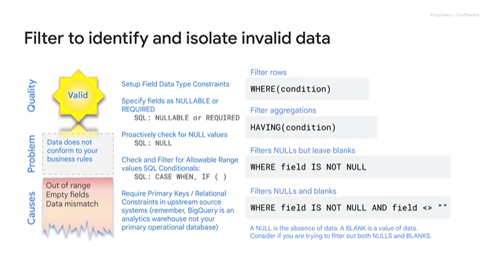

# <https§§§www.cloudskillsboost.google§course_sessions§3591643§video§379216>

> [https://www.cloudskillsboost.google/course_sessions/3591643/video/379216](https://www.cloudskillsboost.google/course_sessions/3591643/video/379216)

# Introduction to Building Batch Data Pipelines

## Module introduction 1 minute

batch pipline
process bounded amount of data and then exit
el = extratc and load
elt = transform on the fly
etl =  load in dwh
we look at el and elt pipelines in bq

## EL, ELT, ETL 3 minutes

el = data imported as is
elt = raw data into target and tranformed when it needed
etl = dataa integration process, T in intermediate layer

el only if data is clean and correct

elt = data is tranformed and we dont know too much how to use the data
so you can go back to raw data any time

## Quality considerations 2 minutes

transformation in bq to improve the quality

ideally all of 5 but rare

elt in bq helps on fixing data issues
in simple scenario using distinct count and viewq

## How to carry out operations in BigQuery 3 minutes

ex

duplicates handling
ex

cleanup data

test data with more high level check

handling null

union from other sources

use cast to be sure data is in valid format

## Shortcomings 3 minutes

elt can be not enough -> need of etl

ex

call external api not possible in sql

we can see dataflow data proc and datafusion
dataporc based on apache hadoop
datafusion simple ux for pipeline
dataflow beam based and template to deploy pipelines

you can store data in datalake for adv analytics

## ETL to solve data quality issues 7 minutes

solve data quality issues

if you use spark already

buld pipeline visually with data fusion

autoscale

and gcloud integration

visual pipeline build

flexible api and script defintion

> regardless we need to keep the lieneage

keep meatadat around for discovery and suitabiliyt

use datacatalog with labels

data catalog provide acl and search for data access

metadata as service

search catalogue for technical metadata and biz metada

integrate with `data loss api`

group dataset with tags

flag columns with sensitive metadata

datacatalog unified discovery in various dbs
