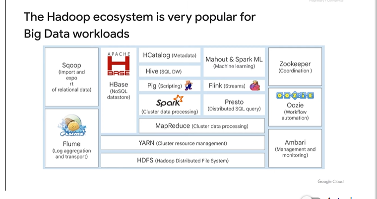
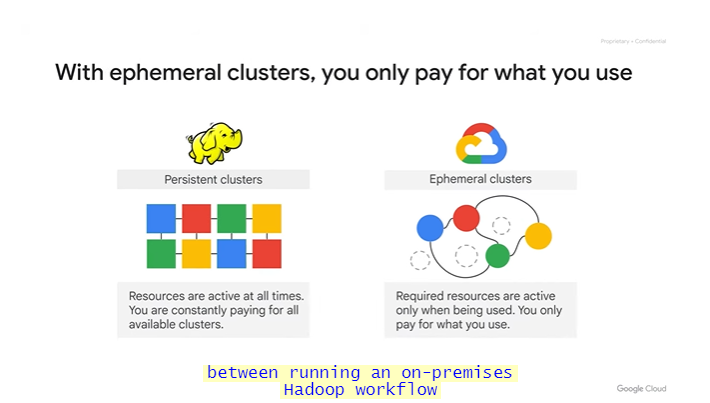
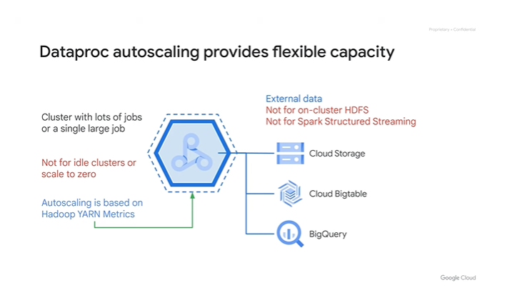

# <https§§§www.cloudskillsboost.google§course_sessions§3591643§video§379223>

> [https://www.cloudskillsboost.google/course_sessions/3591643/video/379223](https://www.cloudskillsboost.google/course_sessions/3591643/video/379223)

# [Building Batch Data Pipelines on Google Cloud] Executing Spark on Dataproc
## Module introduction 1 minute


apache spark and hadoop ecosystem
hadoop on dataproc
gcs and hdfs

## The Hadoop ecosystem 4 minutes

historical notes


stored data in the cluister
ecosystem for hadoop

on premise cluster
presto and spark used

spark is 100 faster than hadoop analytical engine

instead of hadoop cluster you can use dataproc


problem and limitation of hadoop on premise

dataproc is managed hadoop to run existing jobs and tools

managed hw and configuration, dataproc allocate the resources and autoscale

simplified with dataproc version

flexible job conf, in dataproc you focus on clsuter with multiple cluster<->jobs


spark uses available resources

in declarative programming the system handle the how, you say what you need

## Running Hadoop on Dataproc 10 minutes

how and why to run your hadoop/spark/pig code in dataproc


minute by minute billing

fast to start

reasazable clusters

open source ecosystem

integrated with gcloud //cloud monitoring

managed as ssas

img versioning of the tools

HA for job restart

developer tools // api ssh and skd

init action to customize the cluster

auto/manual conf for resources


ex


simple arch as on premise

primary nodes vm

use the same template to spin new vms and resize the cluster

dataproc is short lived cluster

use gcs instead of hdfs


```
hdfs:// -> gs://
```


cluster as single vm for dev

HA with 3 primary nodes

regional endpoints for lowe latency

replication is 2 by default

pre-emptable nodes for saving cost


job submission

you can createre restartable jobs that are idempotent


monitoring of the cluster

## Cloud Storage instead of HDFS 6 minutes

instead of hdfs, before data locality, now with petabyte not needed


block size are related to the actual hw

better having a separated solution


bisection


rate of 1 server from another part, petabyte => no need for local storage, used data from where it is located


colossus and jupyter //fs and network


bq released in 2010 by g


separation of computer and storage

clusters and ephemeral resources


use cloud storage what you need when you need


obj storage


use `distcp`

## Optimizing Dataproc 2 minutes

you can use autozone where to put the cluster

use same region for gcs

check funneled vpn to avoid bottlenecks

avoid 10k input files oth combine in larger files

`fs.gs.block.size`


how to size the number of vm needed compared the on premise cluster

## Optimizing Dataproc storage 9 minutes

some reasons to still use hdfs


in general


first reads from gcloud and last one

so you can separate storage and compute and reduce cost

use local non hdfs for shuffling


some advices

think about region and zones when planning


diff region calls can imply automatic copy of data in diff zones


some other option to store

big table - hbase comliant , low latency and scatter data handling

bq - dwh oriented data

think as shor lived small clsuter for spec jobs called **ephemeral model**


timer to delete the cluster



specialized ephemeral cluster

reduce cost and admin

cluster can be resized any time


decompose with job scoped clusters

use cloud storage

use acl

use eph cluster for the job lifetime


cluster life cycle


use case for persistent cluster

## Optimizing Dataproc templates and autoscaling 5 minutes

yaml file


gcloud and rest api

ex


startup script to install some extra'

use gcloud to create ąnew cluster, def the template to be used and vm details

add job to the cluster // spark job

submit the template as worflow template


save money with autoscale polcies

auto scale improvements:

2 min

polciy can be shared among clusters

cloud logging has info about scaling



set initial workers


after action cooldown period and then autoscaling evalutaion happen again to avoid nodes new and kill in the same moment

## Optimizing Dataproc monitoring 3 minutes


check history server and logs

yarn collect all logs in cloud logging

filter spark app using spark job ids

use labels and for dataproc jobs


dataproc runs on top of compute engine


log level


monitoring


## Lab Intro: Running Apache Spark jobs on Dataproc 1 minute

 


## Lab Running Apache Spark jobs on Cloud Dataproc 1 hour 30 minutes

[https://www.cloudskillsboost.google/course_sessions/3591643/labs/379232](https§§§www.cloudskillsboost.google§course_sessions§3591643§labs§379232/readme.md)


## Summary 1 minute


## Executing Spark on Dataproc


