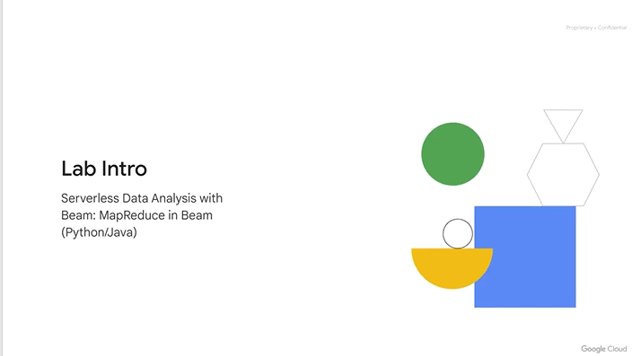
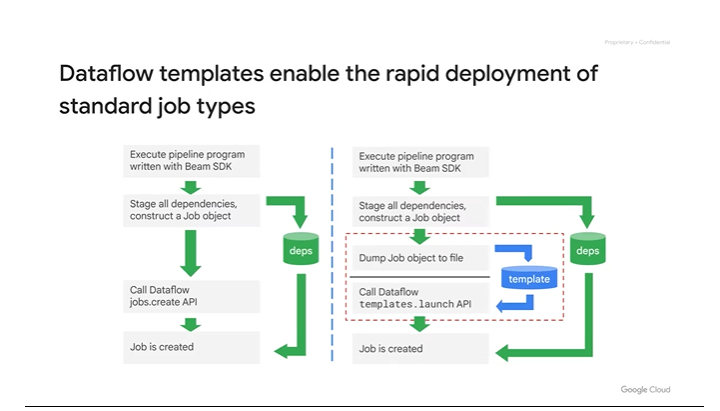

# <https§§§www.cloudskillsboost.google§course_sessions§3591643§video§379235>

> [https://www.cloudskillsboost.google/course_sessions/3591643/video/379235](https://www.cloudskillsboost.google/course_sessions/3591643/video/379235)

# Serverless Data Processing with Dataflow

until now we checked dataporc and batch, now we check batch dataflow pipelines

cover streaming pipeline later

## Module introduction 1 minute

dataflow is servless

dataflow allow to use same code for batch and streaming

> suggested way

learn dataflow and datproc and choose based on use cases

it is scalable

low latency, process data as it comes in

process batch and streaming in same api ...

data process as data comes in in micro batch

in beam it's unified

PTransform PCollection Pipeline runners and pipeline

PCollection is immutable and abstract

pipeleine changes ingest a pcol and create a new one

ptr handle input output and tranformation

data is passed from ptranf to another in the graph

pipeline runners are like containers

a pipline can be run on a computer, adata center or cloud

immutable datya is key diff betwenn batch and data processing

immutable data had no need sharing needed some sipler arch, it simplified distributed process

direct graph and called pipeline but better to called data flow graph

a pcollection represnt batch or streaming  data

no size limit to pcollection

streaming data is a unbounded pcollection

element in a pcollection are individually accessible and immutable

the pipliene and ptranform, runner handles the transfn on each element and distirubte the work

element represnts diff data types and stored in mem with related metadata

in pcollection data types are stored in serialized data so the network transer is easier

the data moves in a serialized state and de-serialize before the ptransf actions

## Introduction to Dataflow 5 minutes

dataflow runs beam

dataflow service choose how to run the pipeline

reads, traform and write out to the sinks

to opt dataflow service optimize the graph

jobs is broken into units and scheduled

resources are free at the end of the job

fault toleranze is automatic

no preemptive scheduling

serveless job handling to process the data

## Why customers value Dataflow 2 minutes

adv: fully mangaed and autoconfired, just deploy the pipeline, graph optimization, it does not wait a step to finish ebfore the next one, autoscale happens in the middle of the job when more resources are needed,

tasks queued are rebalanced to the idle machines when possible

dynamic work rabalancing avoid devops hunti downm hot keys

dataflow can handle late arrival records

glue other service like bigtable or bq or read from pubsub and save in cloudsql...

## Building Dataflow pipelines in code 3 minutes

ex of pipeline, 3 ptranform to have an ooutput pcoll

syntax in python

pipe operator applies the ptransf to the pcollections and output to a new pcoll

in java use of apply()

branching to both ptransform 1 and 2 and store in 2 new pcollections

a more complite example, we have a source where the data in pcollection comes from a sink

ptransh faltmap does apply a func to each row of the input and concatenates all the oputput, retuens 0 or more lelevance going to the output pcollection, the functions is called count_words with biz logic, the output is a set of integer and written in a atext file in cloud storage

using a with clause being the a batch process the pipeline is automatically terminated when done

program execute with defualt runner // local to the machine

pass a aset of options is the runner to tun local or on the gcloud

use of cmd line parameters to switch local and cloud

## Key considerations with designing pipelines 2

in  apcollection we have eleemnts

input and output of the pipline

setup the pipeline with bea.pipeline(options)

get data as input

use readfromtest to read from a bucket

read from pub/sub and parse the topic name

read from bq

write to sinks to bq

establish ref to bq table and details

use beam.writetobq to write

we truncate data for each load

in mem for small data set for lookup data

## Transforming data with PTransforms 3 minutes

now data is in we need ptranform

map phase to do something in parallel

use generator to preserve the seed of the func, so the next is called it can continue where it left off

faltmap iterate over 1 to many

map ex returns (key,value) pair

flatmap ex yields the line only for lines containing the search term

pardo to consider each eleemnt in a pcollection and output to a new collection or discrd it

use pardo to perform conversion of elemtns, simple or complex on elements and output the result as new pcoll

code is as DoFn way and it's a beam class

the dofn function needs to be

- fully seriazilble
- idemptonemt
- code safe

as they work in ditributed env and parallell

## Lab Intro: Building a Simple Dataflow Pipeline 1 minute

## A Simple Dataflow Pipeline (Python) 2.5 1 hour 30 minutes

https://www.cloudskillsboost.google/course_sessions/3591643/labs/379242

## ~Serverless Data Analysis with Dataflow: A Simple Dataflow Pipeline (Java) 1 hour 30 minutes~

## Aggregate with GroupByKey and Combine 5 minutes

after map shuffle phase

group by common keys and return the aggregated values

be aware of data skew ex 1 key with millions of items, then all the elements related go to the same worker group

x will tyake for ever compared to y

y is idle

dataflow is designed to avoid eff like this

def aggregtion steps in dataflow

cogorupbykey

now move to the reduce phase

when you apply combine ptrandform provide a func()  with logic

we have pre-built ones like sum miin and max

more copmplex case use subclass of a combine function

combining func might called multiople times so it needs to have some properties

provide 4 op with override

Combine is orders of magnitude faster than GroupByKey because Dataflow knows how to parallelize a combine step

dataflow uses one worker per key at max

combine by key agggregate and then processed, less data goes on the networker

func must be commutative and associative

flatten like union in sql for obj with same data type

merge pcollection into a bigger one

split a pcollection in smaller pcollection

ex calculate perc and quartile and the top quartile has different processing than all the others

## Lab Intro: MapReduce in Beam1 minute

map/reduce on pcolection

## MapReduce in Beam (Python) 2.5 1 hour 30 minutes

https://www.cloudskillsboost.google/course_sessions/3591643/labs/379246

## ~Serverless Data Analysis with Beam: MapReduce in Beam (Java) 1 hour 30 minutes~

## Side inputs and windows of data 4 minutes

side inputs and windows goes with pcollection input

a side input is additional input that pardo func can access when processing element in the input pcollection

view of some other data that can be read to enrich the elements

inject additional data when processing each element in the input pcollection

additional data needs to def at runtime

ex

words run in map to get lenght

combined globally for total lengh across all the data

figure out the avg lenght of words and feed back in that method to create a view and aviabled to workder nodes as side input

additional capabilites

many ptranfo have 2 parts

ex arith mean with its accumulation step, after we processed all the elements we have the total and the count , the last part is just to divide

in case of unbounded dataset there is no ending, so we need some windowing

global window is by default

streaming pipelines use time based windows for processing data in streaming

for batch we can def some time stamped values

subsequ op can be computed on windows instead of globally

ex sliding windows 60 sec of data and starts a new one each 30 sec

you can do this streaming shit in bactch 📦

## Lab Intro: Practicing Pipeline Side Inputs 1 minute

## Serverless Data Analysis with Dataflow: Side Inputs (Python) 1 hour 30 minutes

https://www.cloudskillsboost.google/course_sessions/3591643/labs/379250

## ~Serverless Data Analysis with Dataflow: Side Inputs (Java) 1 hour 30 minutes~

## Creating and re-using pipeline templates 3 minutes

create templates for the team

rapid deployment of std pipeline

traditional flow

dev and user need to be the same

with template

user no need of dev

batch job submission by users

submit using api or cmd line

google provided template

you can create your own template

run time and compile time params

add value provider interface

java sample

transform what usr submit on what you need

metaata file is used for that

> underscore metadata suffix to the name.

## Summary 2 minutes

dataflow for new pipeline of rewrite old spark code

## QUIZ Serverless Data Processing with Dataflow

 
