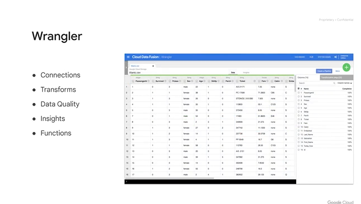
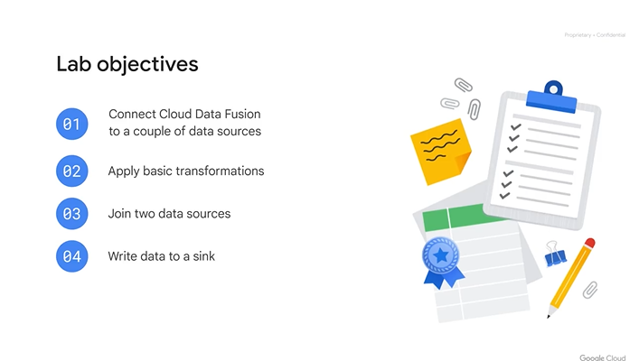
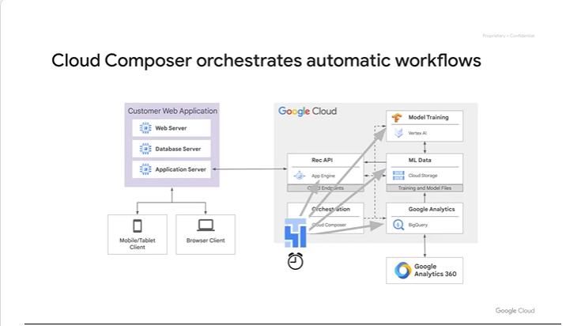
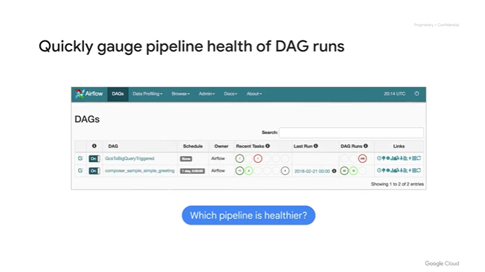

# <https§§§www.cloudskillsboost.google§course_sessions§3591643§video§379255>

> [https://www.cloudskillsboost.google/course_sessions/3591643/video/379255](https://www.cloudskillsboost.google/course_sessions/3591643/video/379255)

# Module introduction

we will discuss how to manage data pipelines with Cloud Data Fusion and Cloud Composer
cdf to build datap and use composer to orchestarte work


## Introduction to Cloud Data Fusion 3 minutes


ux based

no code tools for datapip


diff users


connectors

less complex

interoperability with opne soruce software


use templates and connectors and lib of tranforamtion

test and debug the pipeline


use of unified serach func

track of lienage of transformation


## Components of Cloud Data Fusion 1 minute


warngler and data pipeline


create and share datac dictionary between the 2


eca to parse events

## Cloud Data Fusion UI 1 minute

high level look to UX


home


mutiple pipelines


dev studio



wrangler


tag properties and lineage


hub for sample


admin for mng of services and conf for namespace etc

## Build a pipeline 4 minutes


flow from one direction to another

they cannot feed themself

each stage is a node


you can multiple nodes forking out from a parent


studio is where you have a canvas

minimap to navigate


all the elements

you can use templates


preview mode before deploy, see sample data from each node


click on node add details about it

ex use of speech text api


run pipeline on schedule

designe for bacth data pipelines


lineage tracked

## Explore data using wrangler 1 minute


wrangler used to explore the dataset

useful before building the actual pipeline

new dataset can be explored with the wrangler

ux

- left connection to dataset
- add new connection to datasources
- live browsing in the connection
- rx ex on bucket


explor row and columns

calculated field and filter and wrangle the data as recipe

## Lab Intro: Building and executing a pipeline graph in Cloud Data Fusion 1 minute



## Building and Executing a Pipeline Graph with Data Fusion 2.5 2 hours 30 minutes

[https://www.cloudskillsboost.google/course_sessions/3591643/labs/379262](https§§§www.cloudskillsboost.google§course_sessions§3591643§labs§379262/readme.md)

## Orchestrate work between Google Cloud services with Cloud Composer 1 minute



control services with orch engine

ssas based on airflow


4 tasks to manage ml pipeline

## Apache Airflow environment 1 minute


home


dags folder

bucket with dags file

## DAGs and Operators 7 minutes


dag and operators

workflow are written in py


upload the file and under dags is representd visually as a dag with nodes and edges

wofloflow is called gsctobqtriggered and it ahs 3 taks

each task invokes something


we have success and failure handling

nodes are executed based on the parent outcome


uses 2 operators


airflow has many opearote to impl a task

a task usually is atomic and self contained


more common op for gcp data eng


ml op


open source an multi cloud


4 tasks

and 4 op


the bqop needs some params like the query


filters on the sql are parameters using `{ ... }`


params can be dynamic too based on the airflow vars


ml related


usually the op execution order is defined at the end

## Workflow scheduling 5 minutes


schedule your workflow or trigger based


schedule can be defined


cf to trigger


regualr schedule route


event trigger and then it kicks off


push pull arch


csv in gcs so we choose evnt trigger and bucket to watch


most of this code is all bolier plate to copy from


```
 Here, we specify a name for our function called Trigger DAG, then we tell it where your airflow environment is to be triggered
and which DAG in that airflow environment. In this case, it's looking for one called GCS to BigQuery triggered. Keep in mind, you can have multiple workflows or DAGs in a single airflow environment,
so be sure you specify the correct DAG underscore name to trigger. Then we have a few constants that we are provided, which construct the airflow URL that we're going to trigger a post request to,
as well as who's making the request and what the body of the request is. Lastly, the Trigger DAG function makes the actual request against the airflow server to kick off a workflow DAG
```


index.js and package.json and trigger dag and dunc is capitale seinsitive


the func is watching for the bucket

## Monitoring and Logging 3 minutes


monitor and trouble shoot

check historical

we can have auto retry



some reds -> issues


1st is fine but 2nd is failing


check logs


or cloud logs as well


when using cf check gcloud logs

## Lab Intro: An Introduction to Cloud Composer 1 minute


## An Introduction to Cloud Composer 2.5 1 hour 30 minutes

[https://www.cloudskillsboost.google/course_sessions/3591643/labs/379269](https§§§www.cloudskillsboost.google§course_sessions§3591643§labs§379269/readme.md)

## QUIZ Manage Data Pipelines with Cloud Data Fusion and Cloud Composer
