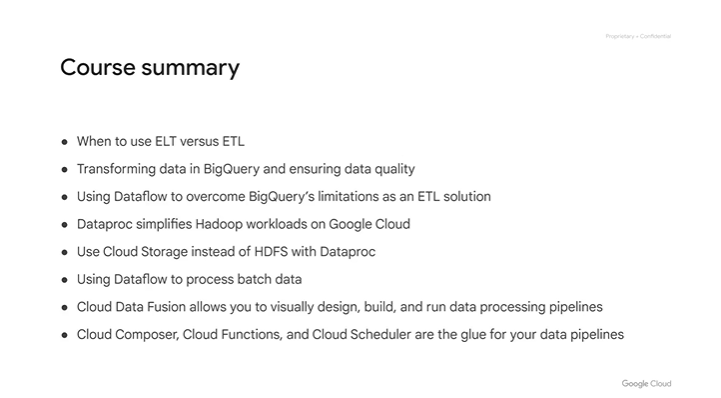
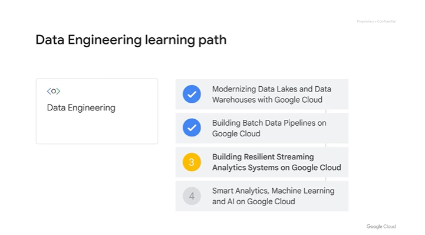

# <https§§§www.cloudskillsboost.google§course_sessions§3591643§video§379271>

> [https://www.cloudskillsboost.google/course_sessions/3591643/video/379271](https://www.cloudskillsboost.google/course_sessions/3591643/video/379271)

# [Building Batch Data Pipelines on Google Cloud].Course Summary



```
person: You've made it to the end of this course on building batch data pipelines. Let's recap what you've learned. In this course, we covered the different methods of loading data into your data lakes and warehouses.
Remember ELT versus ETL and when to use each. ELT of extract, load, transform is a common pattern for when the transformations you want on the data set are minor
and then can be handled after you load the data. An example is loading the data into BigQuery first and then doing SQL on the raw data and storing the transformed version as a new table.
On the other hand, ETL, or transforming before loading, is common when you have data that needs more complex transformations, where the sheer volume of data makes it better to do those transformations before loading.
That's where you would want to use a batch pipeline like Dataflow. Next, we discussed how to transform data in BigQuery using SQL, and you saw the common operations you can perform
to ensure your structured data is ready for insights. Lastly, you practiced building batch pipelines in the serverless way with Dataflow. In our Hadoop module, we discussed dataproc in detail.
You learned that you can lift and shift your existing Hadoop workloads to the cloud with no code changes, and they will just work. However, once in the cloud, there were additional optimizations you could make,
like using cloud storage for cluster storage instead of HDFS for greater efficiency and cost savings. We then used Dataflow to build batch data pipelines using Dataflow templates and by writing them ourselves.
Recall that the fundamental unit of logical data in the pipeline is the PCollection, which stands for a parallel collection. Dataflow will automatically split up your data set into many pieces and farm out the processing
across as many worker VMs as it needs to complete the job. Dataflow is a serverless application, which means you will have some control over the maximum number of workers, the actual processing work
and the autoscaling of workers up and down as the demand requires. In our module on managing data pipelines with Google Cloud, we discussed two new tools: Cloud Data Fusion and Cloud Composer.
Recall that Cloud Data Fusion allows data analysts and ETL developers to wrangle data and build pipelines in a visual way. The technology then builds and executes the pipelines on a runner.
With Cloud Data Fusion, you also get access to the lineage of each data field, which is the series of any transformation logic that happened before and after the field reaches your data set.
The second tool we covered is Cloud Composer as a workflow orchestrator. Cloud Composer is managed Apache Airflow and allows you to, at a high level, command Google Cloud services in a DAG to perform complex operations.
These DAGs can be user scheduled or event driven with cloud functions. Recall the example where when a new CSV was uploaded to our cloud storage bucket, a cloud function was triggered to start a Dataflow pipeline for processing
and then sync the data into BigQuery. Congratulations on completing building batch data pipelines on Google Cloud. Building resilient streaming analytics systems on Google Cloud is the third course of the data engineering on Google Cloud core series
and is covered next. We hope to see you there.
```



