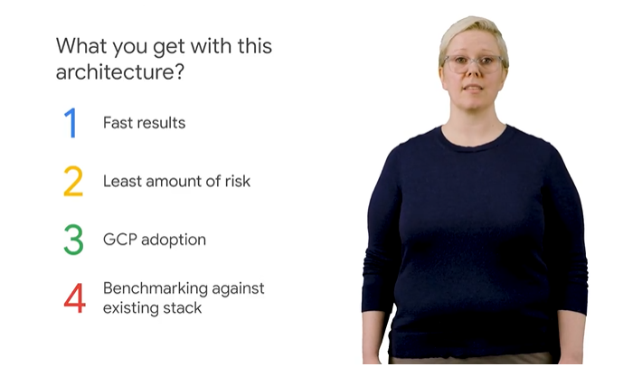
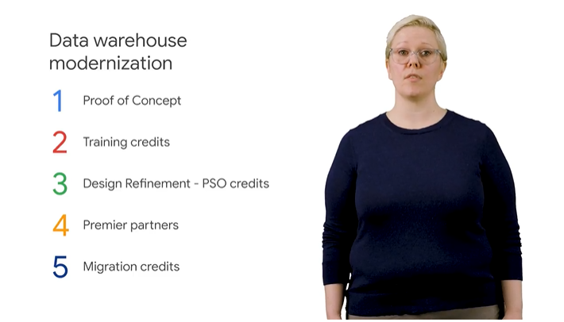

# <https§§§www.cloudskillsboost.google§course_sessions§3605921§video§337129>

> [https://www.cloudskillsboost.google/course_sessions/3605921/video/337129](https://www.cloudskillsboost.google/course_sessions/3605921/video/337129)

# Data Warehouse Solutions on Google Cloud

## Introduction 1 minute

dwh tool in gcloud

end to end dwh solution

identify the feature and insight

tech resource

use the test env

## Implement Big Data Solutions on Google Cloud 3 minutes

impl of big data of gcloud of petabyes

dwh is the repository - bq in gcp

dwh have datamarts as smaller repo to simplify

in bq dataset can be seen as datamarts

data can raw

datalake has raw data as files or bigtable transaction

we can def federated queries on them

traditional dwh are hard to op

bq is modern dwh

bq can

- create read only view of data
- make result accessible via looker, google sheets
- foundation of ml/ai
- analyhze evnt in real time
- ingest up to 100k rows at second and pb fast query
- use of iam for access control

## Customer Needs 6 minutes

what they need

resonable expections

what vallue dwh add to the customer and insights but they can t, feature they want when they move to the cloud

for on premiSE check curr impl

tool used for current analytics

use cases

- corporate reports
- get valuable insight

usually they just do

platorm need to reliable

more tools these days for complex questions

predictive analysis is the end goal

data on reliable

fast data access

poweful tool for analysis with scalability

dwh scehma def how data is related and structured

schema is core of the design

pre-existing schema needs to be update thinking of bq

bq and teradata ansi sql

bq does not support propetaty td sql, so some queires need to be refactored

governance using iam and uth views can be useful

use of datap from operation sources

migration of existing etl

bi solution for reporting and analysis in combination with bq

migrate existing bi solution to bq

even small jobs will run fine in bq or cehck the optimization guide

## Sample Architectures 1 minute

just a sample

op datasource feeding moden dwh

combination of pub/sub and dataflow

more complex using federated query

## Migration Strategies and Planning 8 minutes

key questions

- why migrating to gcloud, think the resource and how to apply, dont architect yet
- doc for migration, where to start
- def end state and scope of migration

in the past we have op stores and dwh for the 3V (velocity, variaty and volume)

history

on gcloud dwh can have the 3v

answers:

focus on data not to infra, to save time

more time for core biz

and roll out new idea

think of bq transfer service

fast access to new results

on premise still there

gcp adoption to styart with

easy to compare both

ideally on-premise will be decommissioned

bq pricing and cost

flat rate on fixed rate of slot

slot is a resource

coast calculator

extra tool - not GA yet

## Working with PSO 2 minutes

gcloud helps partners ;)

for poc etc

## ~Demo: Qwiklabs and the Google Cloud Platform 7 minutes~

## LAB Tour Qwiklabs and Google Cloud [PWDW] 1 hour 30 minutes

## Summary 1 minute
