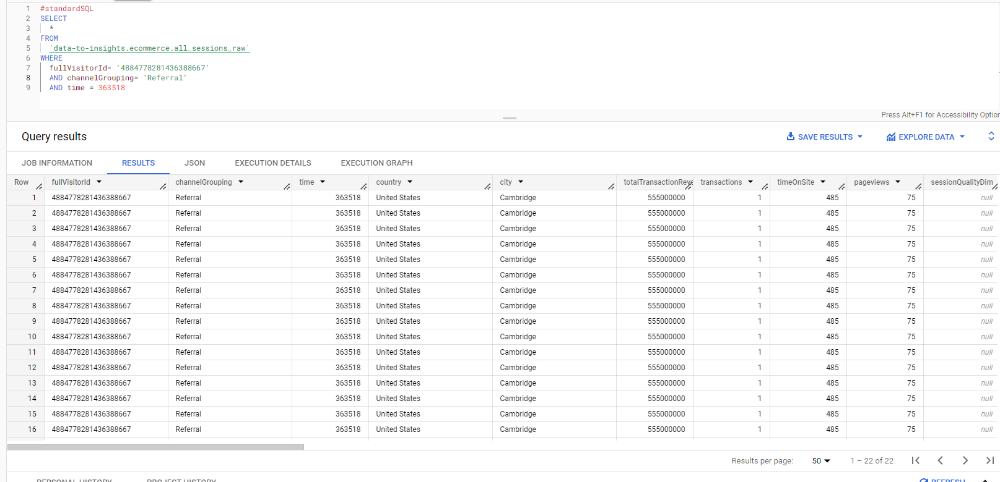

# <https§§§www.cloudskillsboost.google§course_sessions§3631336§labs§376367>

> [https://www.cloudskillsboost.google/course_sessions/3631336/labs/376367](https://www.cloudskillsboost.google/course_sessions/3631336/labs/376367)

# Overview

[https://www.en.advertisercommunity.com/t5/Articles/Introducing-the-Google-Analytics-Sample-Dataset-for-BigQuery/ba-p/1676331#](https§§§www.en.advertisercommunity.com§t5§Articles§Introducing-the-Google-Analytics-Sample-Dataset-for-BigQuery§ba-p§1676331#/readme.md)

[https://cloud.google.com/bigquery/docs/reference/standard-sql/query-syntax](https§§§cloud.google.com§bigquery§docs§reference§standard-sql§query-syntax/readme.md)


## Task 1. Star the lab project in BigQuery


metadata


### Identify duplicate rows

```sql
#standardSQL
SELECT COUNT(*) as num_duplicate_rows, * FROM
`data-to-insights.ecommerce.all_sessions_raw`
GROUP BY
fullVisitorId, channelGrouping, time, country, city, totalTransactionRevenue, transactions, timeOnSite, pageviews, sessionQualityDim, date, visitId, type, productRefundAmount, productQuantity, productPrice, productRevenue, productSKU, v2ProductName, v2ProductCategory, productVariant, currencyCode, itemQuantity, itemRevenue, transactionRevenue, transactionId, pageTitle, searchKeyword, pagePathLevel1, eCommerceAction_type, eCommerceAction_step, eCommerceAction_option
HAVING num_duplicate_rows > 1;
```


or in general

```sql
#standardSQL
SELECT COUNT(*) as num_duplicate_rows, fullVisitorId, channelGrouping, time, country, city, totalTransactionRevenue, transactions, timeOnSite, pageviews, sessionQualityDim, date, visitId, type, productRefundAmount, productQuantity, productPrice, productRevenue, productSKU, v2ProductName, v2ProductCategory, productVariant, currencyCode, itemQuantity, itemRevenue, transactionRevenue, transactionId, pageTitle, searchKeyword, pagePathLevel1, eCommerceAction_type, eCommerceAction_step, eCommerceAction_option FROM
`data-to-insights.ecommerce.all_sessions_raw`
GROUP BY
fullVisitorId, channelGrouping, time, country, city, totalTransactionRevenue, transactions, timeOnSite, pageviews, sessionQualityDim, date, visitId, type, productRefundAmount, productQuantity, productPrice, productRevenue, productSKU, v2ProductName, v2ProductCategory, productVariant, currencyCode, itemQuantity, itemRevenue, transactionRevenue, transactionId, pageTitle, searchKeyword, pagePathLevel1, eCommerceAction_type, eCommerceAction_step, eCommerceAction_option
order by num_duplicate_rows desc, fullVisitorId, channelGrouping, time, country, city, totalTransactionRevenue, transactions, timeOnSite, pageviews, sessionQualityDim, date, visitId, type, productRefundAmount, productQuantity, productPrice, productRevenue, productSKU, v2ProductName, v2ProductCategory, productVariant, currencyCode, itemQuantity, itemRevenue, transactionRevenue, transactionId, pageTitle, searchKeyword, pagePathLevel1, eCommerceAction_type, eCommerceAction_step, eCommerceAction_option
-- HAVING num_duplicate_rows > 1;
```

in fact


### Analyze the new all_sessions table

```sql
#standardSQL
# schema: https://support.google.com/analytics/answer/3437719?hl=en
SELECT
fullVisitorId, # the unique visitor ID
visitId, # a visitor can have multiple visits
date, # session date stored as string YYYYMMDD
time, # time of the individual site hit  (can be 0 to many per visitor session)
v2ProductName, # not unique since a product can have variants like Color
productSKU, # unique for each product
type, # a visitor can visit Pages and/or can trigger Events (even at the same time)
eCommerceAction_type, # maps to ‘add to cart', ‘completed checkout'
eCommerceAction_step,
eCommerceAction_option,
  transactionRevenue, # revenue of the order
  transactionId, # unique identifier for revenue bearing transaction
COUNT(*) as row_count
FROM
`data-to-insights.ecommerce.all_sessions`
GROUP BY 1,2,3 ,4, 5, 6, 7, 8, 9, 10,11,12
HAVING row_count > 1 # find duplicates
```

## Task 3. Write basic SQL on ecommerce data

### Write a query that shows total unique visitors

Your query determines the total views by counting `product_views` and the number of unique visitors by counting `fullVisitorID`.

```sql
#standardSQL
SELECT
  COUNT(*) AS product_views,
  COUNT(DISTINCT fullVisitorId) AS unique_visitors
FROM `data-to-insights.ecommerce.all_sessions`;
```

Now write a query that shows total unique visitors(`fullVisitorID`) by the referring site (`channelGrouping`):

```sql
#standardSQL
SELECT
  COUNT(DISTINCT fullVisitorId) AS unique_visitors,
  channelGrouping
FROM `data-to-insights.ecommerce.all_sessions`
GROUP BY channelGrouping
ORDER BY channelGrouping DESC;
```

Write a query to list all the unique product names (`v2ProductName`) alphabetically:

> :tip use group by  for uniq

Write a query to list the five products with the most views (`product_views`) from all visitors (include people who have viewed the same product more than once). Your query counts number of times a product (`v2ProductName`) was viewed (`product_views`), puts the list in descending order, and lists the top 5 entries

```sql
#standardSQL
SELECT
  COUNT(*) AS product_views,
  (v2ProductName) AS ProductName
FROM `data-to-insights.ecommerce.all_sessions`
WHERE type = 'PAGE'
GROUP BY v2ProductName
ORDER BY product_views DESC
LIMIT 5;
```

Refine the query to no longer double-count product views for visitors who have viewed a product many times. Each distinct product view should only count once per visitor.

```sql
WITH unique_product_views_by_person AS (
-- find each unique product viewed by each visitor
SELECT
 fullVisitorId,
 (v2ProductName) AS ProductName
FROM `data-to-insights.ecommerce.all_sessions`
WHERE type = 'PAGE'
GROUP BY fullVisitorId, v2ProductName )
-- aggregate the top viewed products and sort them
SELECT
  COUNT(*) AS unique_view_count,
  ProductName
FROM unique_product_views_by_person
GROUP BY ProductName
ORDER BY unique_view_count DESC
LIMIT 5
```

:tip You can use the SQL `WITH` clause to help break apart a complex query into multiple steps

expand your previous query to include the total number of distinct products ordered and the total number of total units ordered (`productQuantity`)

```sql
#standardSQL
SELECT
  COUNT(*) AS product_views,
  COUNT(productQuantity) AS orders,
  SUM(productQuantity) AS quantity_product_ordered,
  v2ProductName
FROM `data-to-insights.ecommerce.all_sessions`
WHERE type = 'PAGE'
GROUP BY v2ProductName
ORDER BY product_views DESC
LIMIT 5;
```


Expand the query to include the average amount of product per order (total number of units ordered/total number of orders, or `SUM(productQuantity)`/`COUNT(productQuantity)`

## Task 4. Practice with SQL

### Challenge 1: Calculate a conversion rate

```sql
#standardSQL
SELECT
  COUNT(*) AS product_views,
  COUNT(productQuantity) AS potential_orders,
  SUM(productQuantity) AS quantity_product_added,
  (COUNT(productQuantity) / COUNT(*)) AS conversion_rate,
  v2ProductName
FROM `data-to-insights.ecommerce.all_sessions`
WHERE LOWER(v2ProductName) NOT LIKE '%frisbee%'
GROUP BY v2ProductName
HAVING quantity_product_added > 1000
ORDER BY conversion_rate DESC
LIMIT 10;
```

### Challenge 2: Track visitor checkout progress

```sql
#standardSQL
SELECT
  COUNT(DISTINCT fullVisitorId) AS number_of_unique_visitors,
  eCommerceAction_type,
  CASE eCommerceAction_type
  WHEN '0' THEN 'Unknown'
  WHEN '1' THEN 'Click through of product lists'
  WHEN '2' THEN 'Product detail views'
  WHEN '3' THEN 'Add product(s) to cart'
  WHEN '4' THEN 'Remove product(s) from cart'
  WHEN '5' THEN 'Check out'
  WHEN '6' THEN 'Completed purchase'
  WHEN '7' THEN 'Refund of purchase'
  WHEN '8' THEN 'Checkout options'
  ELSE 'ERROR'
  END AS eCommerceAction_type_label
FROM `data-to-insights.ecommerce.all_sessions`
GROUP BY eCommerceAction_type
ORDER BY eCommerceAction_type;
```


### Challenge 3: Track abandoned carts from high quality sessions

```sql
#standardSQL
# high quality abandoned carts
SELECT  
  #unique_session_id
  CONCAT(fullVisitorId,CAST(visitId AS STRING)) AS unique_session_id,
  sessionQualityDim,
  SUM(productRevenue) AS transaction_revenue,
  MAX(eCommerceAction_type) AS checkout_progress
FROM `data-to-insights.ecommerce.all_sessions`
WHERE sessionQualityDim > 60 # high quality session
GROUP BY unique_session_id, sessionQualityDim
HAVING
  checkout_progress = '3' # 3 = added to cart
  AND (transaction_revenue = 0 OR transaction_revenue IS NULL)
```
