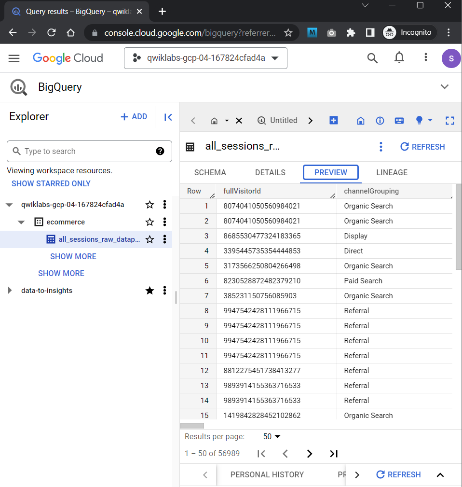
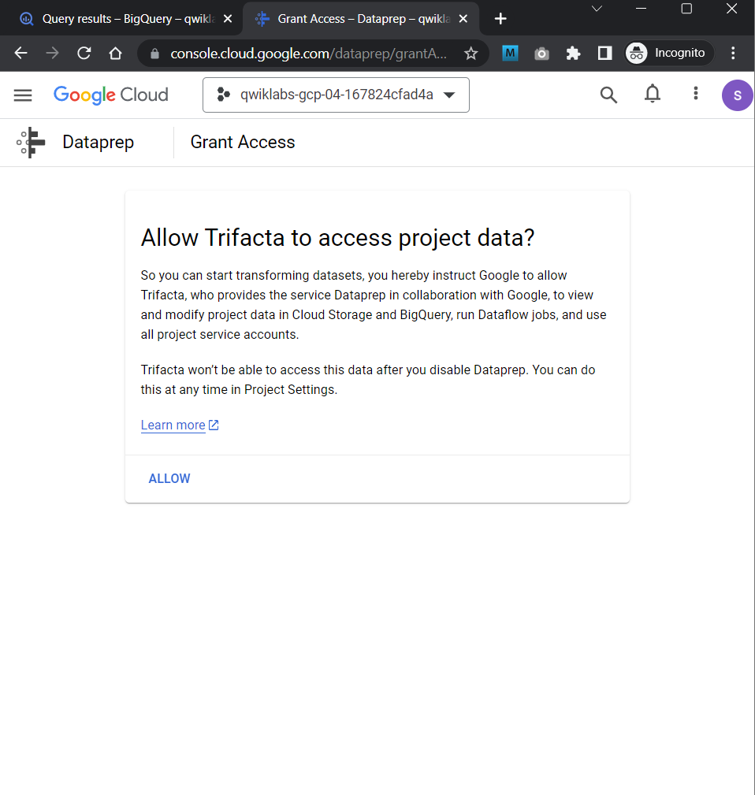
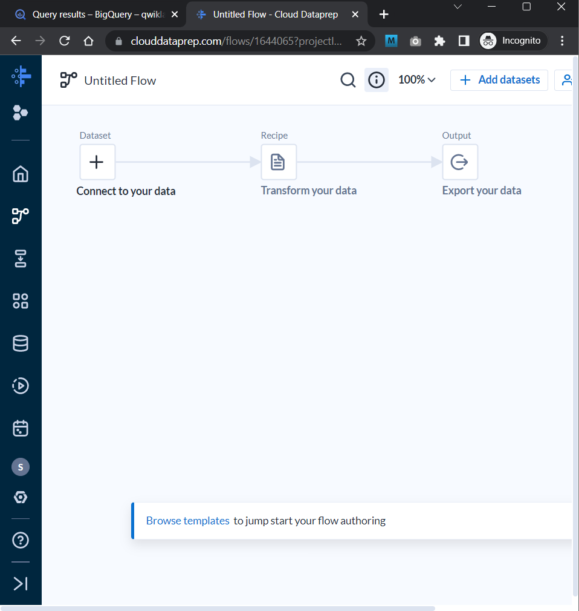
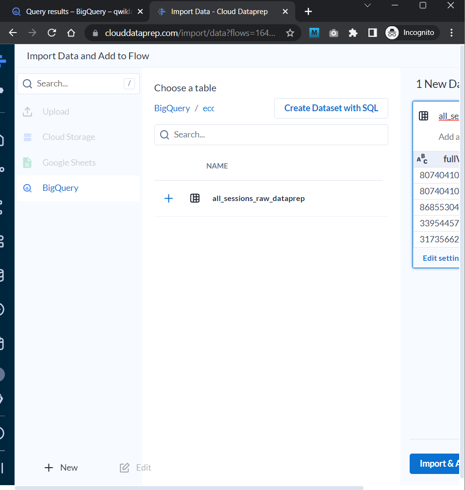
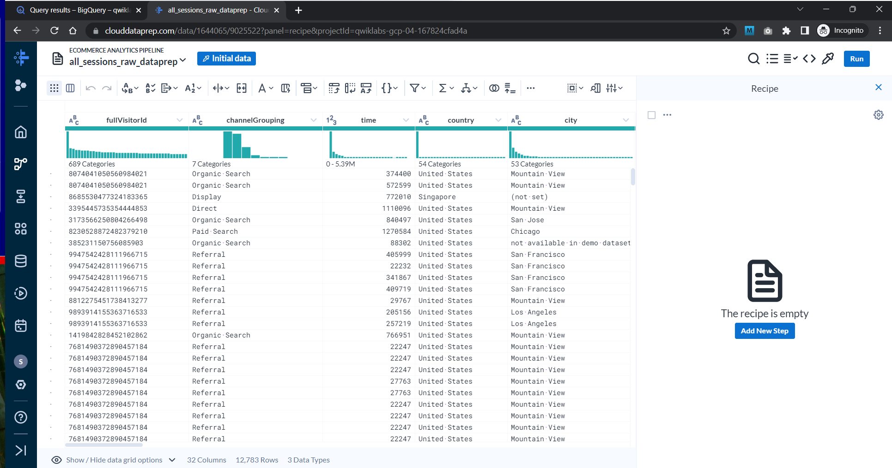

###### <https§§§www.cloudskillsboost.google§course_sessions§3631336§labs§376387>

> [https://www.cloudskillsboost.google/course_sessions/3631336/labs/376387](https://www.cloudskillsboost.google/course_sessions/3631336/labs/376387)

# Exploring and Creating an Ecommerce Analytics Pipeline with Cloud Dataprep v1.5

## Task 1. Create an empty BigQuery dataset

```sql
#standardSQL
CREATE OR REPLACE TABLE
  ecommerce.all_sessions_raw_dataprep OPTIONS( description="Raw data from analyst team to ingest into Cloud Dataprep" ) AS
SELECT
  *
FROM
  `data-to-insights.ecommerce.all_sessions_raw`
WHERE
  date = '20170801'; # limiting to one day of data 56k rows for this lab
```



## Task 2. Open Cloud Dataprep



## Task 3. Connect BigQuery data to Cloud Dataprep

1. Click  **Create a new flow** .



import and add to flow



## Task 4. Explore ecommerce data fields with a UI


