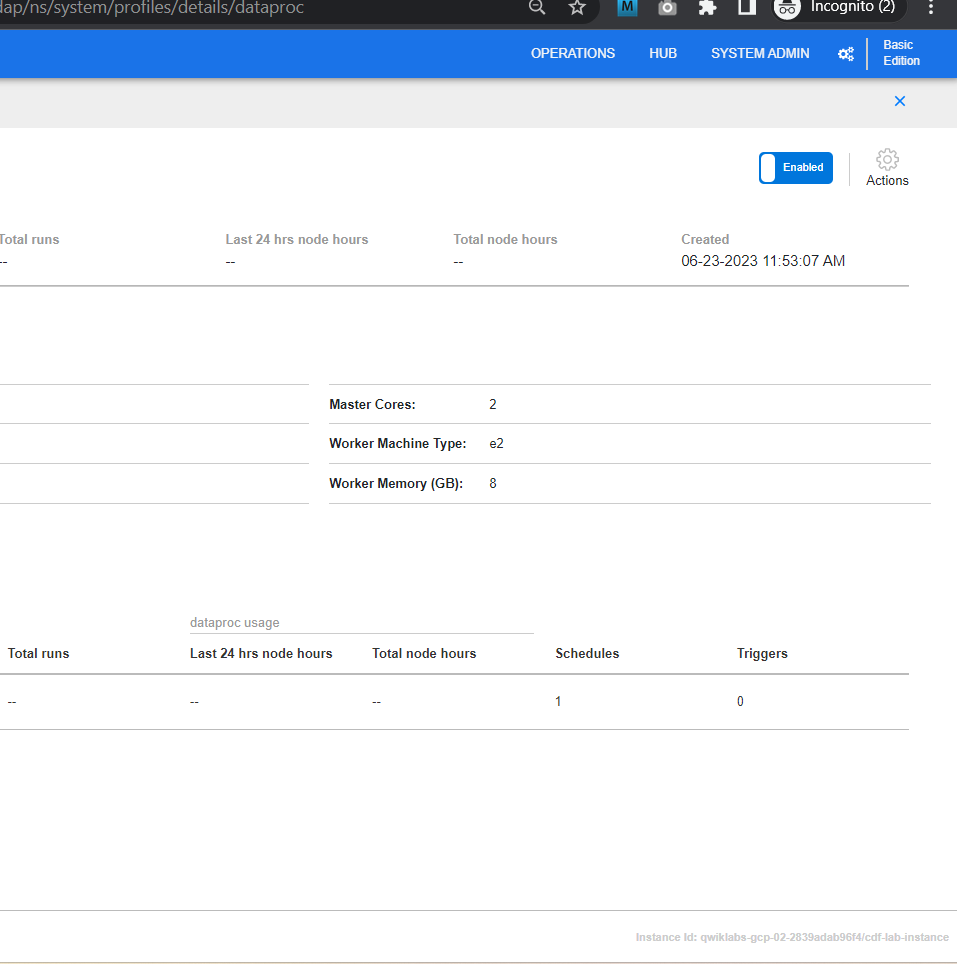

# <https§§§www.cloudskillsboost.google§course_sessions§3631336§labs§376391>

> [https://www.cloudskillsboost.google/course_sessions/3631336/labs/376391](https://www.cloudskillsboost.google/course_sessions/3631336/labs/376391)

# Building Transformations and Preparing Data with Wrangler in Cloud Data Fusion

## Task 1. Add necessary permissions for your Cloud Data Fusion instance


from instance info

Service Account cloud-datafusion-management-sa@.iam.gserviceaccount.com


```bash
gcloud iam service-accounts create cloud-datafusion-management-sa  --display-name="cloud-datafusion-management-sa@e447ef94f678706e9-tp.iam.gserviceaccount.com"
```


projectnumber

201799689269
use it

`service-201799689269@gcp-sa-datafusion.iam.gserviceaccount.com`


service-201799689269@gcp-sa-datafusion.iam.gserviceaccount.com


service-201799689269@gcp-sa-datafusion.iam.gserviceaccount.com

add


## Task 2. Load the data

copy some data

```bash
export BUCKET=$GOOGLE_CLOUD_PROJECT
gcloud storage buckets create gs://$BUCKET
gcloud storage cp gs://cloud-training/OCBL163/titanic.csv gs://$BUCKET
```

## Task 3. Navigate the Cloud Data Fusion UI


## Task 4. Working with Wrangler

import titanic


**Note:** To apply transformations, you can also use the command line interface (CLI). The CLI is the black bar at the bottom of the screen (with the green **$** prompt). As you start typing commands the autofill feature kicks in and presents you with a matching option. For example, to drop the body column, you could have alternatively used the directive:  **drop: body** .


insights


## Task 5. Working with Transformation Steps

```mermaidfill-null-or-empty
send-to-error empty(Age)
parse-as-csv :Name ',' false
drop Name
fill-null-or-empty :Name_2 'none'
rename Name_1 Last_Name
rename Name_2 First_Name
set-type :PassengerId integer
parse-as-csv :First_Name '.' false
drop First_Name
drop First_Name_3
rename First_Name_1 Salutation
fill-null-or-empty :First_Name_2 'none'
rename First_Name_2 First_Name
send-to-error !dq:isNumber(Age) || !dq:isInteger(Age) || (Age == 0  || Age > 125)
set-type :Age integer
set-type :Fare double
set-column Today_Fare (Fare * 23.4058)+1
generate-uuid id
mask-shuffle First_Name
```

top  right

more -> view schema


## Task 6. Ingestion into BigQuery


deploy


run


it kicks dataproc



dataproc jobs


