# <https§§§www.cloudskillsboost.google§course_sessions§3631336§video§376358>

> [https://www.cloudskillsboost.google/course_sessions/3631336/video/376358](https://www.cloudskillsboost.google/course_sessions/3631336/video/376358)

# Analytics challenges faced by data analysts

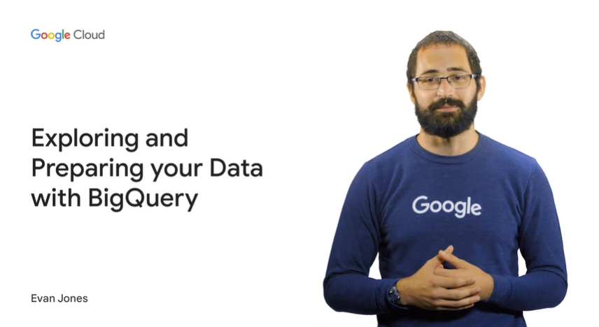

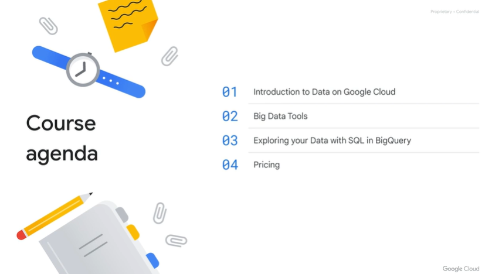

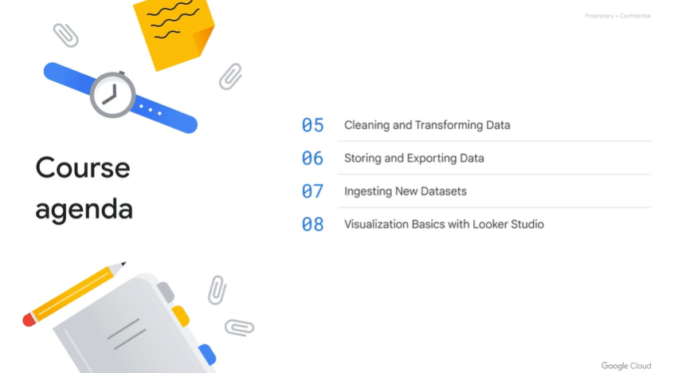

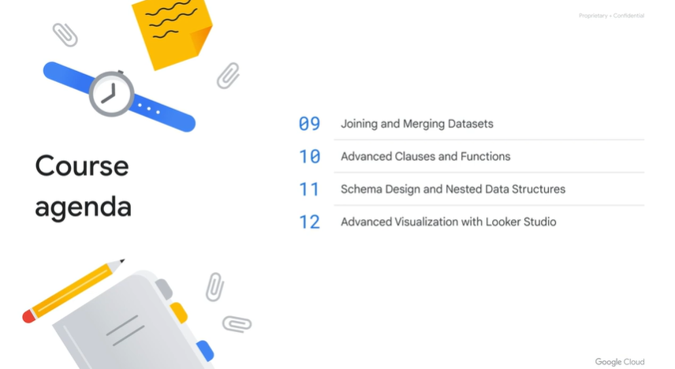

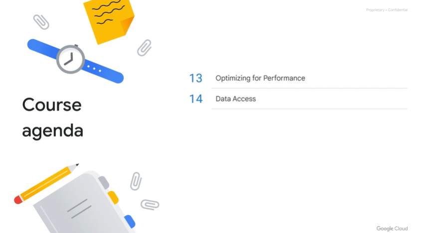

some challenges from data analyst

- long running queries
- combine data source
- some problem with infra resources
- store only subset or process on sma clusters
- no central dwh to dump all the raw data

# Big data on-premises versus in the cloud

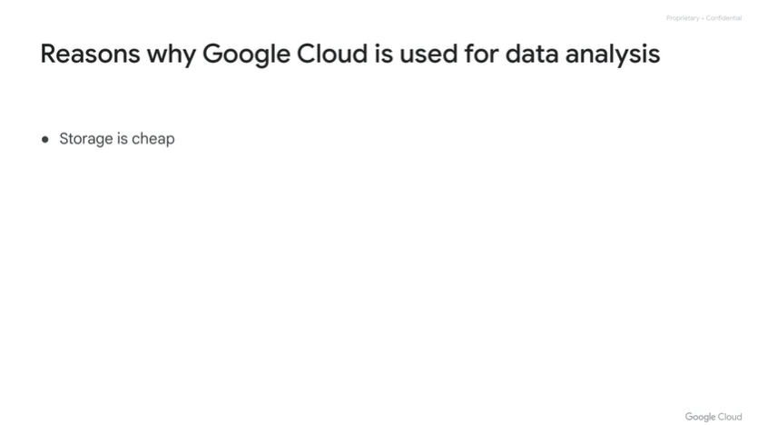

- storage is super cheap
- focus on quries not infra
- massive scalability

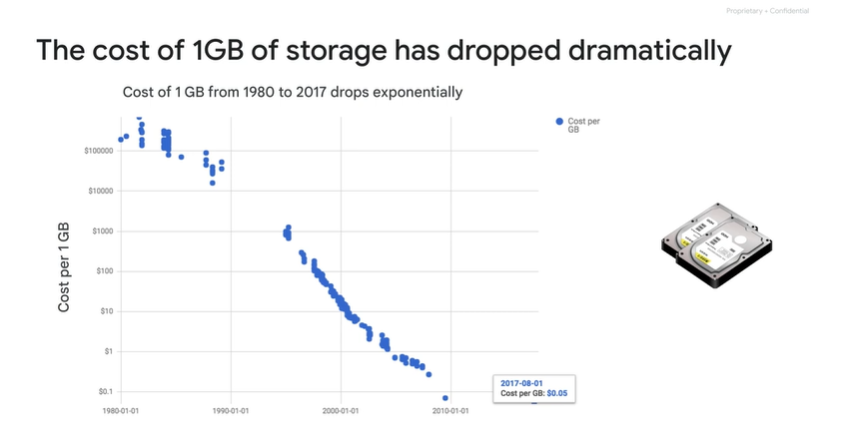

in the in the 80s, you're looking to pay upwards of $100,000 per per gigabyte. Whereas now it's $0.05

> cost of GB in th past !

traditional infra need hd space, cpu and internet speed and it to support all

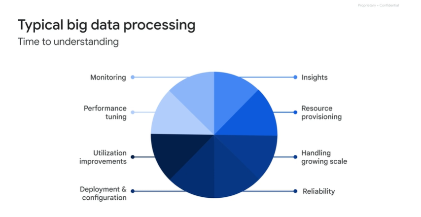

google infra is massive

use as ssas the google infra

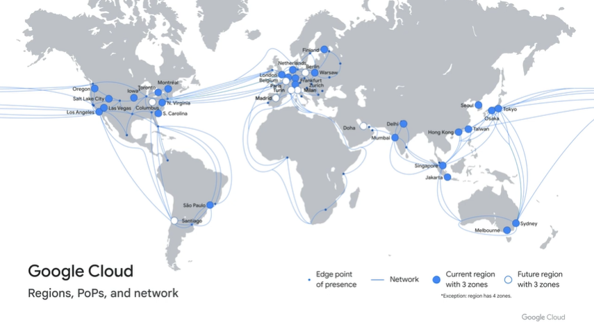

the cloud and data center and network

old way you need to assemble your own

 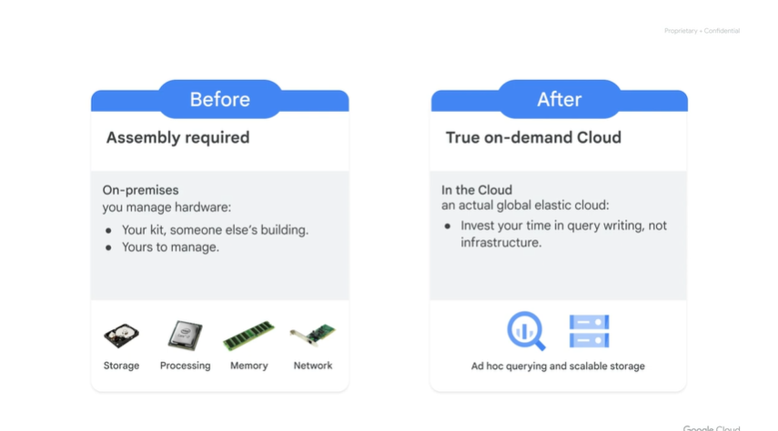

after you can save time and avoid up front costs

 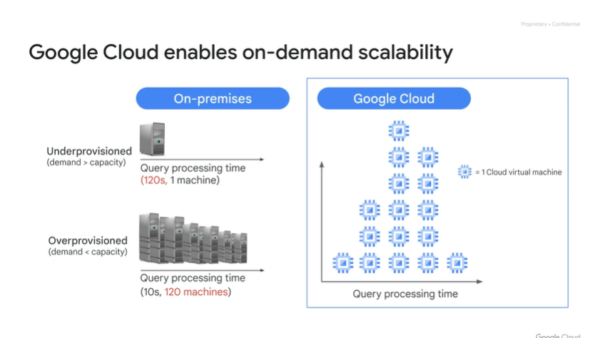

on demand can save you time and money

 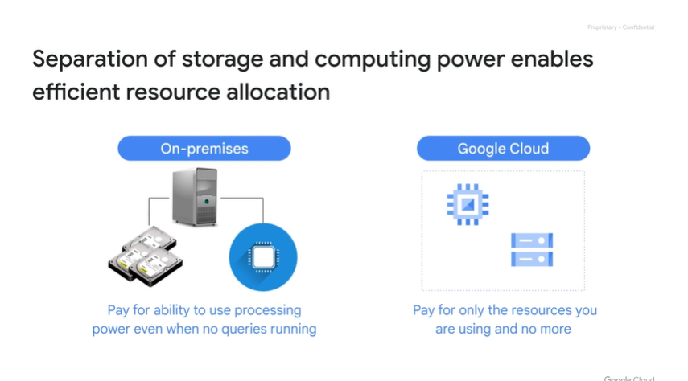

 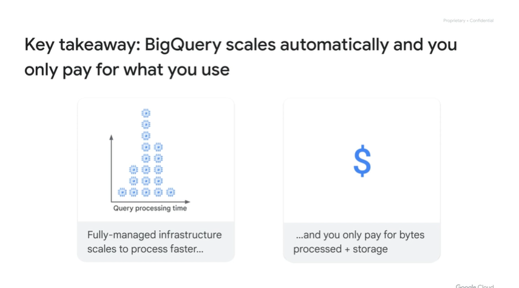

bq scales autmatically, pay for what you process

# Real-world use cases

 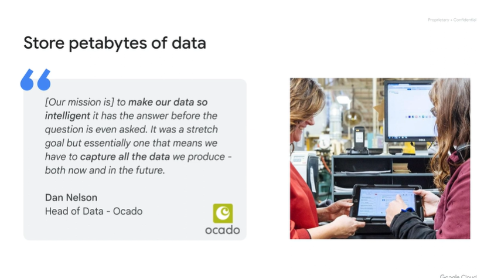

[https://cloud.google.com/customers/featured/ocado-technology](https§§§cloud.google.com§customers§featured§ocado-technology/readme.md)

 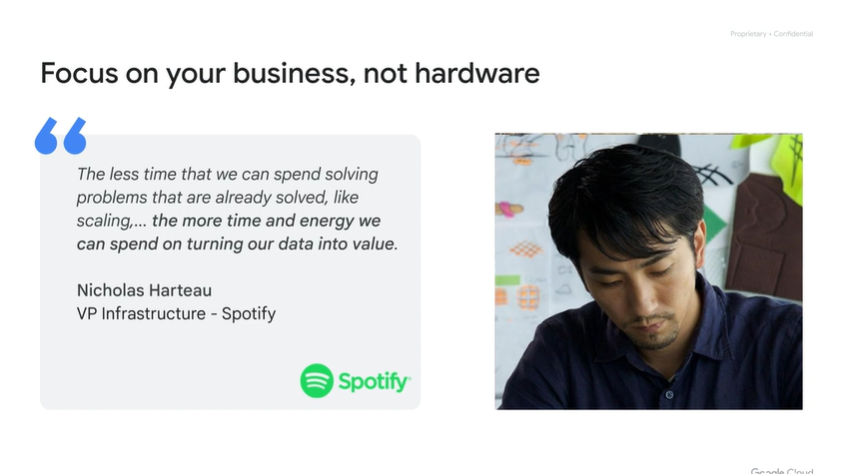

[https://cloud.google.com/customers/spotify](https§§§cloud.google.com§customers§spotify/readme.md)

# Google Cloud project basics

sandbox accounr

umbrella resource is the project

resources in the project

billing to be charged

 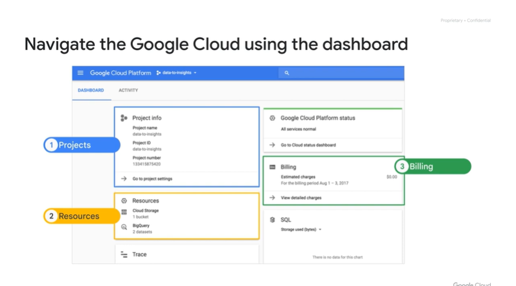

 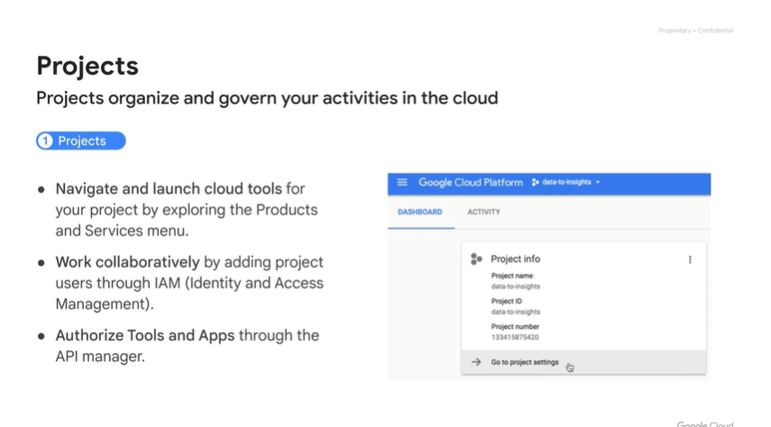

projects org all the reosurces

 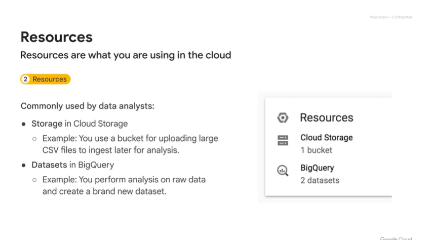

using bq and buckets mostly 

 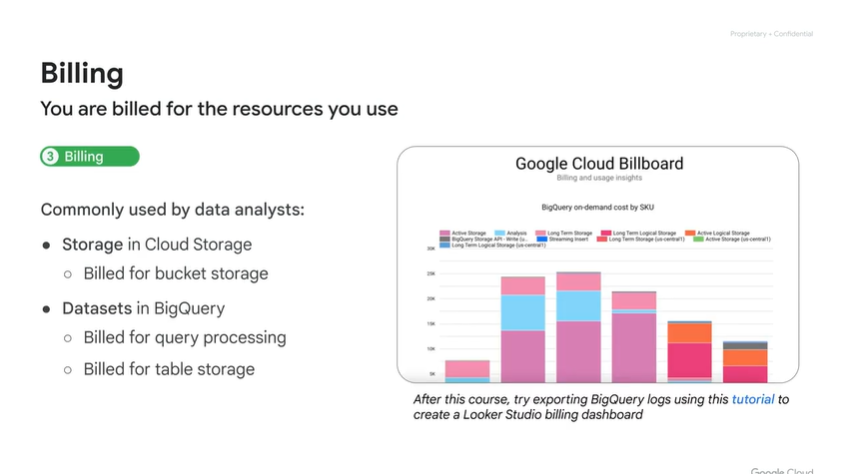

how much pay and fo what

 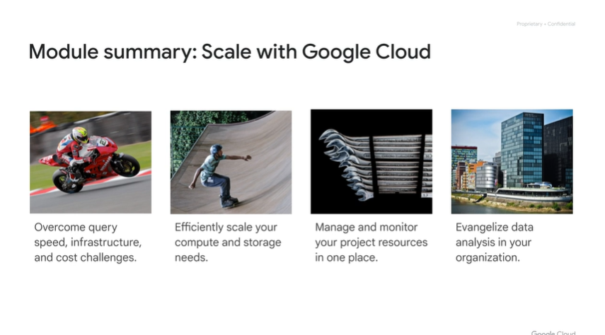

Wrapping up this module, let's review some of the key points about Google Cloud Platform. We've covered some of the common challenges data analysts face and how the Cloud offers scalable, fully-managed tools for any data analyst to use. Now in the following course modules, we'll introduce the actual specific tools, like BigQuery, Data Studio and Cloud DataPrep, and how they build on the compute and storage scalability of the Google Cloud platform.

# Quiz: Introduction to Data on Google Cloud

# Quiz: Introduction to Data on Google Cloud

 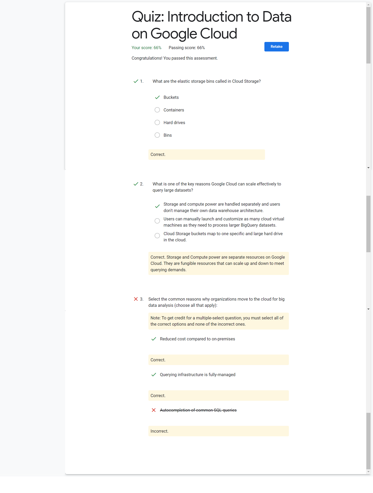
