# <https§§§www.cloudskillsboost.google§course_sessions§3631336§video§376363>

> [https://www.cloudskillsboost.google/course_sessions/3631336/video/376363](https://www.cloudskillsboost.google/course_sessions/3631336/video/376363)

# Data analyst tasks and challenges and Google Cloud data tools

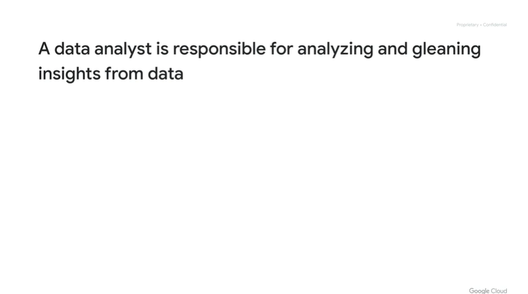

data analyst

- ingest data
- transorm data
- cretesoke reports
- analyz
- visualzie

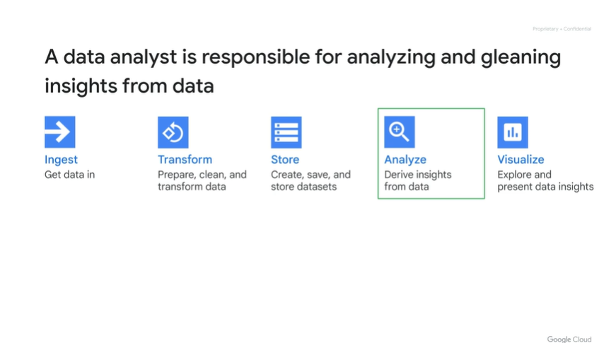

each step presents some chalenges

ingstion - petabyte of data to load not possible, only small amount

transform data - slow process as you need to  rely on other ppl

store - scaling up  the amount  of data

analyze - slow quries

visualzie - some lag in the analyze

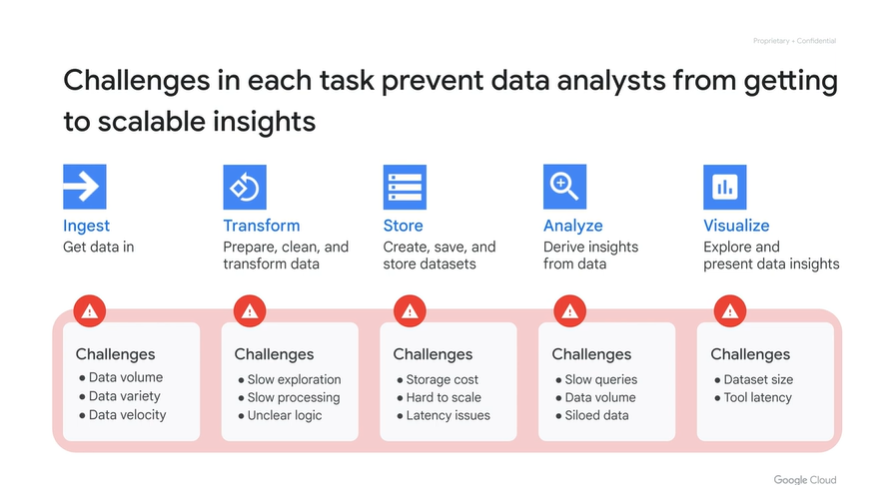

gcloud can help to mitigate/face those

ingest = bq storage and ingestion

transofrm = sql in bq and datarprep

store = bucket is not exp and bq storage

analysys = sql bq and scale out as ssas

visualzie = looker studio on top of bq

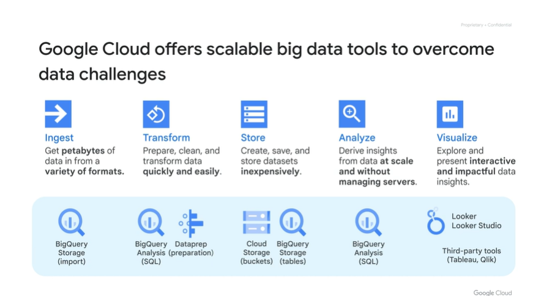

# 9 fundamental BigQuery features

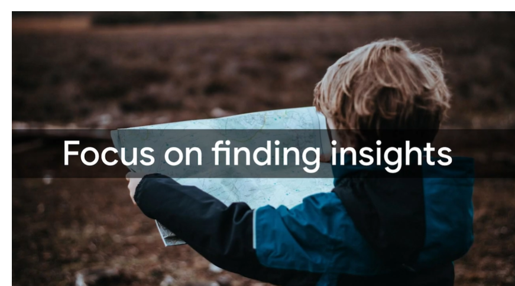

dont manage hw but focus on data insights

in a nutshell

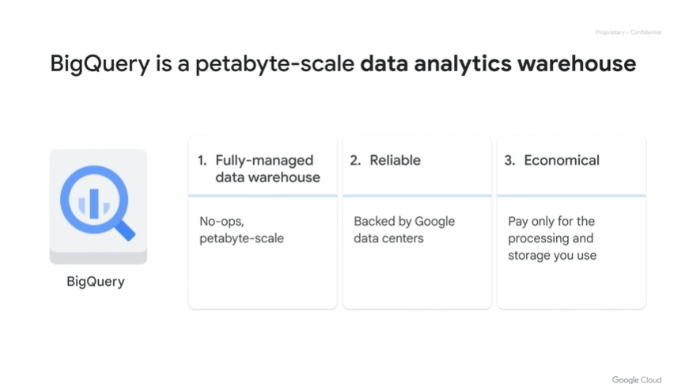

pay for what you consume

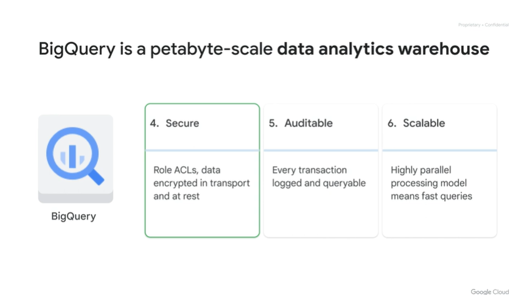

acl for members and groups

queries goes i the logging

pass multiple query at same time

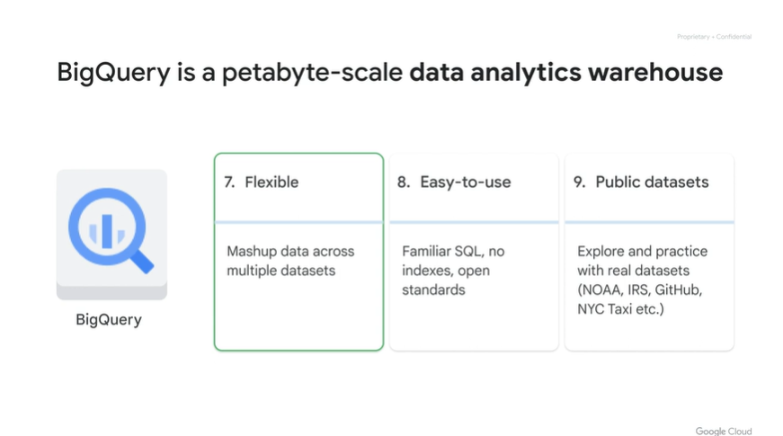

multiple datasets and no idx or keys as traditional rdbms

explore prebuilt dataset on line

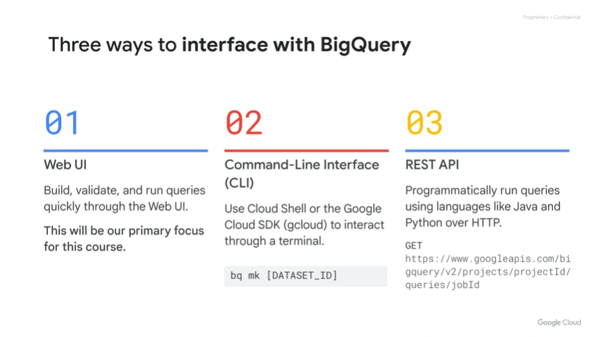

# Walkthrough: Data architecture diagram

arch diagram

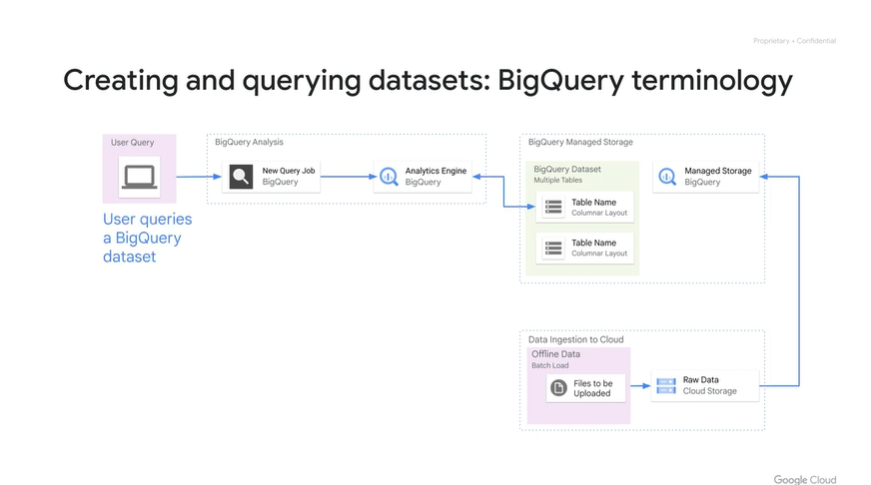

a job is what you sumbit on bq ssas

data is fully managed

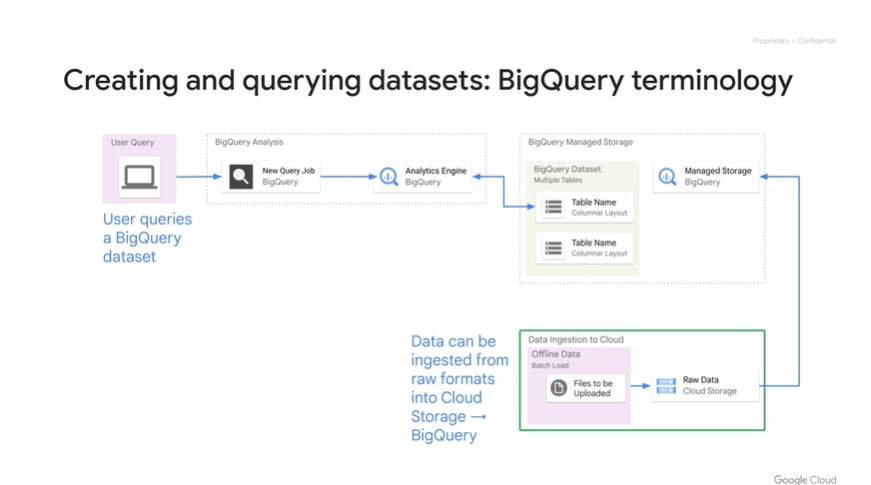

or put data in buckets and then query it

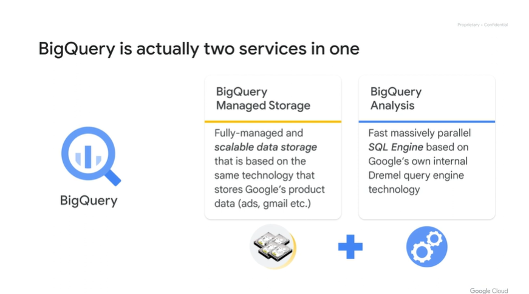

bq is

- managed storage service
- analysis service

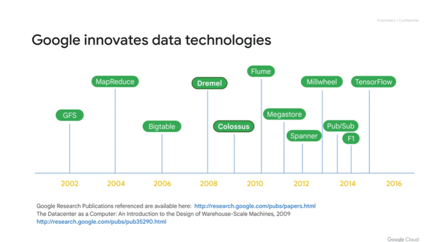

- 2002 = gfs and mr papers
- 2008 dremel = process query on parallel on small cluster

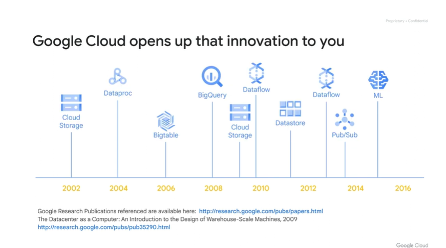

bq is 15y old

2015 https://archive.is/pQR2x

# Google Cloud tools for analysts data scientists and data engineers

this is more for data analyst

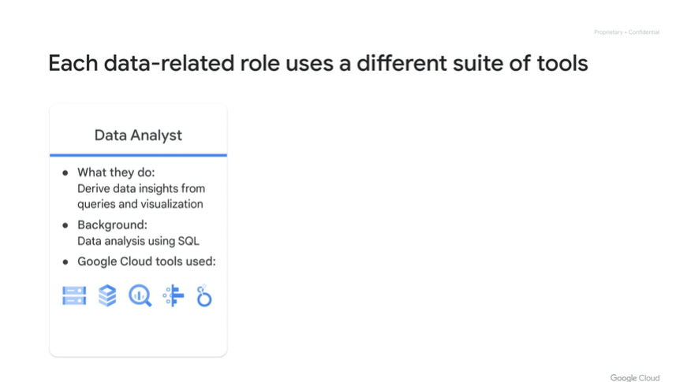

vs

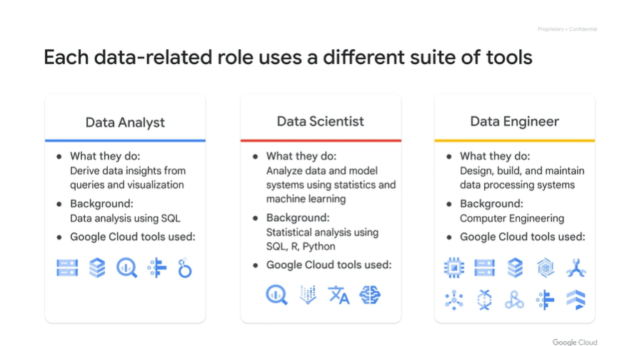

ex

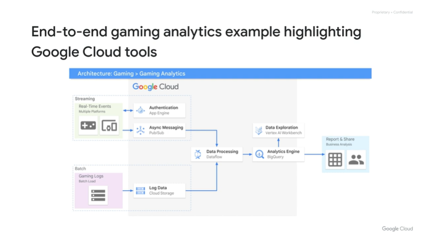

```
So you have two different types of data. You have streaming events coming off a video game online.

You also have massive logs of data that are loaded in batches to a Cloud Storage staging area through a bucket resource. Data Engineers could use a service like Dataflow to build a pipeline.

You could then pipe in massive amounts of data into a data warehouse like BigQuery to perform ad hoc queries. Further right of that, for your reports, you could use an Analytics tool like Looker Studio

to analyze, explore, visualize, and present that information. Or, if you're a Data Scientist, you can plug in Vertex AI as a layer on top of BigQuery and invoke those queries to pre-process your data to build something cool like a machine

learning model
```

# Exploring an Ecommerce Dataset using SQL in Google BigQuery


[https://www.cloudskillsboost.google/course_sessions/3631336/labs/376367](https§§§www.cloudskillsboost.google§course_sessions§3631336§labs§376367/readme.md)

# Quiz: Big Data Tools Overview
 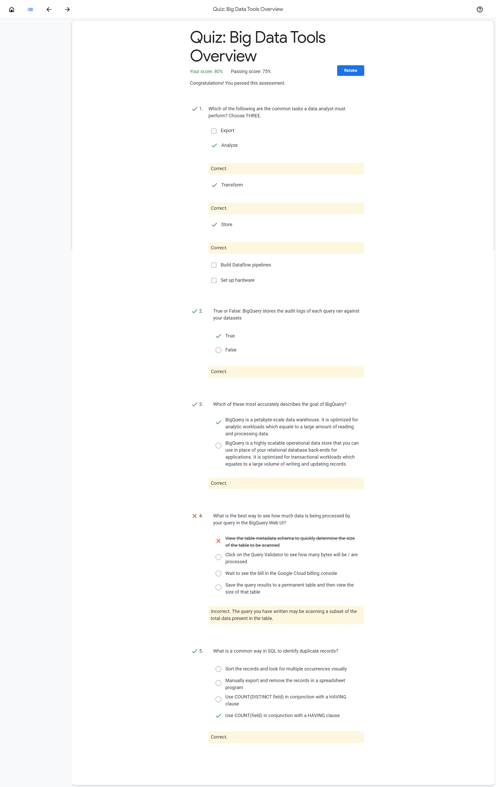

