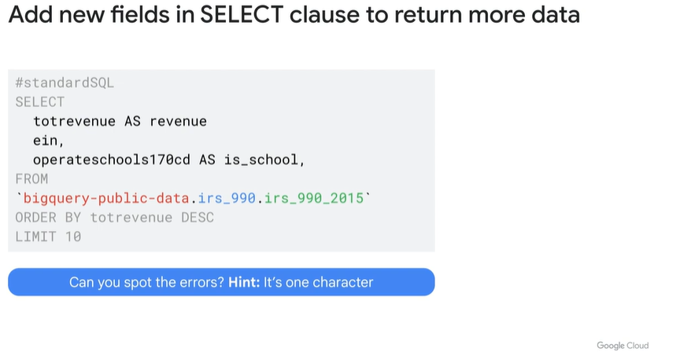
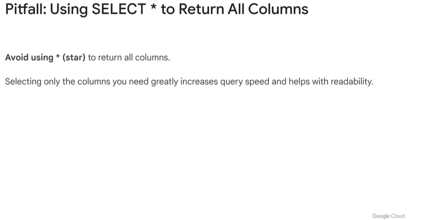
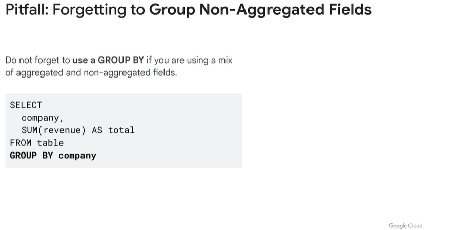
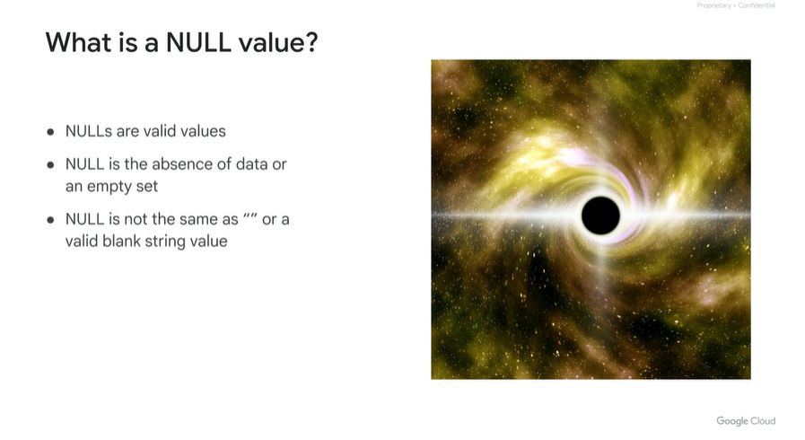

# <https§§§www.cloudskillsboost.google§course_sessions§3631336§video§376370>

> [https://www.cloudskillsboost.google/course_sessions/3631336/video/376370](https://www.cloudskillsboost.google/course_sessions/3631336/video/376370)

sql is imperative for data analyst

what to do

ask question about data

access the dataset or load to bq anf familiriaze

write good sql

from left to right, you need to practice

sql has been around since the '80s

ansi 2011 sql is used from bq

# IRS public dataset overview

https://console.cloud.google.com/marketplace/product/internal-revenue-service/irs-990

# Query basics

convert questions to sql

3 parts in backticks

example

add more fields to make sense of the data or ordering

# Introduction to functions

use of format fx()

some functions

add alias

calculated field

where condition, it saves bytes skipping the data

order by

avoid select STAR

# Filters, aggregates, and duplicates

alias not known at filtering time

check agrgations

calculation/aggr on all the rows

nested functions

group what is **not **under aggr

address duplicates

filter on aggregation

use explanation tab

check data quality al th time when working with new datasets

treat date as str and then parse as date properly

better than taking just the first 4 chars

# Data types, date functions, and NULLs

data types

use cast to convert

not sure what it is, use safe_cast

null is absence of value - not empty or others

handy when matching data

not state == NULL , use ISNULL

when you have as yyyymmdd then you can use a lot of date functions

# Wildcard filters with LIKE

more specific with 'help%'

another module for late

summary:

# Troubleshooting Common SQL Errors with BigQuery v1.5

https://www.cloudskillsboost.google/course_sessions/3631336/labs/376377

# Quiz: Exploring your Data with SQL

 

