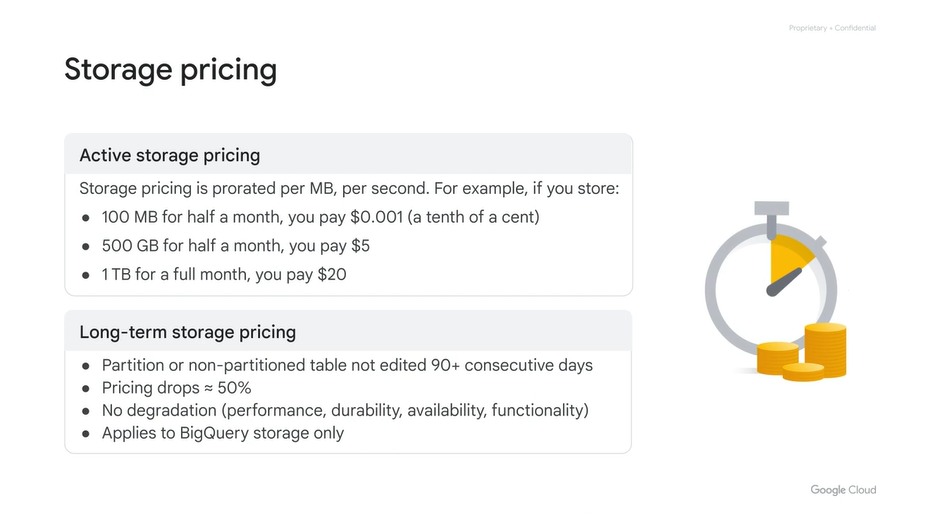
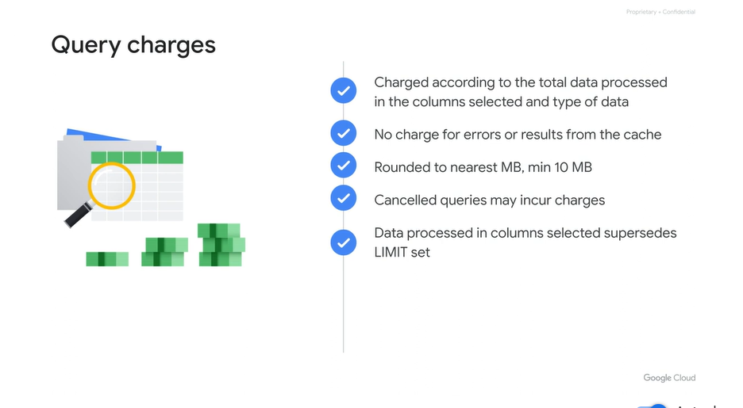

# <https§§§www.cloudskillsboost.google§course_sessions§3631336§video§376379>

> [https://www.cloudskillsboost.google/course_sessions/3631336/video/376379](https://www.cloudskillsboost.google/course_sessions/3631336/video/376379)

# BigQuery jobs


job are task for bq


you pay for query and storage

# Sizing and cost management




log terms storage is diff froma active storage


use partition tables to save on money


anaytic engine cost


slots is basic unit of work

use pricing calculator


byte read


byte processed


def quotas

ails with a "Query exceeded limit for bytes billed" error without incurring any charges.


data processed in the column




limit is processed after


flat rate


consideration


on demand query

query validator provide ans estimate


dry run flag , query does not get eastimate


enater bytes

< 1TB for free per month


flat rate tab

```
pt
00:03 so let's take a look at how to determine and control the cost of both storage and analytics. Once your data is loaded into BigQuery, you are charged for storing it.
00:16 Storage pricing is based on the amount of data stored in tables when it's uncompressed. The size of the data is calculated based on the data types of the individual columns.
00:27 Active storage pricing is prorated per megabyte, per second. If a partition or non-partitioned table isn't edited for 90 consecutive days it's considered long-term storage. The price of storage for that table automatically drops by approximately 50%.
00:49 There is no degradation of performance, durability, availability, or any other functionality. If the table is edited, the price reverts back to the regular storage pricing, and the 90-day timer starts counting from zero.
01:05 This is another reason for considering using partitioned tables. Even if it doesn't improve query performance, you can save money on storage. Any actions on a table that do not change the data
01:20 or the structure of the table don't affect the timer. Analytics engine cost is separate from storage costs. The default pricing is "on-demand", but organizations who prefer a consistent bill amount may opt for flat-rate pricing.
01:37 Capacity is sold in increments of 500 slots with a current minimum of 500 slots. Slots are available in the following commitment plans: Flex slots, where you commit to an initial 60 seconds.
01:52 Monthly, where you commit to an initial 30 days, and annual, where you commit to 365 days. Google offers a 25% discount for organizations choosing a term length of at least one year.
02:08 Use the Google Cloud Pricing Calculator to find the exact price for the number of slots you want in a region. Let's compare the on demand and flat rate options in a little more detail.
02:21 Under on-demand pricing, BigQuery charges for queries by using one metric: the number of bytes processed, also referred to as bytes read. You're charged for the number of bytes processed
02:36 whether the data is stored in BigQuery or in an external data source such as Cloud Storage, Google Drive, or Bigtable. To help control costs you can set user-level and project-level
02:51 custom quotas, and you can set the maximum bytes billed by query. If the query will read bytes beyond the limit, the query fails with a "Query exceeded limit for bytes billed" error without incurring any charges.
03:08 There are a number of things to note regarding query charges. BigQuery uses a columnar data structure. You are charged according to the total data processed in the columns you select,
03:23 and the total data per column is calculated based on the types of data in the column. You aren't charged for queries that return an error, or for queries that retrieve results from the cache.
03:37 Using results from cache is on by default. Queries are rounded to the nearest megabyte, with a minimum 10 megabyte data processed per table referenced by the query, and with a minimum 10 megabyte data processed per query.
03:55 Canceling a running query job may incur charges up to the full cost for the query were it allowed to run to completion. When you run a query, you are charged according to the data processed
04:08 in the columns you select, even if you set an explicit LIMIT on the results. That's because LIMIT is processed AFTER the query completes. Partitioning and clustering tables can help reduce the amount of data processed by queries.
04:26 As a best practice, use partitioning and clustering whenever possible. On-demand pricing is referred to as analysis pricing on the Google Cloud SKUs page. This is useful if you're looking at billing reports.
04:44 Now let's have a look at flat-rate pricing. Flat-rate pricing limits the number of slots used at any time. Slot usage includes resources required for both DML and DDL. If your queries exceed your flat-rate capacity,
05:02 your queries are queued until your flat-rate resources become available. As with fixed-rate pricing, storage costs are calculated independently. The flat-rate cost depends on both the number of slots and the region in which the slots are purchased.
05:22 By default, flat-rate pricing is calculated based on a monthly commitment, but you can get a discounted price for an annual commitment. BigQuery limits the rate of incoming requests on a per-project basis.
05:39 You can contact Google Cloud Support to increase quotas, however additional charges may occur. There are a number of considerations for flat-rate pricing. Flex slots are a special commitment type.
05:56 The commitment duration is only 60 seconds and you can cancel Flex slots any time thereafter. You are also charged only for the seconds your commitment was deployed. Flex slots are subject to capacity availability.
06:14 When you attempt to purchase Flex slots, the success of the purchase isn't guaranteed. However, once your commitment purchase is successful, your capacity is guaranteed until you cancel it. Monthly commitments cannot be canceled for 30 days after your commitment is active.
06:35 After the first 30 calendar days, you can cancel or downgrade any time. If you cancel or downgrade, charges are prorated per second at the monthly rate. For example, you cannot cancel on day 29.
06:52 If you cancel during the first second of day 31, you are charged for 30 days and 1 second, and if you cancel at the mid-point of the third month,
07:05 you're charged 50% of your monthly rate for that month. Prior to the anniversary of your commitment date, you can choose to renew for another year, or convert it to a monthly or flex commitment.
07:20 If you move to the monthly rate, you can cancel at any time, and you're charged per-second at the monthly rate. For example: If you renew for another year after your annual commitment date,
07:34 you enter into a new annual commitment, and you continue to be charged the yearly commitment rate. Also, if you don't renew for another year after your annual commitment date, you can cancel at any time,
07:48 and your charges are prorated per second at the monthly rate. If you determine you need more BigQuery slots, you can purchase additional increments of 500. However, doing so will create a new commitment.
08:07 When you purchase at a flat-rate plan, you specify the allocation of slots by location. To use slots in multiple locations, you must purchase slots in each location. A project can use either flat-rate or on-demand pricing.
08:24 If you have multiple projects in a given location, you can choose which projects use flat-rate pricing and which projects use on-demand pricing. Lastly, to discontinue a flat-rate pricing plan, you must cancel or downgrade your commitment,
08:43 but only AFTER the initial commitment period - 30 days or 1 year. On demand queries are charged based on the number of bytes read. If your query processes a small amount of data, you might need
08:59 to convert the bytes that are processed from kilobytes to megabytes. A megabyte is the smallest measure that is used by the Google Cloud Pricing Calculator. When you enter a
09:12 query in the Cloud Console, the query validator verifies the query syntax and provides an estimate of the number of bytes to be read. You can use this estimate to calculate query cost in the Pricing Calculator.
09:27 When you run a query in the command line interface, you can use the --dry_run flag to estimate the number of bytes read. You can use this estimate to calculate query cost in the Pricing Calculator.
09:41 When you run the command with dry_ run set, the query is not executed, and the response contains the estimated bytes. You can also perform dry-run estimates by the API
09:54 or using language libraries for Go, Python, and so on. The Google Cloud Pricing Calculator can be used to estimate the on-demand cost of queries or storage, or both. To estimate on-demand query costs, enter the number of bytes that are processed
10:13 by the query as megabyte, gigabyte, terabyte or petabyte. If your query process is less than 1 terabyte, the estimate is $0 because BigQuery provides one terabyte of on demand processing free per month.
10:30 To estimate on demand storage costs, enter the number of sites that are stored as megabyte, gigabyte, terabyte or petabyte. BigQuery provides 10 gigabytes of storage free per month. If flat-rate pricing is applied to a billing account,
10:47 you can click the Flat-Rate tab, choose the location and number of slots, then add storage cost to the estimate. A BigQuery Slot is a proprietary measure of capacity. You can choose a number of slots between 500 and 200,000.
11:06 As discussed, a slot is a combination of CPU, memory, and networking resources. It also includes a number of supporting technologies and sub-services. Refer to the link in the Course Resources to access the Google
11:21 Cloud Pricing Calculator.
```


# Optimize queries for cost


 

Use those cache results when possible.

make use of permanent tables instead of rerunning your SQL query every time through vie

 


# Quiz: BigQuery Pricing
