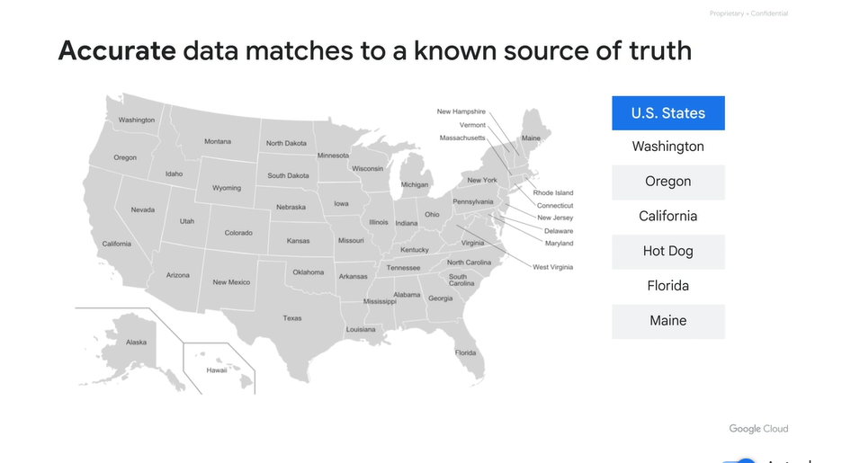
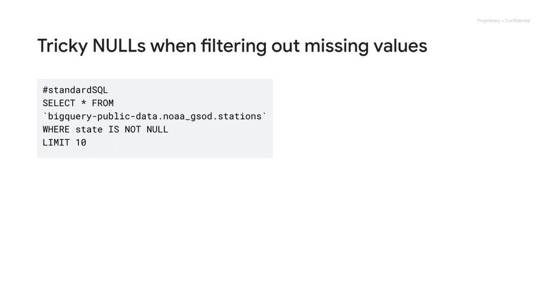
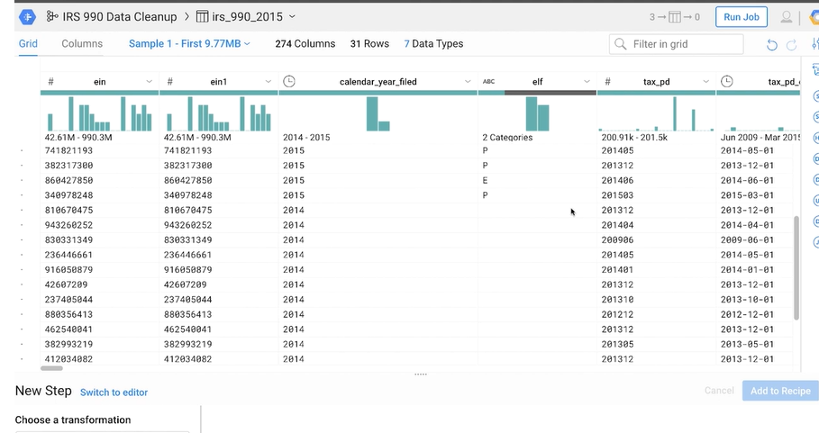
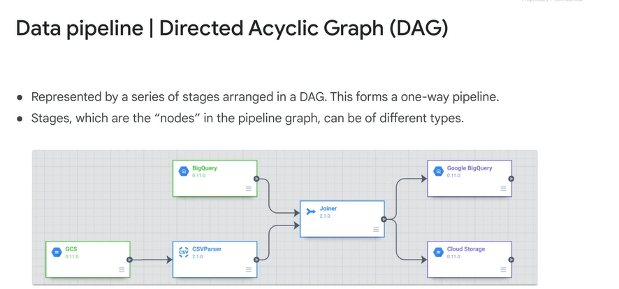
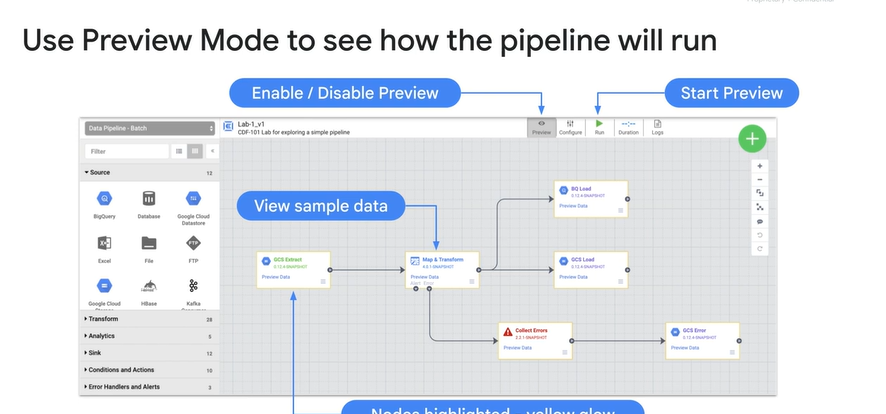
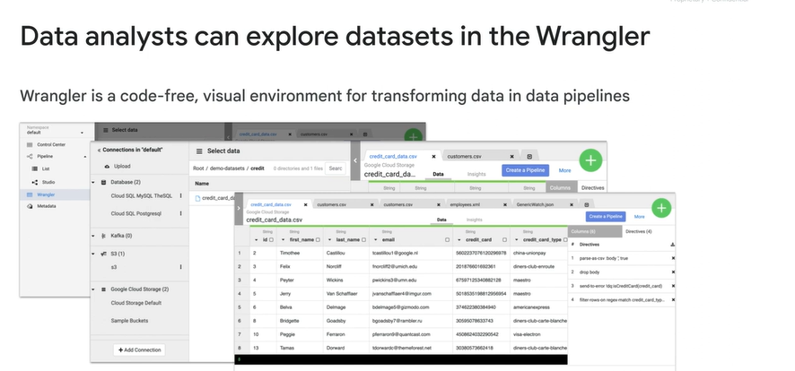

# <https§§§www.cloudskillsboost.google§course_sessions§3631336§video§376383>

> [https://www.cloudskillsboost.google/course_sessions/3631336/video/376383](https://www.cloudskillsboost.google/course_sessions/3631336/video/376383)

# 5 principles of dataset integrity

\

guide lines

uniq is a factor to identify clean data

constarins of range

no data put of range

7  cannot be a valid value

# Dataset shape and skew

wide but short is the worst

check the visualization of how data looks, and related skew

# Clean and transform data using SQL

2 way to clean data: sql and dataprep

put constraints on the source

sub query to validate

hard one, look for what is not there

sub string , parsing and replace bas values

ex

why still there null?

it is not null, it's blank value inserted

# Clean and transform data using a new UI: Introducing Dataprep

data prep

uses dataflow

def recipes

after job run

ex

# Exploring and Creating an Ecommerce Analytics Pipeline with Cloud Dataprep v1.5

https://www.cloudskillsboost.google/course_sessions/3631336/labs/376387

Components of Data Fusion

mutiple pipelines

** **

dev studio and connector

hub

integration

mostly  building pileines and wrangling data

# Build a pipeline

nodes

studio is ux to build the pipleins

# Explore data using wrangler

data set needs to be explored

connection to datasets

browse the data

quality

recipes

# Building Transformations and Preparing Data with Wrangler in Cloud Data Fusion

https://www.cloudskillsboost.google/course_sessions/3631336/labs/376391

# Quiz: Cleaning and Transforming Your Data

 
