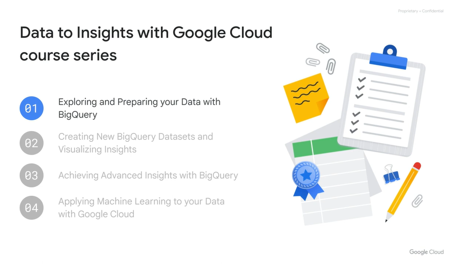
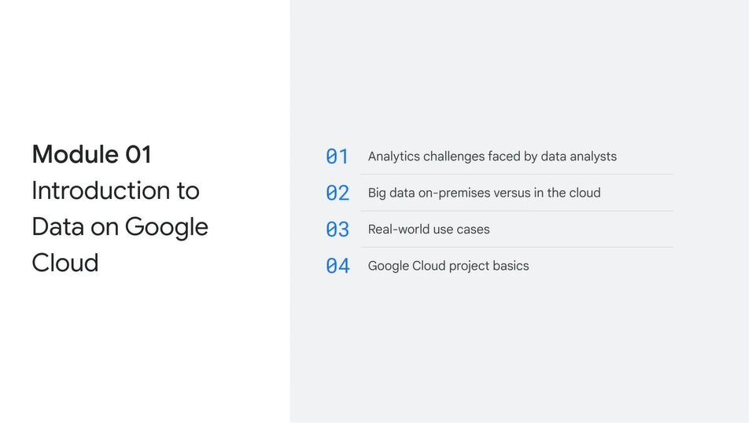
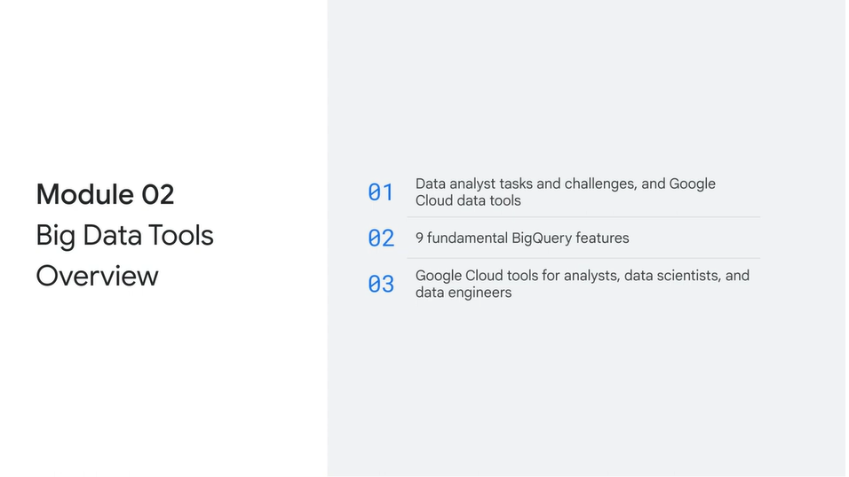
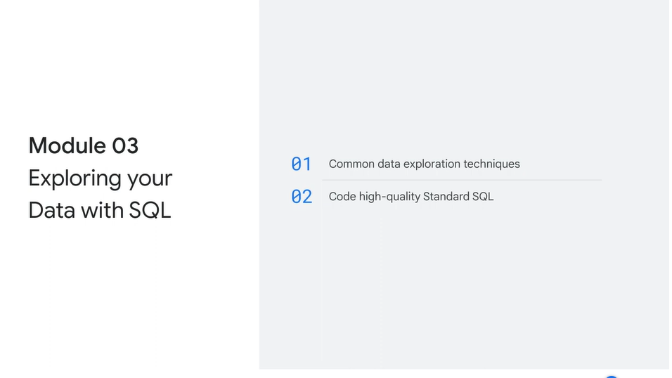
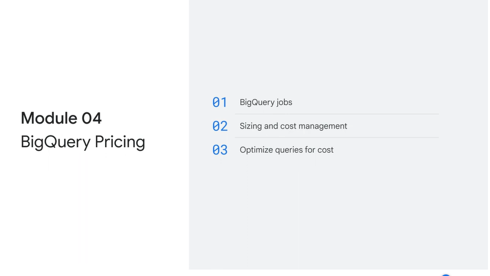
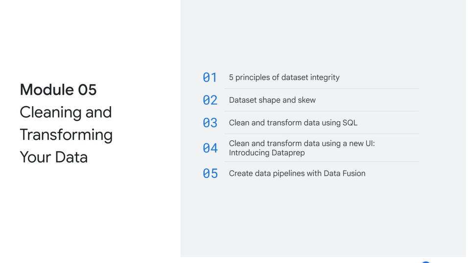
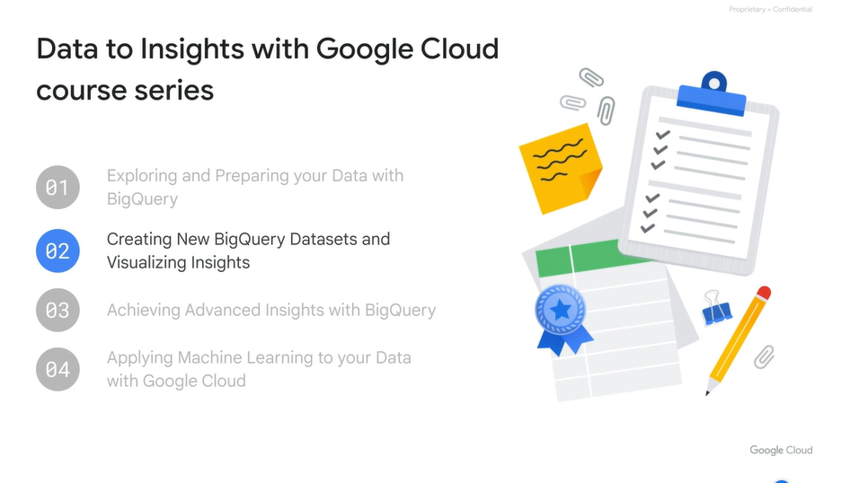

# <https§§§www.cloudskillsboost.google§course_sessions§3631336§video§376393>

> [https://www.cloudskillsboost.google/course_sessions/3631336/video/376393](https://www.cloudskillsboost.google/course_sessions/3631336/video/376393)

# Course summary

 

first of the series

recap:

Congratulations. You've completed Exploring and Preparing your Data with BigQuery, the first course in the Data to Insights with Google Cloud course series. Let's recap all that we've covered so far in this course series.
In module 1, data on Google Cloud was introduced. You looked at the query, infrastructure, and storage challenges that are faced by data analysts. This included queries taking too long to run, there
being no easy way to combine and query data collected, on premises clusters not scaling with analyses, the cost of storing data, and the lack of a central data analytics warehouse or set of tools.
You compared traditional big data on-premises platforms that require a significant investment in infrastructure, with big data on Google Cloud. With Google Cloud, there is no need to focus on infrastructure,
allowing you to focus on insights instead. Google Cloud enables efficient resource allocation through the separation of storage and computing power. BigQuery specifically scales automatically and you only pay for what you use.
You were introduced to two real world use cases, Ocada and Spotify, both of whom turned to BigQuery as a solution for managing and leveraging their big data. Lastly in module 1, you were introduced briefly to three key components
of the Google Cloud Console dashboard: projects, resources, and billing.

 

Congratulations. You've completed Exploring and Preparing your Data with BigQuery, the first course in the Data to Insights with Google Cloud course series. Let's recap all that we've covered so far in this course series.
In module 1, data on Google Cloud was introduced. You looked at the query, infrastructure, and storage challenges that are faced by data analysts. This included queries taking too long to run, there
being no easy way to combine and query data collected, on premises clusters not scaling with analyses, the cost of storing data, and the lack of a central data analytics warehouse or set of tools.
You compared traditional big data on-premises platforms that require a significant investment in infrastructure, with big data on Google Cloud. With Google Cloud, there is no need to focus on infrastructure,
allowing you to focus on insights instead. Google Cloud enables efficient resource allocation through the separation of storage and computing power. BigQuery specifically scales automatically and you only pay for what you use.
You were introduced to two real world use cases, Ocada and Spotify, both of whom turned to BigQuery as a solution for managing and leveraging their big data. Lastly in module 1, you were introduced briefly to three key components
of the Google Cloud Console dashboard: projects, resources, and billing.

 

In Module three, exploring data with SQL was introduced. You started with three fundamental steps to exploring data through SQL, first, ask a good questions. Second, know your data. And third, write good SQL.
You then learned a number of best practices for coding high quality Standard SQL, including the use of clauses and functions. You ended the module with a lab where you troubleshoot
common SQL errors with BigQuery.

 

Module four discussed BigQuery pricing. You learned that the unit of work in BigQuery is called a Job and that there are four different types of jobs, namely Query,
Load data, Extract, and Copy. You also learned that only Query jobs incur a processing cost. You then learned how to determine and control the cost of both storage and analytics.
Lastly, you were introduced to a few cost optimization principles to apply when writing your queries.

 

In Module five, data cleaning and transformation was discussed. You were reminded of the saying "Garbage in, garbage out" and learned about
the five strict integrity rules that high quality data sets conform to. These are validity, accuracy, completeness, consistency, and uniformity. You then learned about data set shape, where ideally you had the right amount of columns and records
to make judgments and inferences from your data and insights. You also learned about data set skew, which is the distribution of values. You revisited the five principles of data set integrity
and how these relate to cleaning and transforming data with SQL. You were then introduced to Dataprep, a tool that allows you to apply the best practices learned for cleaning data through a drag and drop interface.
You also had the opportunity to explore the Dataprep UI by building an e-commerce transformation pipeline that will run at a scheduled interval and output results back into BigQuery. Lastly, in module five, you were introduced to Data Fusion.
After exploring the components of the Data Fusion UI, learning how to build a pipeline, and exploring data using Wrangler, you completed a lab where you had the opportunity to build transformations and prepare data with Wrangler in Data Fusion.

Next:

 
