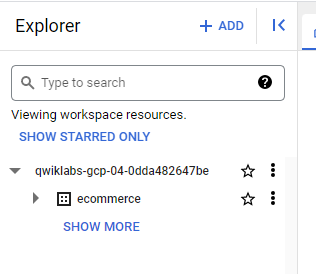

# <https§§§www.cloudskillsboost.google§course_sessions§3671937§labs§375617>

> [https://www.cloudskillsboost.google/course_sessions/3671937/labs/375617](https://www.cloudskillsboost.google/course_sessions/3671937/labs/375617)

# Creating Permanent Tables and Access-Controlled Views in BigQuery v1.5


## Task 1. Create a new dataset to store the tables

 


## Task 2. Troubleshooting CREATE TABLE statements

 


rules


### Query 1: Columns, columns, columns


```sql
#standardSQL
# copy one day of ecommerce data to explore
CREATE OR REPLACE TABLE ecommerce.all_sessions_raw_20170801
 OPTIONS(
   description="Raw data from analyst team into our dataset for 08/01/2017"
 ) AS
 SELECT fullVisitorId, * FROM `data-to-insights.ecommerce.all_sessions_raw`
 WHERE date = '20170801'  #56,989 records
;
```

`Error: CREATE TABLE has columns with duplicate name fullVisitorId at [8:2]`

 


### Query 2: Columns revisited


```sql
#standardSQL
# copy one day of ecommerce data to explore
CREATE OR REPLACE TABLE ecommerce.all_sessions_raw_20170801
#schema
(
  fullVisitorId STRING OPTIONS(description="Unique visitor ID"),
  channelGrouping STRING OPTIONS(description="Channel e.g. Direct, Organic, Referral...")
)
 OPTIONS(
   description="Raw data from analyst team into our dataset for 08/01/2017"
 ) AS
 SELECT * FROM `data-to-insights.ecommerce.all_sessions_raw`
 WHERE date = '20170801'  #56,989 records
;
```

`Error: The number of columns in the column definition list does not match the number of columns produced by the query at [6:1]`

 


### Query 3: It's valid! Or is it?

```sql
#standardSQL
# copy one day of ecommerce data to explore
CREATE OR REPLACE TABLE ecommerce.all_sessions_raw_20170801
#schema
(
  fullVisitorId STRING OPTIONS(description="Unique visitor ID"),
  channelGrouping STRING OPTIONS(description="Channel e.g. Direct, Organic, Referral...")
)
 OPTIONS(
   description="Raw data from analyst team into our dataset for 08/01/2017"
 ) AS
 SELECT fullVisitorId, city FROM `data-to-insights.ecommerce.all_sessions_raw`
 WHERE date = '20170801'  #56,989 records
;
```


`Valid: This query will process 1.05 GB when run.`

 

 


### Query 4: The gatekeeper

```sql
#standardSQL
# copy one day of ecommerce data to explore
CREATE OR REPLACE TABLE ecommerce.all_sessions_raw_20170801
#schema
(
  fullVisitorId STRING NOT NULL OPTIONS(description="Unique visitor ID"),
  channelGrouping STRING NOT NULL OPTIONS(description="Channel e.g. Direct, Organic, Referral..."),
  totalTransactionRevenue INT64 NOT NULL OPTIONS(description="Revenue * 10^6 for the transaction")
)
 OPTIONS(
   description="Raw data from analyst team into our dataset for 08/01/2017"
 ) AS
 SELECT fullVisitorId, channelGrouping, totalTransactionRevenue FROM `data-to-insights.ecommerce.all_sessions_raw`
 WHERE date = '20170801'  #56,989 records
;
```

 


### Query 5: Working as intended


```sql
#standardSQL
# copy one day of ecommerce data to explore
CREATE OR REPLACE TABLE ecommerce.all_sessions_raw_20170801
#schema
(
  fullVisitorId STRING NOT NULL OPTIONS(description="Unique visitor ID"),
  channelGrouping STRING NOT NULL OPTIONS(description="Channel e.g. Direct, Organic, Referral..."),
  totalTransactionRevenue INT64 OPTIONS(description="Revenue * 10^6 for the transaction")
)
 OPTIONS(
   description="Raw data from analyst team into our dataset for 08/01/2017"
 ) AS
 SELECT fullVisitorId, channelGrouping, totalTransactionRevenue FROM `data-to-insights.ecommerce.all_sessions_raw`
 WHERE date = '20170801'  #56,989 records
;
```

 


### Query 6: Your turn to practice

 

```sql
#standardSQL
# copy one day of ecommerce data to explore
CREATE OR REPLACE TABLE ecommerce.revenue_transactions_20170801
#schema
(
  fullVisitorId STRING NOT NULL OPTIONS(description="Unique visitor ID"),
  visitId STRING NOT NULL OPTIONS(description="ID of the session, not unique across all users"),
  channelGrouping STRING NOT NULL OPTIONS(description="Channel e.g. Direct, Organic, Referral..."),
  totalTransactionRevenue FLOAT64 NOT NULL OPTIONS(description="Revenue for the transaction")
)
 OPTIONS(
   description="Revenue transactions for 08/01/2017"
 ) AS
 SELECT DISTINCT
  fullVisitorId,
  CAST(visitId AS STRING) AS visitId,
  channelGrouping,
  totalTransactionRevenue / 1000000 AS totalTransactionRevenue
 FROM `data-to-insights.ecommerce.all_sessions_raw`
 WHERE date = '20170801'
      AND totalTransactionRevenue IS NOT NULL #XX transactions
;
```


### What are ways to overcome stale data?

https://cloud.google.com/bigquery/docs/scheduling-queries


 


## Task 3. Creating views

Views are saved queries that are run each time the view is called

```sql
#standardSQL
SELECT DISTINCT
  date,
  fullVisitorId,
  CAST(visitId AS STRING) AS visitId,
  channelGrouping,
  totalTransactionRevenue / 1000000 AS totalTransactionRevenue
 FROM `data-to-insights.ecommerce.all_sessions_raw`
 WHERE totalTransactionRevenue IS NOT NULL
 ORDER BY date DESC # latest transactions
 LIMIT 100
;
```

 


you can save your common reporting queries as views as demonstrated below:

```sql
#standardSQL
CREATE OR REPLACE VIEW ecommerce.vw_latest_transactions
AS
SELECT DISTINCT
  date,
  fullVisitorId,
  CAST(visitId AS STRING) AS visitId,
  channelGrouping,
  totalTransactionRevenue / 1000000 AS totalTransactionRevenue
 FROM `data-to-insights.ecommerce.all_sessions_raw`
 WHERE totalTransactionRevenue IS NOT NULL
 ORDER BY date DESC # latest transactions
 LIMIT 100
;
```

A simple convention is to prefix the view name with `vw_` or add a suffix like `_vw` or `_view`.


You can also give your view a description and labels using **OPTIONS**


```sql
#standardSQL
CREATE OR REPLACE VIEW ecommerce.vw_latest_transactions
OPTIONS(
  description="latest 100 ecommerce transactions",
  labels=[('report_type','operational')]
)
AS
SELECT DISTINCT
  date,
  fullVisitorId,
  CAST(visitId AS STRING) AS visitId,
  channelGrouping,
  totalTransactionRevenue / 1000000 AS totalTransactionRevenue
 FROM `data-to-insights.ecommerce.all_sessions_raw`
 WHERE totalTransactionRevenue IS NOT NULL
 ORDER BY date DESC # latest transactions
 LIMIT 100
;
```


```sql
#standardSQL
# top 50 latest transactions
CREATE VIEW ecommerce.vw_latest_transactions # CREATE
OPTIONS(
  description="latest 50 ecommerce transactions",
  labels=[('report_type','operational')]
)
AS
SELECT DISTINCT
  date,
  fullVisitorId,
  CAST(visitId AS STRING) AS visitId,
  channelGrouping,
  totalTransactionRevenue / 1000000 AS totalTransactionRevenue
 FROM `data-to-insights.ecommerce.all_sessions_raw`
 WHERE totalTransactionRevenue IS NOT NULL
 ORDER BY date DESC # latest transactions
 LIMIT 50
;
```

`Error: Already Exists: Table project-name:ecommerce.vw_latest_transactions`


 


### View Creation: Your turn to practice

 


```sql
/*
write the answer to the above prompt in BigQuery and compare it to the answer given below
*/
#standardSQL
CREATE OR REPLACE VIEW ecommerce.vw_large_transactions
OPTIONS(
  description="large transactions for review",
  labels=[('org_unit','loss_prevention')]
)
AS
SELECT DISTINCT
  date,
  fullVisitorId,
  visitId,
  channelGrouping,
  totalTransactionRevenue / 1000000 AS revenue,
  currencyCode
  #v2ProductName
 FROM `data-to-insights.ecommerce.all_sessions_raw`
 WHERE
  (totalTransactionRevenue / 1000000) > 1000
  AND currencyCode = 'USD'
 ORDER BY date DESC # latest transactions
 LIMIT 10
;
```


### Extra credit

https://cloud.google.com/bigquery/docs/reference/standard-sql/functions-and-operators#string_agg


 


```sql
#standardSQL
CREATE OR REPLACE VIEW ecommerce.vw_large_transactions
OPTIONS(
  description="large transactions for review",
  labels=[('org_unit','loss_prevention')]
)
AS
SELECT DISTINCT
  date,
  fullVisitorId,
  visitId,
  channelGrouping,
  totalTransactionRevenue / 1000000 AS totalTransactionRevenue,
  currencyCode,
  STRING_AGG(DISTINCT v2ProductName ORDER BY v2ProductName LIMIT 10) AS products_ordered
 FROM `data-to-insights.ecommerce.all_sessions_raw`
 WHERE
  (totalTransactionRevenue / 1000000) > 1000
  AND currencyCode = 'USD'
 GROUP BY 1,2,3,4,5,6
  ORDER BY date DESC # latest transactions
  LIMIT 10
```


### Using SESSION_USER() in views for limiting data access


 


```sql
#standardSQL
SELECT
  SESSION_USER() AS viewer_ldap;
```

Modify the below query to add an additional filter to only allow users in the `qwiklabs.net` domain to see view results:


```sql
#standardSQL
SELECT DISTINCT
  SESSION_USER() AS viewer_ldap,
  REGEXP_EXTRACT(SESSION_USER(), r'@(.+)') AS domain,
  date,
  fullVisitorId,
  visitId,
  channelGrouping,
  totalTransactionRevenue / 1000000 AS totalTransactionRevenue,
  currencyCode,
  STRING_AGG(DISTINCT v2ProductName ORDER BY v2ProductName LIMIT 10) AS products_ordered
 FROM `data-to-insights.ecommerce.all_sessions_raw`
 WHERE
  (totalTransactionRevenue / 1000000) > 1000
  AND currencyCode = 'USD'
 # add filter here
 GROUP BY 1,2,3,4,5,6,7,8
  ORDER BY date DESC # latest transactions
  LIMIT 10
```

possible solution

```sql
#standardSQL
SELECT DISTINCT
  SESSION_USER() AS viewer_ldap,
  REGEXP_EXTRACT(SESSION_USER(), r'@(.+)') AS domain,
  date,
  fullVisitorId,
  visitId,
  channelGrouping,
  totalTransactionRevenue / 1000000 AS totalTransactionRevenue,
  currencyCode,
  STRING_AGG(DISTINCT v2ProductName ORDER BY v2ProductName LIMIT 10) AS products_ordered
 FROM `data-to-insights.ecommerce.all_sessions_raw`
 WHERE
  (totalTransactionRevenue / 1000000) > 1000
  AND currencyCode = 'USD'
  AND REGEXP_EXTRACT(SESSION_USER(), r'@(.+)') IN ('qwiklabs.net')
 GROUP BY 1,2,3,4,5,6,7,8
  ORDER BY date DESC # latest transactions
  LIMIT 10
```

 


```sql
#standardSQL
CREATE OR REPLACE VIEW ecommerce.vw_large_transactions
OPTIONS(
  description="large transactions for review",
  labels=[('org_unit','loss_prevention')],
  expiration_timestamp=TIMESTAMP_ADD(CURRENT_TIMESTAMP(), INTERVAL 90 DAY)
)
AS
#standardSQL
SELECT DISTINCT
  SESSION_USER() AS viewer_ldap,
  REGEXP_EXTRACT(SESSION_USER(), r'@(.+)') AS domain,
  date,
  fullVisitorId,
  visitId,
  channelGrouping,
  totalTransactionRevenue / 1000000 AS totalTransactionRevenue,
  currencyCode,
  STRING_AGG(DISTINCT v2ProductName ORDER BY v2ProductName LIMIT 10) AS products_ordered
 FROM `data-to-insights.ecommerce.all_sessions_raw`
 WHERE
  (totalTransactionRevenue / 1000000) > 1000
  AND currencyCode = 'USD'
  AND REGEXP_EXTRACT(SESSION_USER(), r'@(.+)') IN ('qwiklabs.net')
 GROUP BY 1,2,3,4,5,6,7,8
  ORDER BY date DESC # latest transactions
  LIMIT 10;
```


Confirm with the below SELECT statement you can see the data returned in the view


```sql
#standardSQL
SELECT * FROM ecommerce.vw_large_transactions;
```

https://cloud.google.com/bigquery/docs/reference/standard-sql/data-definition-language


# Module Quiz


 
