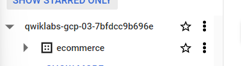
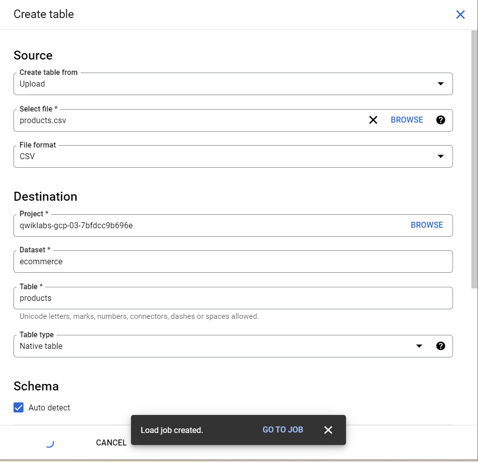
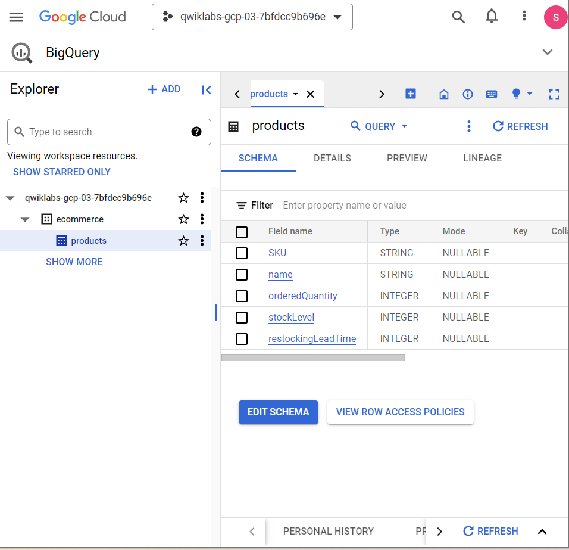
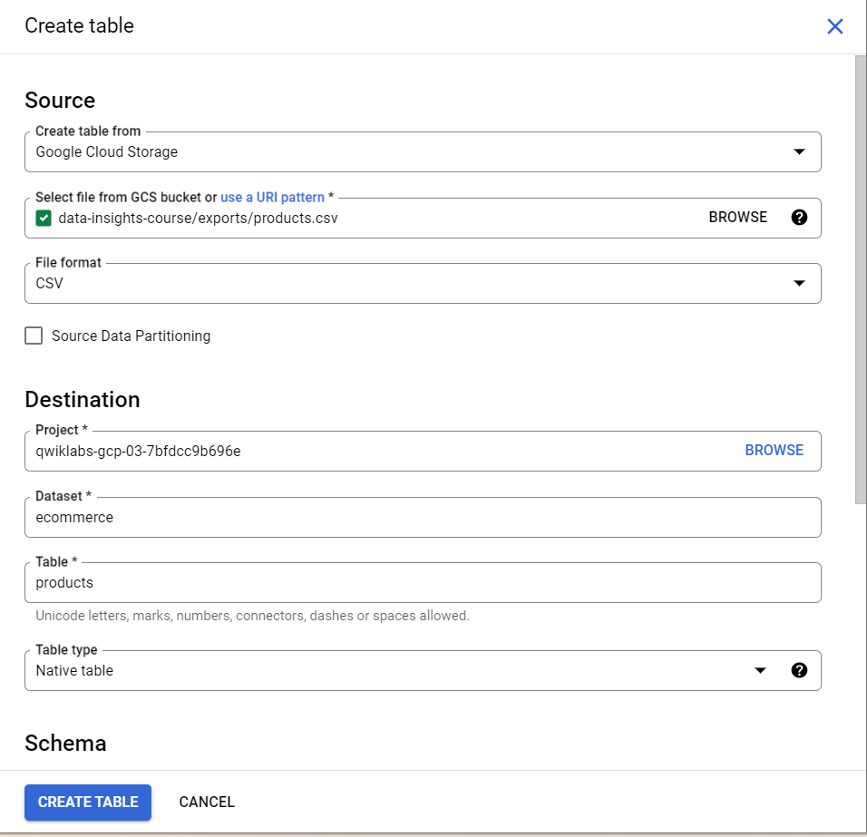

# <https§§§www.cloudskillsboost.google§course_sessions§3671937§labs§375621>

> [https://www.cloudskillsboost.google/course_sessions/3671937/labs/375621](https://www.cloudskillsboost.google/course_sessions/3671937/labs/375621)


## Overview

https://www.en.advertisercommunity.com/t5/Articles/Introducing-the-Google-Analytics-Sample-Dataset-for-BigQuery/ba-p/1676331#


## Task 1. Create a new dataset to store tables

 


## Task 2. Ingest a new dataset from a CSV

https://storage.googleapis.com/data-insights-course/exports/products.csv

 

a job is created

 


```
#standardSQL
SELECT
  *
FROM
  ecommerce.products
ORDER BY
  stockLevel DESC
LIMIT  5
```


## Task 3. Ingest data from Google Cloud Storage

 

from gcs

 


**Advanced Options** and in the **Write Preference** dropdown menu, select  **Overwrite table** .


## Task 4. Ingest a new dataset from a Google Spreadsheet

```
#standardSQL
SELECT
  *,
  SAFE_DIVIDE(orderedQuantity,stockLevel) AS ratio
FROM
  ecommerce.products
WHERE
# include products that have been ordered and
# are 80% through their inventory
orderedQuantity > 0
AND SAFE_DIVIDE(orderedQuantity,stockLevel) >= .8
ORDER BY
  restockingLeadTime DESC
```


> If you specify a relative project name path like `ecommerce.products` instead of `project_id.ecommerce.products`, BigQuery will assume the current project.
