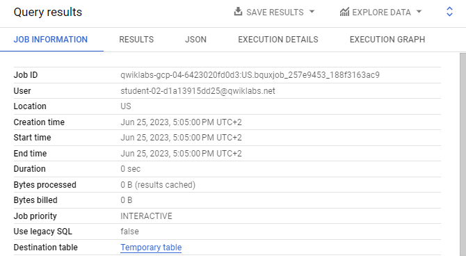

# <https§§§www.cloudskillsboost.google§course_sessions§3671937§labs§375624>

> [https://www.cloudskillsboost.google/course_sessions/3671937/labs/375624](https://www.cloudskillsboost.google/course_sessions/3671937/labs/375624)


## Task 2. Creating tables with date partitions

```
#standardSQL
SELECT DISTINCT
  fullVisitorId,
  date,
  city,
  pageTitle
FROM `data-to-insights.ecommerce.all_sessions_raw`
WHERE date = '20170708'
LIMIT 5
```


 


```
#standardSQL
CREATE OR REPLACE TABLE
  ecommerce.partition_by_day
PARTITION BY
  date_formatted OPTIONS( description="a table partitioned by date" ) AS
SELECT
  DISTINCT PARSE_DATE("%Y%m%d", date) AS date_formatted,
  fullvisitorId
FROM
  `data-to-insights.ecommerce.all_sessions_raw`
```

 

 

 


## Task 3. View data processed with a partitioned tabl 


 


## Task 4. Creating an auto-expiring partitioned table


Auto-expiring partitioned tables are used to comply with data privacy statutes, and can be used to avoid unnecessary storage (which you'll be charged for in a production environment). If you want to create a rolling window of data, add an expiration date so the partition disappears after you're finished using it.

`bigquery-public-data`

 


**noaa_gsod** dataset (which are manually sharded and not partitioned).

```sql
#standardSQL
SELECT
  DATE(CAST(year AS INT64), CAST(mo AS INT64), CAST(da AS INT64)) AS date,
  (
  SELECT
    ANY_VALUE(name)
  FROM
    `bigquery-public-data.noaa_gsod.stations` AS stations
  WHERE
    stations.usaf = stn) AS station_name,
  prcp
FROM
  `bigquery-public-data.noaa_gsod.gsod*` AS weather
WHERE
  prcp < 99.9
  AND LENGTH(_TABLE_SUFFIX) = 4
  AND CAST(_TABLE_SUFFIX AS int64) >= 2018
  AND prcp > 0
  AND CAST(_TABLE_SUFFIX AS int64) >= 2018
ORDER BY
  date DESC
LIMIT
  10
```


 


Notice that the table wildcard * used in the FROM clause to limit the amount of tables referred to in the *TABLE_SUFFIX* filter


## Task 5. Your turn: Create a partitioned table

 

```sql
#standardSQL
 CREATE OR REPLACE TABLE ecommerce.days_with_rain
 PARTITION BY date
 OPTIONS (
   partition_expiration_days=60,
   description="weather stations with precipitation, partitioned by day"
 ) AS
 SELECT
   DATE(CAST(year AS INT64), CAST(mo AS INT64), CAST(da AS INT64)) AS date,
   (SELECT ANY_VALUE(name) FROM `bigquery-public-data.noaa_gsod.stations` AS stations
    WHERE stations.usaf = stn) AS station_name,  -- Stations may have multiple names
   prcp
 FROM `bigquery-public-data.noaa_gsod.gsod*` AS weather
 WHERE prcp < 99.9  -- Filter unknown values
   AND length(_TABLE_SUFFIX) = 4 AND CAST(_TABLE_SUFFIX AS int64) >= 2018
   AND prcp > 0      -- Filter
   AND CAST(_TABLE_SUFFIX AS int64) >= 2018
```


### Confirm data partition expiration is working


```sql
#standardSQL
# avg monthly precipitation
SELECT
  AVG(prcp) AS average,
  station_name,
  date,
  CURRENT_DATE() AS today,
  DATE_DIFF(CURRENT_DATE(), date, DAY) AS partition_age,
  EXTRACT(MONTH FROM date) AS month
FROM ecommerce.days_with_rain
WHERE station_name = 'WAKAYAMA' #Japan
GROUP BY station_name, date, today, month, partition_age
ORDER BY date DESC; # most recent days first
```


## Task 6. Confirm the oldest partition_age is at or below 60 days

```sql
#standardSQL
# avg monthly precipitation
SELECT
  AVG(prcp) AS average,
  station_name,
  date,
  CURRENT_DATE() AS today,
  DATE_DIFF(CURRENT_DATE(), date, DAY) AS partition_age,
  EXTRACT(MONTH FROM date) AS month
FROM ecommerce.days_with_rain
WHERE station_name = 'WAKAYAMA' #Japan
GROUP BY station_name, date, today, month, partition_age
ORDER BY partition_age DESC
```

 
