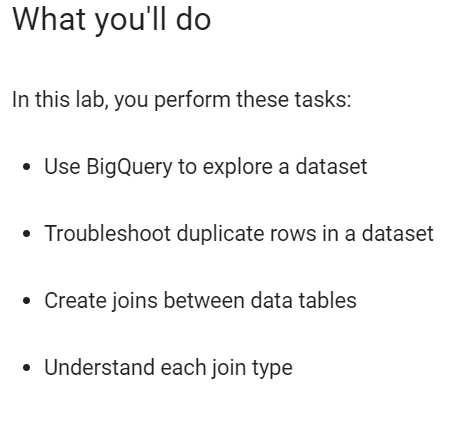
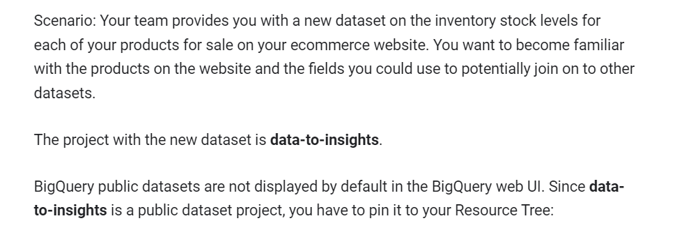
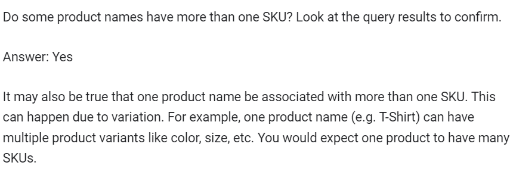
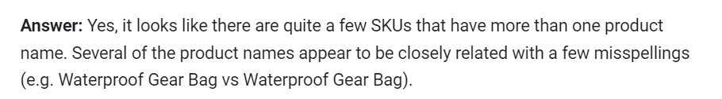
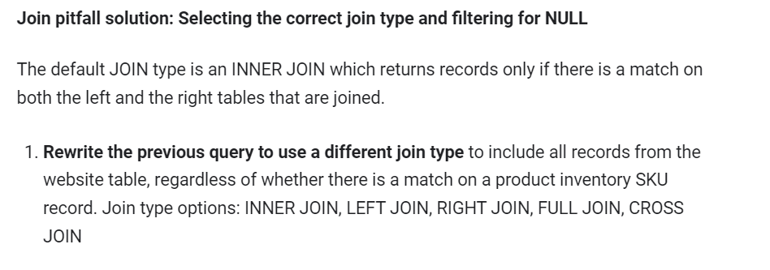
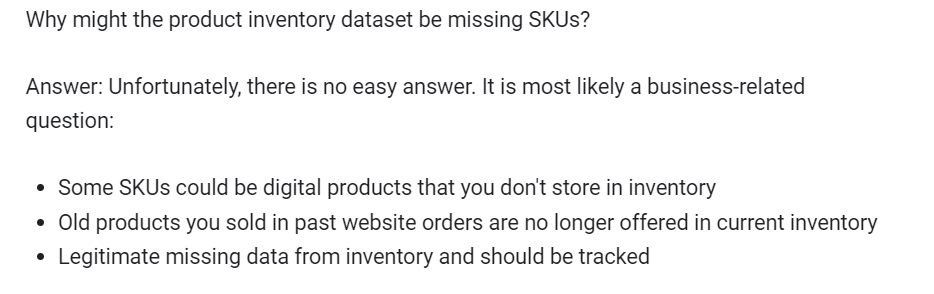
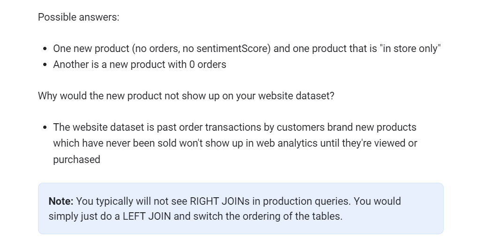
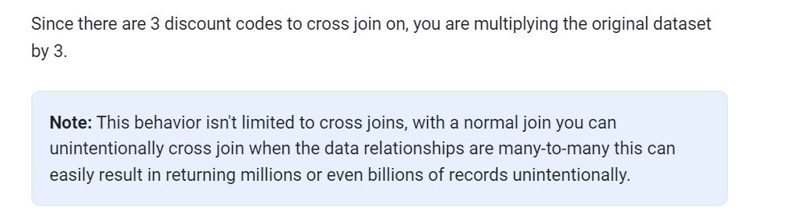

# <https§§§www.cloudskillsboost.google§course_sessions§3671937§labs§375631>

> [https://www.cloudskillsboost.google/course_sessions/3671937/labs/375631](https://www.cloudskillsboost.google/course_sessions/3671937/labs/375631)

# Troubleshooting and Solving Data Join Pitfalls v1.5

## Overview

* *Cross join* : combines each row of the first dataset with each row of the second dataset, where every combination is represented in the output.
* *Inner join* : requires that key values exist in both tables for the records to appear in the results table. Records appear in the merge only if there are matches in both tables for the key values.
* *Left join* : Each row in the left table appears in the results, regardless of whether there are matches in the right table.
* *Right join* : the reverse of a left join. Each row in the right table appears in the results, regardless of whether there are matches in the left table.

https://cloud.google.com/bigquery/docs/reference/standard-sql/query-syntax



## Task 2. Pin the Lab Project in BigQuery



## Task 3. Examine the fields

navigate to `data-to-insights` > `ecommerce` > `all_sessions_raw`.

## Task 4. Identify a key field in your ecommerce dataset

You want to become familiar with the products on the website and the fields you could use to potentially join on to other datasets

### Examine the records

```sql
#standardSQL
# how many products are on the website?
SELECT DISTINCT
productSKU,
v2ProductName
FROM `data-to-insights.ecommerce.all_sessions_raw`
```

use distinct

```sql
#standardSQL
# find the count of unique SKUs
SELECT
DISTINCT
productSKU
FROM `data-to-insights.ecommerce.all_sessions_raw`
```

> The first results probably contain products with duplicate SKUs.

use str_aggr

```sql
#standardSQL
# how can we find the products with more than 1 sku?
SELECT
DISTINCT
COUNT(DISTINCT productSKU) AS SKU_count,
STRING_AGG(DISTINCT productSKU LIMIT 5) AS SKU,
v2ProductName
FROM `data-to-insights.ecommerce.all_sessions_raw`
WHERE productSKU IS NOT NULL
GROUP BY v2ProductName
HAVING SKU_count > 1
ORDER BY SKU_count DESC
# product name is not unique (expected for variants)
```



```sql
#standardSQL
SELECT
DISTINCT
COUNT(DISTINCT v2ProductName) AS product_count,
STRING_AGG(DISTINCT v2ProductName LIMIT 5) AS product_name,
productSKU
FROM `data-to-insights.ecommerce.all_sessions_raw`
WHERE v2ProductName IS NOT NULL
GROUP BY productSKU
HAVING product_count > 1
ORDER BY product_count DESC
# SKU is not unique (indicates data quality issues)
```



## Task 5. Pitfall: non-unique key

> Having a non-unique key can cause serious data issues.

```sql
#standardSQL
# multiple records for this SKU
SELECT DISTINCT
v2ProductName,
productSKU
FROM `data-to-insights.ecommerce.all_sessions_raw`
WHERE productSKU = 'GGOEGPJC019099'
```

### Joining website data against your product inventory list

See the impact of joining on a dataset with multiple products for a single SKU. First, explore the product inventory dataset (the `products` table) to see if this SKU is unique there.

```sql
#standardSQL
# join in another table
# products (has inventory)
SELECT * FROM `data-to-insights.ecommerce.products`
WHERE SKU = 'GGOEGPJC019099'
```

### Join pitfall: Unintentional many-to-one SKU relationship

```sql
#standardSQL
SELECT DISTINCT
website.v2ProductName,
website.productSKU,
inventory.stockLevel
FROM `data-to-insights.ecommerce.all_sessions_raw` AS website
JOIN `data-to-insights.ecommerce.products` AS inventory
ON website.productSKU = inventory.SKU
WHERE productSKU = 'GGOEGPJC019099'
```

```sql
#standardSQL
SELECT DISTINCT
website.v2ProductName,
website.productSKU,
inventory.stockLevel
FROM `data-to-insights.ecommerce.all_sessions_raw` AS website
JOIN `data-to-insights.ecommerce.products` AS inventory
ON website.productSKU = inventory.SKU
WHERE productSKU = 'GGOEGPJC019099'
```

## Task 6. Join pitfall solution: use distinct SKUs before joining

First, you need to only select distinct SKUs from the website before joining on other datasets

```sql
#standardSQL
SELECT
COUNT(DISTINCT website.productSKU) AS distinct_sku_count
FROM `data-to-insights.ecommerce.all_sessions_raw` AS website
```

### Join pitfall: Losing data records after a join

```sql
#standardSQL
SELECT DISTINCT
website.productSKU
FROM `data-to-insights.ecommerce.all_sessions_raw` AS website
JOIN `data-to-insights.ecommerce.products` AS inventory
ON website.productSKU = inventory.SKU
```


You lost 819 SKUs after joining the datasets, investigate by adding more specificity in your fields.

```sql
#standardSQL
# pull ID fields from both tables
SELECT DISTINCT
website.productSKU AS website_SKU,
inventory.SKU AS inventory_SKU
FROM `data-to-insights.ecommerce.all_sessions_raw` AS website
JOIN `data-to-insights.ecommerce.products` AS inventory
ON website.productSKU = inventory.SKU
# IDs are present in both tables, how can we dig deeper?
```



```sql
#standardSQL
# the secret is in the JOIN type
# pull ID fields from both tables
SELECT DISTINCT
website.productSKU AS website_SKU,
inventory.SKU AS inventory_SKU
FROM `data-to-insights.ecommerce.all_sessions_raw` AS website
LEFT JOIN `data-to-insights.ecommerce.products` AS inventory
ON website.productSKU = inventory.SKU
```

**Write a query** to filter on NULL values from the inventory table

```sql
#standardSQL
# find product SKUs in website table but not in product inventory table
SELECT DISTINCT
website.productSKU AS website_SKU,
inventory.SKU AS inventory_SKU
FROM `data-to-insights.ecommerce.all_sessions_raw` AS website
LEFT JOIN `data-to-insights.ecommerce.products` AS inventory
ON website.productSKU = inventory.SKU
WHERE inventory.SKU IS NULL
```

**Copy and paste** the below query to confirm using one of the specific SKUs from the website dataset:

```sql
#standardSQL
# you can even pick one and confirm
SELECT * FROM `data-to-insights.ecommerce.products`
WHERE SKU = 'GGOEGATJ060517'
# query returns zero results
```



Are there any products are in the product inventory dataset but missing from the website?

```sql
#standardSQL
# reverse the join
# find records in website but not in inventory
SELECT DISTINCT
website.productSKU AS website_SKU,
inventory.SKU AS inventory_SKU
FROM `data-to-insights.ecommerce.all_sessions_raw` AS website
RIGHT JOIN `data-to-insights.ecommerce.products` AS inventory
ON website.productSKU = inventory.SKU
WHERE website.productSKU IS NULL
```


Next, add more fields from the product inventory dataset for more details.

```sql
#standardSQL
# what are these products?
# add more fields in the SELECT STATEMENT
SELECT DISTINCT
website.productSKU AS website_SKU,
inventory.*
FROM `data-to-insights.ecommerce.all_sessions_raw` AS website
RIGHT JOIN `data-to-insights.ecommerce.products` AS inventory
ON website.productSKU = inventory.SKU
WHERE website.productSKU IS NULL
```



What if you wanted one query that listed all products missing from either the website or inventory?

Write a query using a different join type.

```sql
#standardSQL
SELECT DISTINCT
website.productSKU AS website_SKU,
inventory.SKU AS inventory_SKU
FROM `data-to-insights.ecommerce.all_sessions_raw` AS website
FULL JOIN `data-to-insights.ecommerce.products` AS inventory
ON website.productSKU = inventory.SKU
WHERE website.productSKU IS NULL OR inventory.SKU IS NULL
```


### Join pitfall: Unintentional Cross Join

> Not knowing the relationship between data table keys (1:1, 1:N, N:N) can return unexpected results and also significantly reduce query performance.

The last join type is the CROSS JOIN.

```sql
#standardSQL
CREATE OR REPLACE TABLE ecommerce.site_wide_promotion AS
SELECT .05 AS discount;
```

```sql
SELECT DISTINCT
productSKU,
v2ProductCategory,
discount
FROM `data-to-insights.ecommerce.all_sessions_raw` AS website
CROSS JOIN ecommerce.site_wide_promotion
WHERE v2ProductCategory LIKE '%Clearance%'
```


```sql
#standardSQL
INSERT INTO ecommerce.site_wide_promotion (discount)
VALUES (.04),
       (.03);
```

What happens when you apply the discount again across all 82 clearance products?

```sql
#standardSQL
# now what happens:
SELECT DISTINCT
productSKU,
v2ProductCategory,
discount
FROM `data-to-insights.ecommerce.all_sessions_raw` AS website
CROSS JOIN ecommerce.site_wide_promotion
WHERE v2ProductCategory LIKE '%Clearance%'
```


```sql
#standardSQL
SELECT DISTINCT
productSKU,
v2ProductCategory,
discount
FROM `data-to-insights.ecommerce.all_sessions_raw` AS website
CROSS JOIN ecommerce.site_wide_promotion
WHERE v2ProductCategory LIKE '%Clearance%'
AND productSKU = 'GGOEGOLC013299'
```



## Task 7. Deduplicating rows

At the start of the lab you wrote a query that showed multiple product names for a single SKU. Deduplicating records like this is a common skill for data analysts

```sql
#standardSQL
# recall the earlier query that showed multiple product_names for each SKU
SELECT
DISTINCT
COUNT(DISTINCT v2ProductName) AS product_count,
STRING_AGG(DISTINCT v2ProductName LIMIT 5) AS product_name,
productSKU
FROM `data-to-insights.ecommerce.all_sessions_raw`
WHERE v2ProductName IS NOT NULL
GROUP BY productSKU
HAVING product_count > 1
ORDER BY product_count DESC
```

write a query to only choose one of the product_names.

```sql
#standardSQL
# take the one name associated with a SKU
WITH product_query AS (
  SELECT
  DISTINCT
  v2ProductName,
  productSKU
  FROM `data-to-insights.ecommerce.all_sessions_raw`
  WHERE v2ProductName IS NOT NULL
)
SELECT k.* FROM (
  # aggregate the products into an array and
  # only take 1 result
  SELECT ARRAY_AGG(x LIMIT 1)[OFFSET(0)] k
  FROM product_query x
  GROUP BY productSKU # this is the field you want deduplicated
);
```

> You have successfully deduplicated the product names for each SKU
