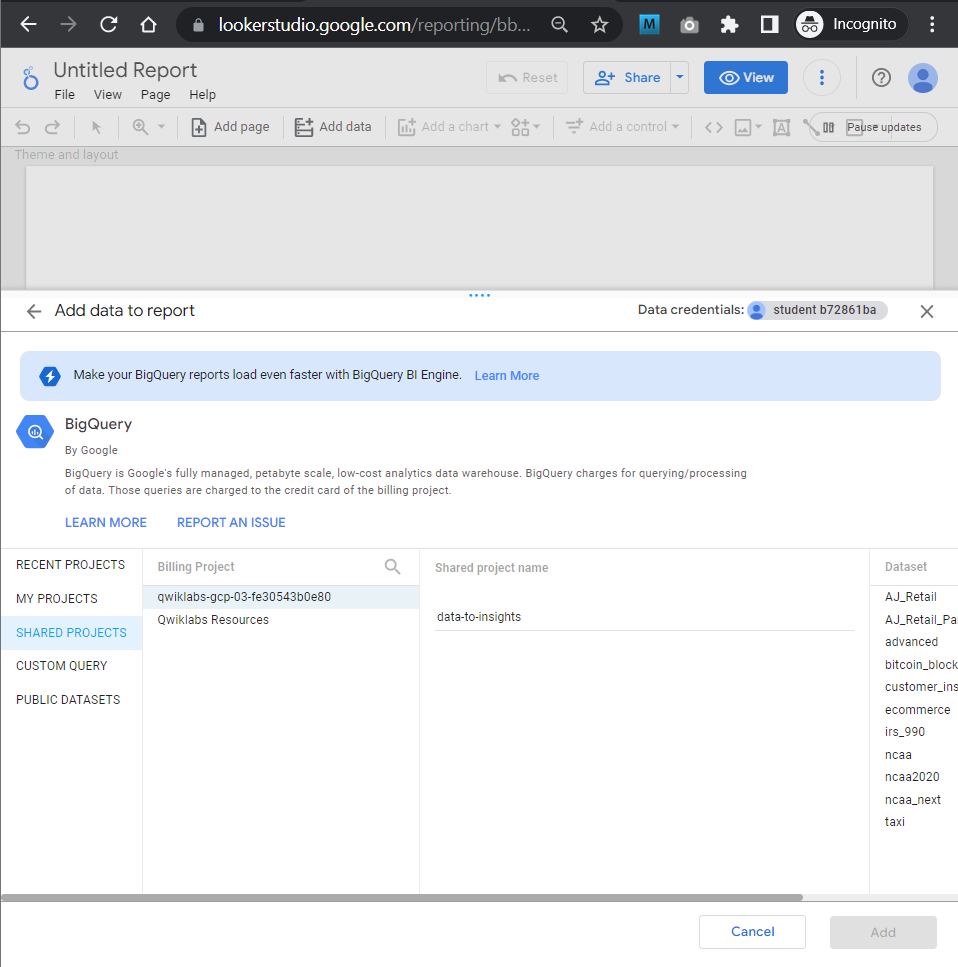

# <https§§§www.cloudskillsboost.google§course_sessions§3671937§labs§375640>

> [https://www.cloudskillsboost.google/course_sessions/3671937/labs/375640](https://www.cloudskillsboost.google/course_sessions/3671937/labs/375640)

# Explore and Create Reports with Looker Studio v1.5

## Overview

[https://cloud.google.com/looker-studio](https§§§cloud.google.com§looker-studio/readme.md)

 

## Task 1. Launch Looker Studio and create a blank report

[https://lookerstudio.google.com/overview](https§§§lookerstudio.google.com§overview/readme.md)

[https://lookerstudio.google.com/navigation/reporting](https§§§lookerstudio.google.com§navigation§reporting/readme.md)

 

add sared project

 

ecomerce sales_report

 

add to report

 

as perc

 

## Task 2. Create a report

 

 

other graph

 

 
