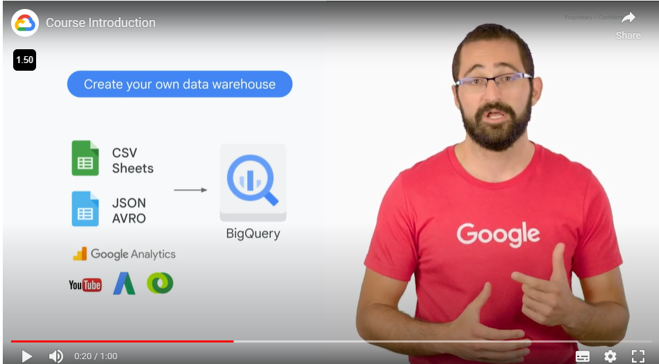
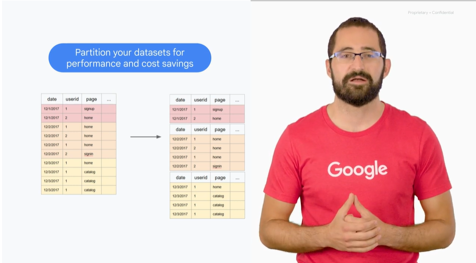
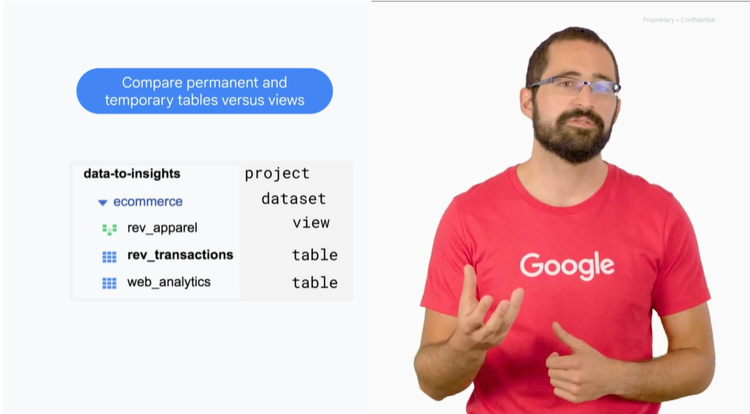
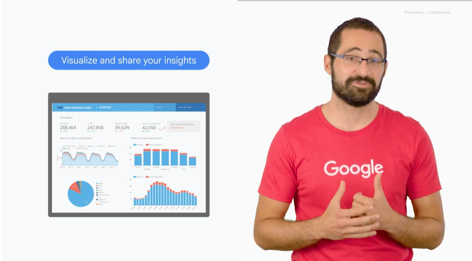
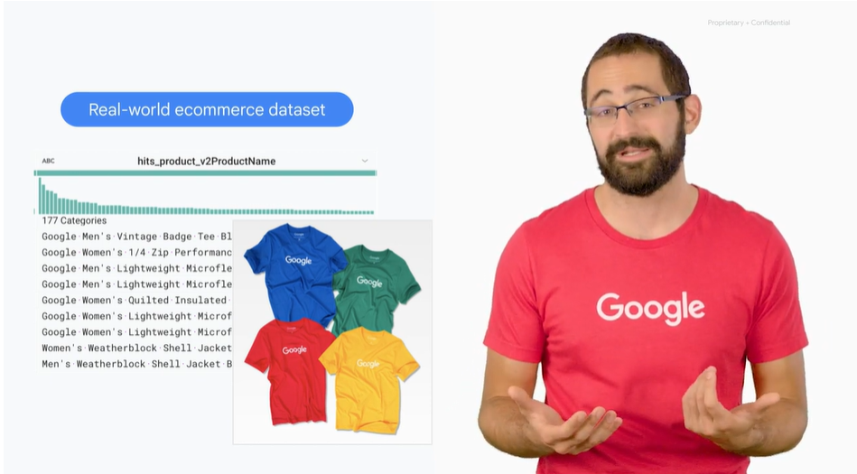

# <https§§§www.cloudskillsboost.google§course_sessions§3671937§video§375610>

> [https://www.cloudskillsboost.google/course_sessions/3671937/video/375610](https://www.cloudskillsboost.google/course_sessions/3671937/video/375610)

# Course Introduction

types of data usable in bq

partitioning

perm and temp  table and views

# Recap of Google Analytics ecommerce dataset

we use 1y of data from ecommerve

 
