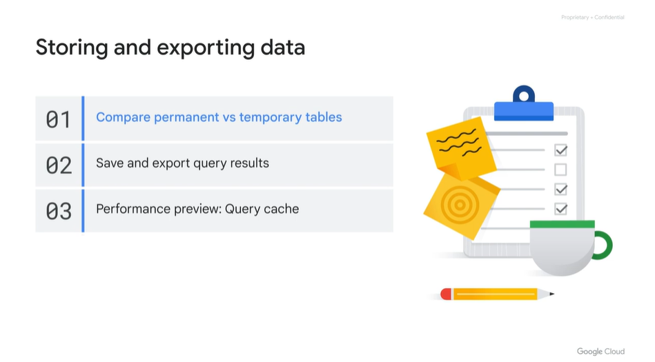
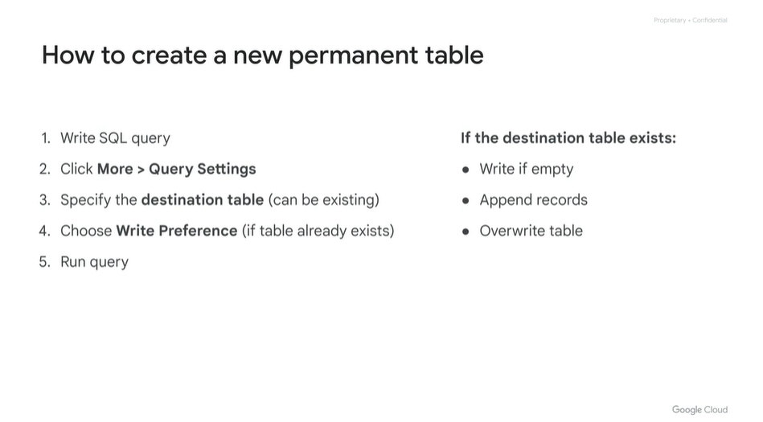
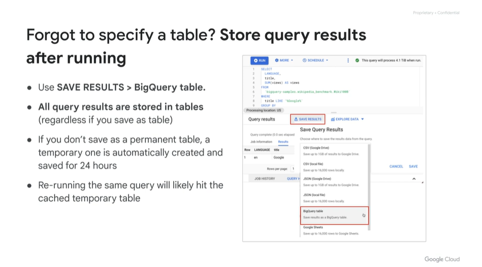
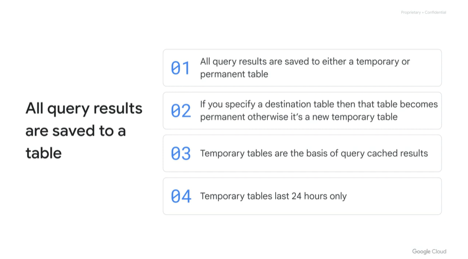
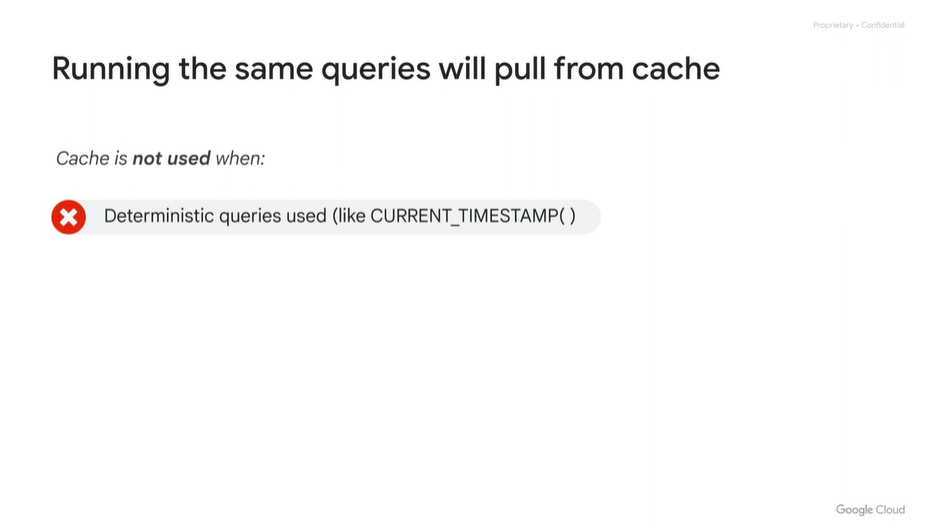
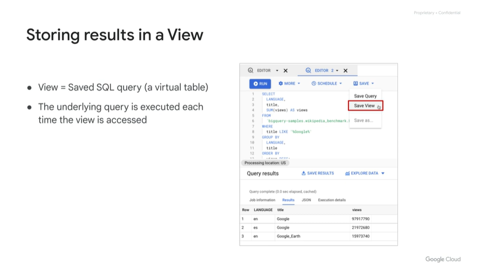
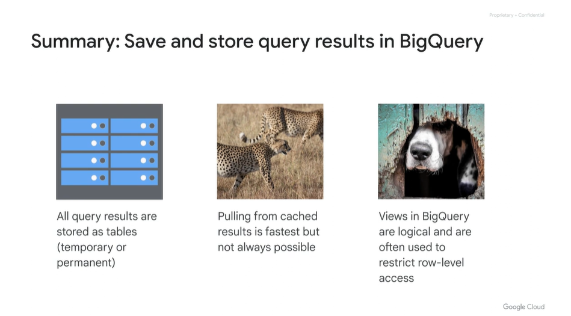
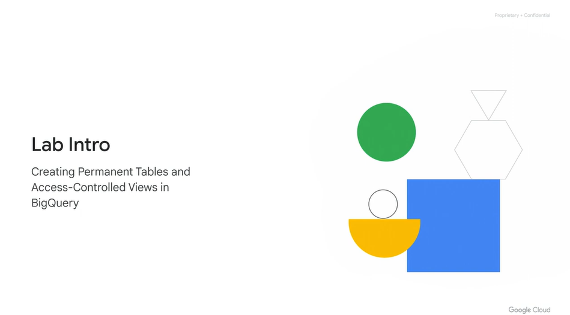

# <https§§§www.cloudskillsboost.google§course_sessions§3671937§video§375612>

> [https://www.cloudskillsboost.google/course_sessions/3671937/video/375612](https://www.cloudskillsboost.google/course_sessions/3671937/video/375612)

# Creating permanent tables

 

perm table stores data

 

# Temporary tables and query results

save results

 

fyi

 

# Performance preview: Query cache

 

or table changes

# Creating logical Views

store quety as view

 

 

bq stores all your result for 24 hours automatically

# Lab Intro: Creating Permanent Tables and Access-Controlled Views in BigQuery

# Creating Permanent Tables and Access-Controlled Views in BigQuery v1.5

https://www.cloudskillsboost.google/course_sessions/3671937/labs/375617
