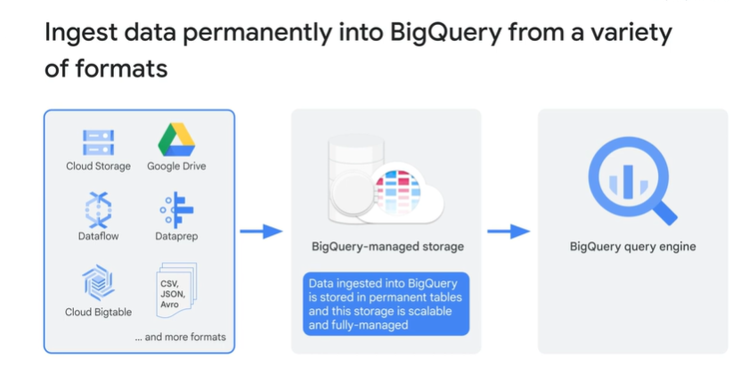
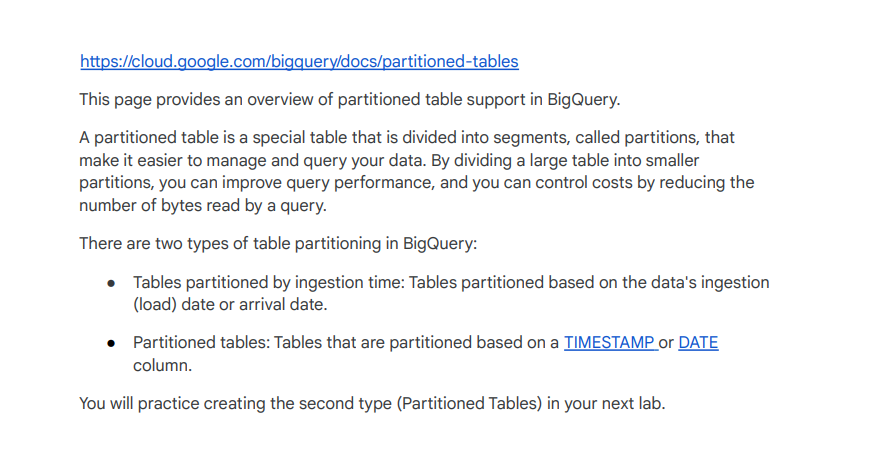

# <https§§§www.cloudskillsboost.google§course_sessions§3671937§video§375619>

> [https://www.cloudskillsboost.google/course_sessions/3671937/video/375619](https://www.cloudskillsboost.google/course_sessions/3671937/video/375619)

# Ingesting new data into BigQuery

or

external data and connection

a few limitations

you can stream to  bq

# Lab Intro: Ingesting New Datasets into BigQuery

[https://www.cloudskillsboost.google/course_sessions/3671937/labs/375621](https§§§www.cloudskillsboost.google§course_sessions§3671937§labs§375621/readme.md)

Module Quiz

# Background: Partitioned tables

 

[https://cloud.google.com/bigquery/docs/reference/standard-sql/data-types#timestamp_type](https§§§cloud.google.com§bigquery§docs§reference§standard-sql§data-types#timestamp_type/readme.md)

[https://cloud.google.com/bigquery/docs/reference/standard-sql/data-types#date_type](https§§§cloud.google.com§bigquery§docs§reference§standard-sql§data-types#date_type/readme.md)

# Creating Date-Partitioned Tables in BigQuery v1.5

[https://www.cloudskillsboost.google/course_sessions/3671937/labs/375624](https§§§www.cloudskillsboost.google§course_sessions§3671937§labs§375624/readme.md)
