# <https§§§www.cloudskillsboost.google§course_sessions§3671937§video§375635>

> [https://www.cloudskillsboost.google/course_sessions/3671937/video/375635](https://www.cloudskillsboost.google/course_sessions/3671937/video/375635)

# Overview of data visualization principles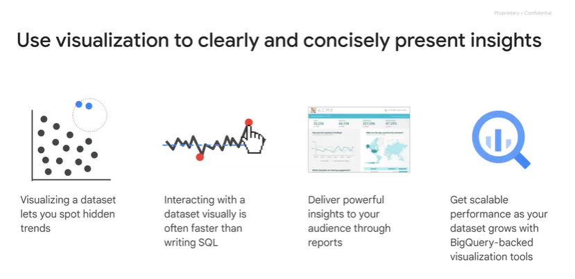

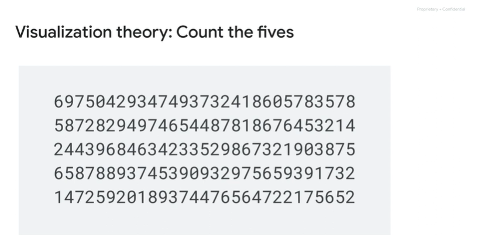

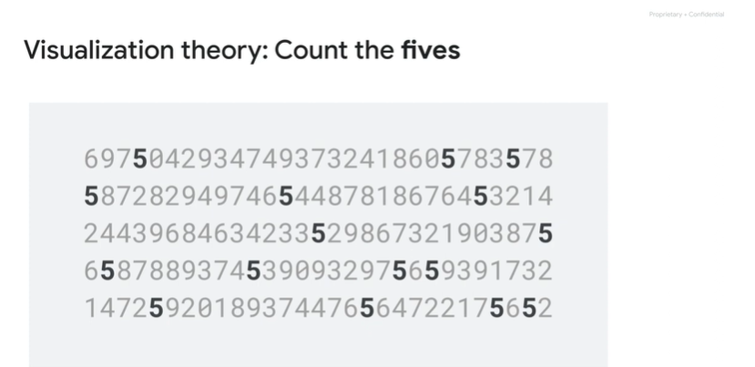

# Comparing good and bad visualizations

the graph on the left doesn’t have any type of quantitative details to show what the actual values are.

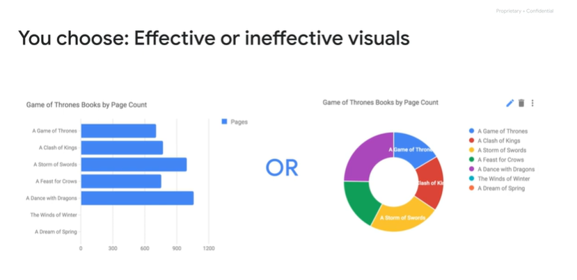

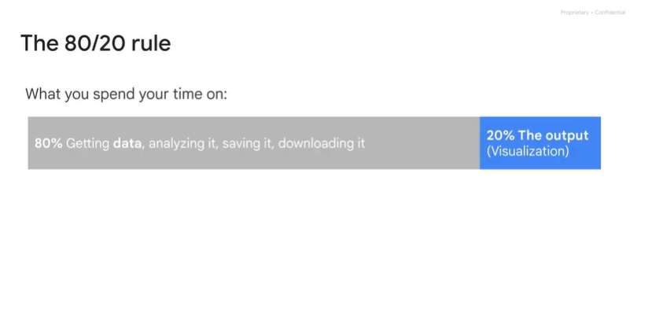

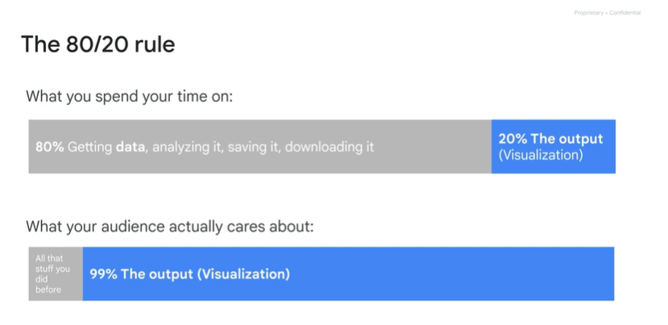

# Dimensions, Measures, and Reports

One of the core concepts that we're going to dive into is dimensions versus measures

 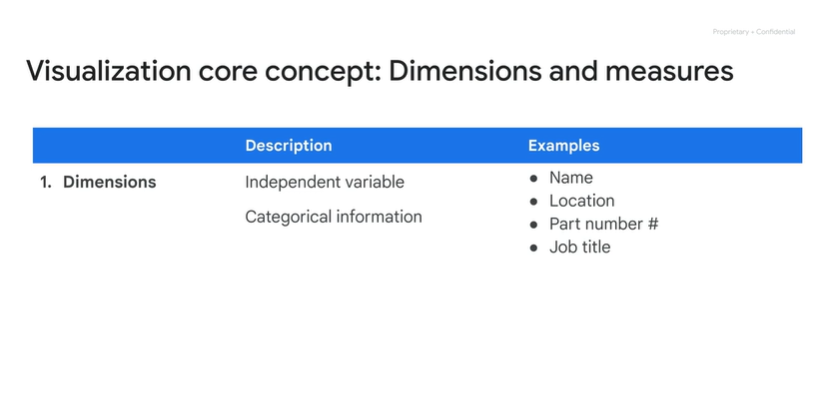

A dimension is a field that you can classify, that is an independent variable

 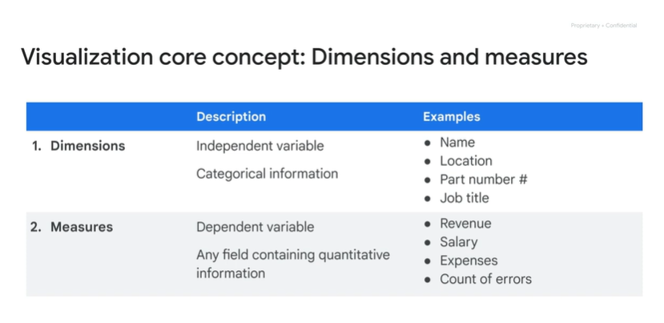

Measures are generally going to be quantitative information, things like revenue metrics, expenses, salaries, counts, or sums.

 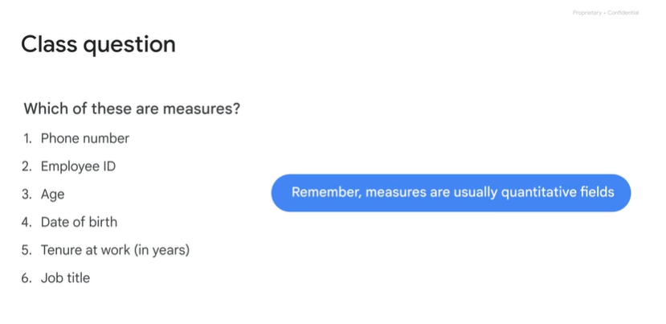

primary output

 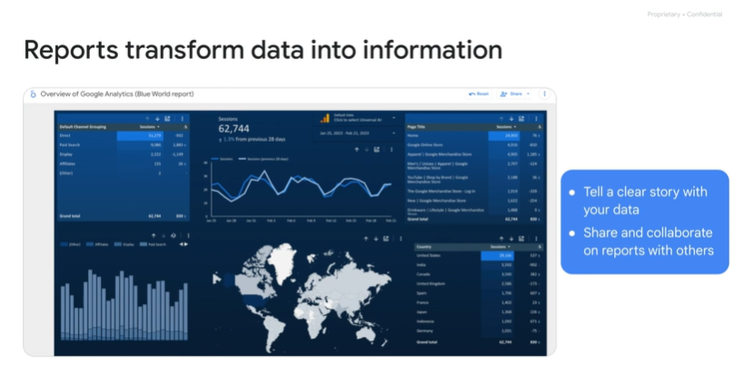

# Introducing Looker Studio

Now it's time to look at Looker Studio, one of the ways that you can visualize the insights I've been talking about

> I'll differentiate between Looker and Looker Studio

Looker is a business intelligence and big data analytics platform that helps users explore, analyze, and share real-time business analytics. 

Looker Studio, formerly known as Data Studio, is a web interface that makes it easy  to create interactive dashboards and reports from a wide variety of sources

 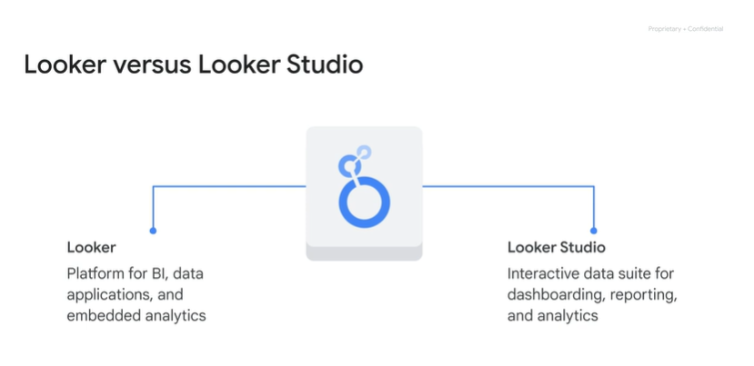

 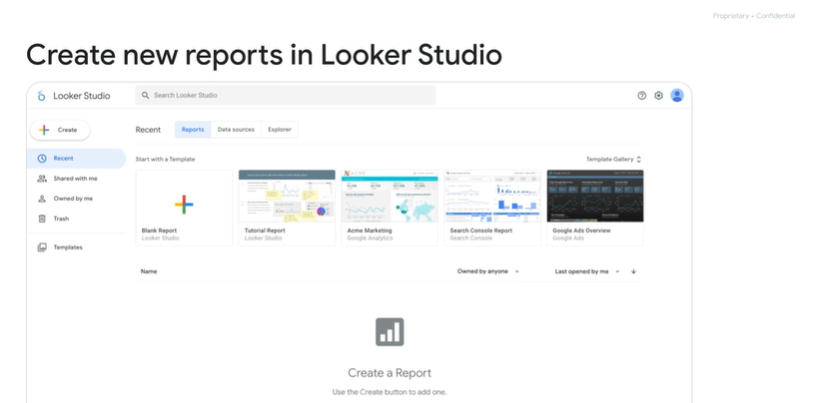

home

 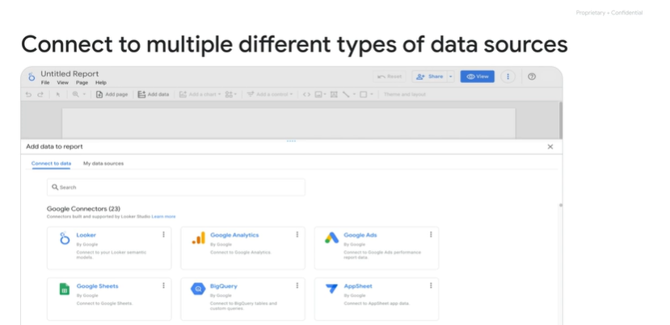

connector

 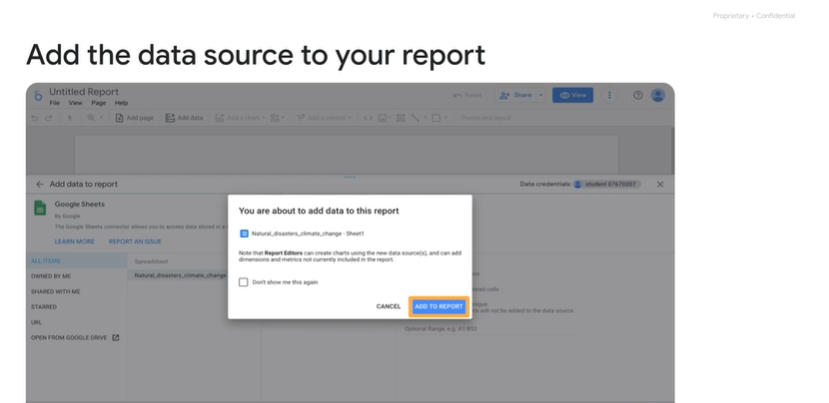

add datasource

 

tour

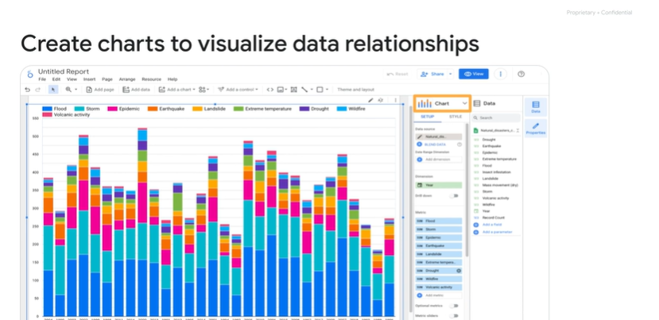

# Lab Intro: Explore and Create Reports with Looker Studio

 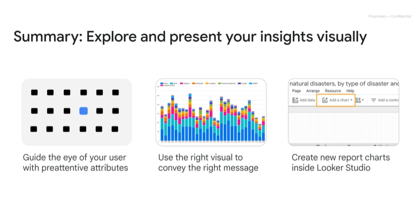

Now it's time for you to explore an ecommerce dataset that has millions of Google Analytics records for the Google Merchandise Store loaded into BigQuery.

 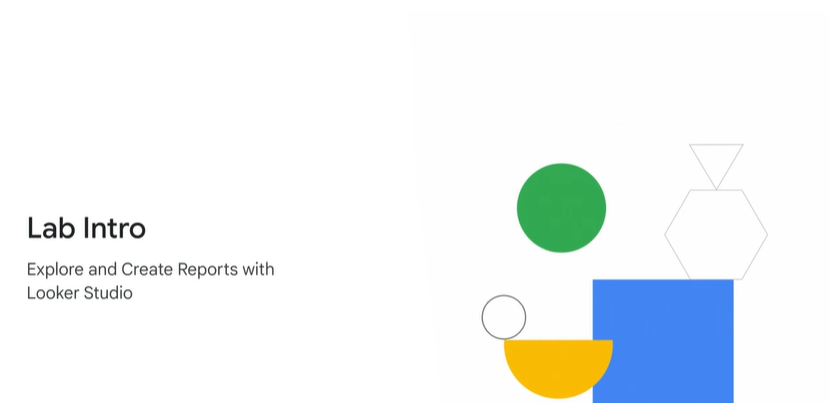

# Explore and Create Reports with Looker Studio v1.5

https://www.cloudskillsboost.google/course_sessions/3671937/labs/375640

# Module Quiz

 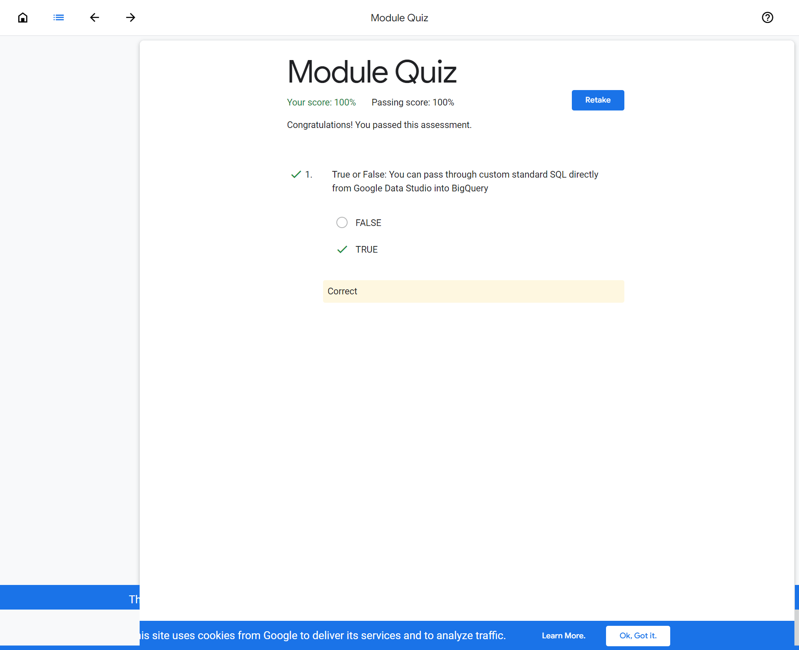
