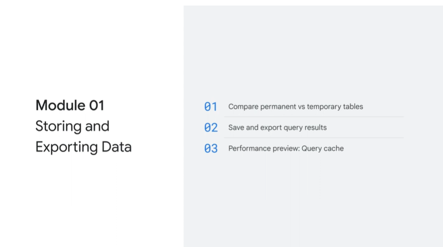
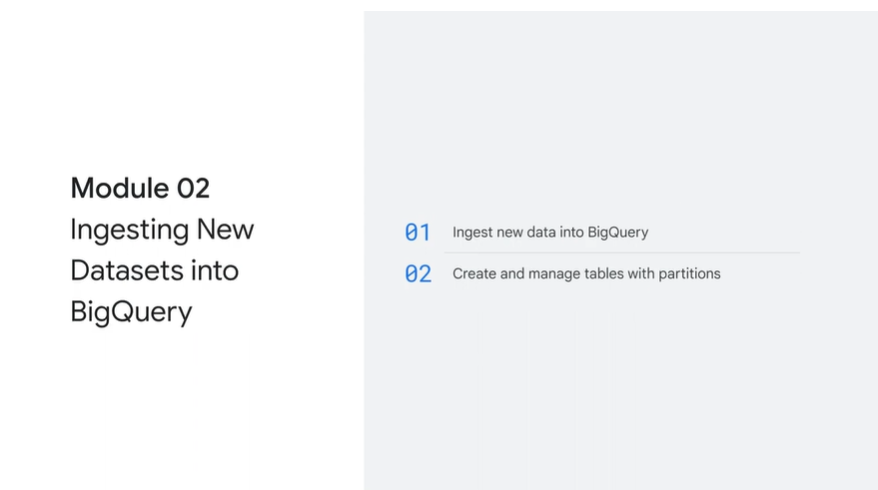
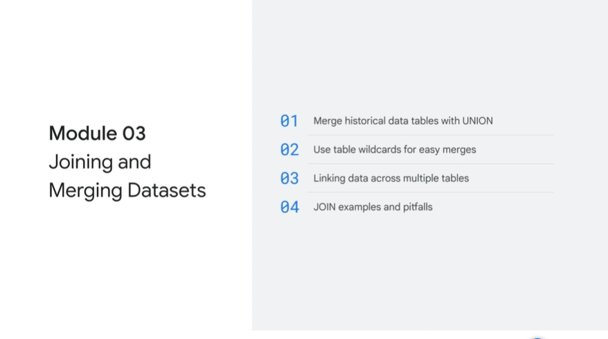
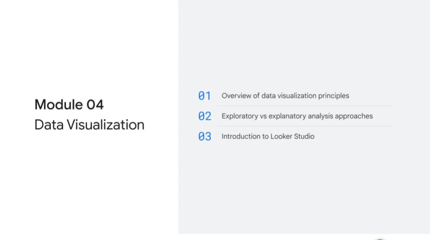
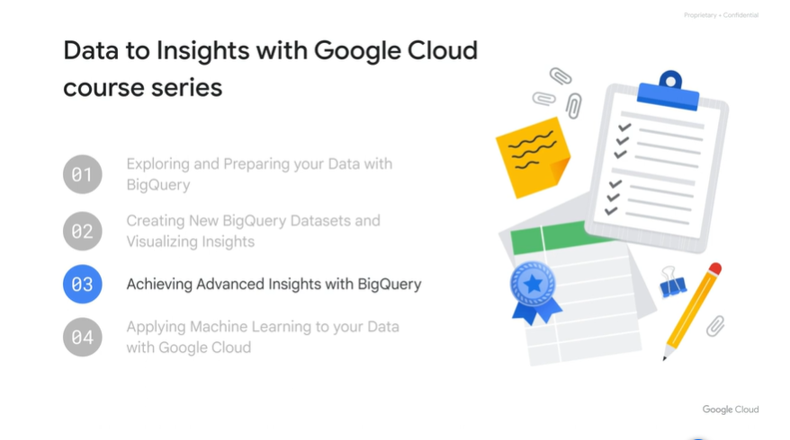

# <https§§§www.cloudskillsboost.google§course_sessions§3671937§video§375642>

> [https://www.cloudskillsboost.google/course_sessions/3671937/video/375642](https://www.cloudskillsboost.google/course_sessions/3671937/video/375642)

# Course summary

In module 1, storing and exporting data was introduced. One of the core building blocks of data analysis is creating and running your SQL queries on raw data sources, and then saving those results into new tables that you can access later.
You learned about the difference between permanent and temporary data tables, and how to store the results of your queries. You also learned about query cache, which results in faster query results, and how to
store your query as a View. Lastly in module 1, you completed a lab where you created permanent tables and access-controlled views in BigQuery.

In module 2, ingesting new datasets into BigQuery was introduced.
You learned about the difference between loading data into BigQuery versus querying it directly from an external data source. You also learned about streaming records into BigQuery through the API.
Lastly in module 2, you completed a lab where you practiced loading data into BigQuery from external sources like Cloud Storage and Google Sheets. You also learned how to set up an external data connection

In module 3, joining and merging datasets was introduced. You learned how to append additional historical datasets together through UNIONs and how to make your merges easier by using the table wildcard.
You also learned about JOINs, where you access data from separate tables that share a common element. Then, you learned about the different types of JOINs and pitfalls to be aware of when
creating them. Lastly in module 3, you completed a lab where you brought data together from different data tables through UNIONS and JOINS

In module 4, data visualization was introduced.
One of the key outputs and deliverables that data analysts create are those insightful reports you present to your audience. You learned a little visualization theory and best practices by comparing good and bad
visualizations. You also learned about dimensions and measures, core visualization conceptst. Then, you explored Looker Studio before completing a lab where you created a new report and added visuals and interactive filters for your reporting users.

 

