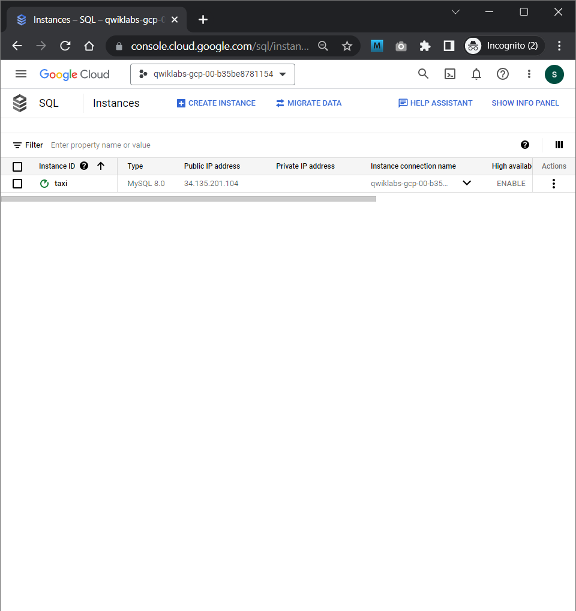
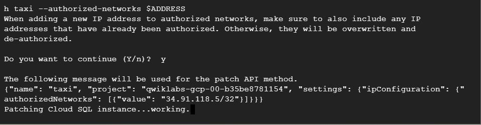
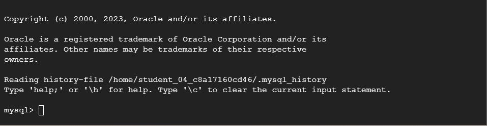
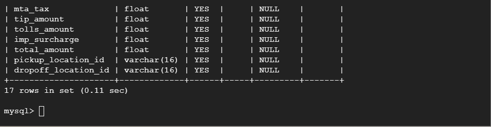
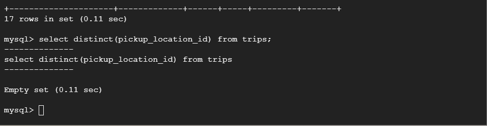
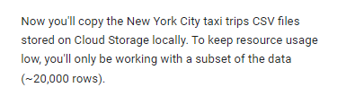
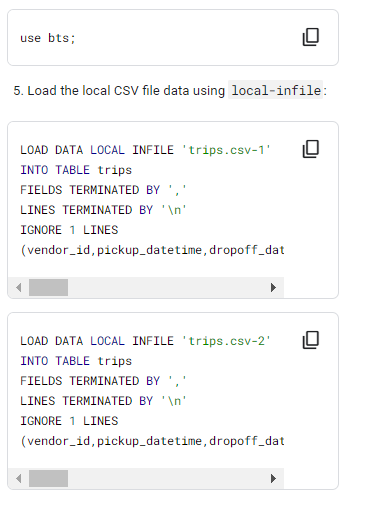
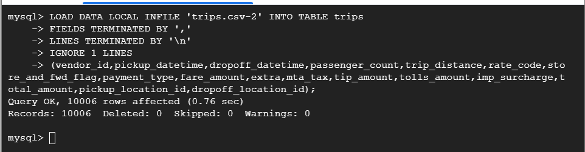

# <https§§§www.cloudskillsboost.google§course_sessions§3724532§labs§382266>

> [https://www.cloudskillsboost.google/course_sessions/3724532/labs/382266](https://www.cloudskillsboost.google/course_sessions/3724532/labs/382266)

# Loading Taxi Data into Google Cloud SQL 2.5


## Setup and requirements

```bash
export PROJECT_ID=$(gcloud info --format='value(config.project)')
export BUCKET=${PROJECT_ID}-ml
```


## Task 2. Create a Cloud SQL instance

```bash
# Enter the following commands to create a Cloud SQL instance:
gcloud sql instances create taxi \
    --tier=db-n1-standard-1 --activation-policy=ALWAYS

# Set a root password for the Cloud SQL instance:
gcloud sql users set-password root --host % --instance taxi \
 --password Passw0rd
```

`Passw0rd`


 

```bash
# create an environment variable with the IP address of the Cloud Shell:
export ADDRESS=$(wget -qO - http://ipecho.net/plain)/32

# whitelist the cloud shell imnstance
gcloud sql instances patch taxi --authorized-networks $ADDRESS
```


 


```bash
Get the IP address of your Cloud SQL instance by running:

MYSQLIP=$(gcloud sql instances describe \
taxi --format="value(ipAddresses.ipAddress)")

mysql --host=$MYSQLIP --user=root \
      --password --verbose
```


 


```sql
create database if not exists bts;
use bts;
drop table if exists trips;
create table trips (
  vendor_id VARCHAR(16),
  pickup_datetime DATETIME,
  dropoff_datetime DATETIME,
  passenger_count INT,
  trip_distance FLOAT,
  rate_code VARCHAR(16),
  store_and_fwd_flag VARCHAR(16),
  payment_type VARCHAR(16),
  fare_amount FLOAT,
  extra FLOAT,
  mta_tax FLOAT,
  tip_amount FLOAT,
  tolls_amount FLOAT,
  imp_surcharge FLOAT,
  total_amount FLOAT,
  pickup_location_id VARCHAR(16),
  dropoff_location_id VARCHAR(16)
);
```

describe trips;

 

select distinct(pickup_location_id) from trips;

 


## Task 3. Add data to Cloud SQL instance

 


```bash
gcloud storage cp gs://cloud-training/OCBL013/nyc_tlc_yellow_trips_2018_subset_1.csv trips.csv-1
gcloud storage cp gs://cloud-training/OCBL013/nyc_tlc_yellow_trips_2018_subset_2.csv trips.csv-2
```


 


 


## Task 4. Checking for data integrity
