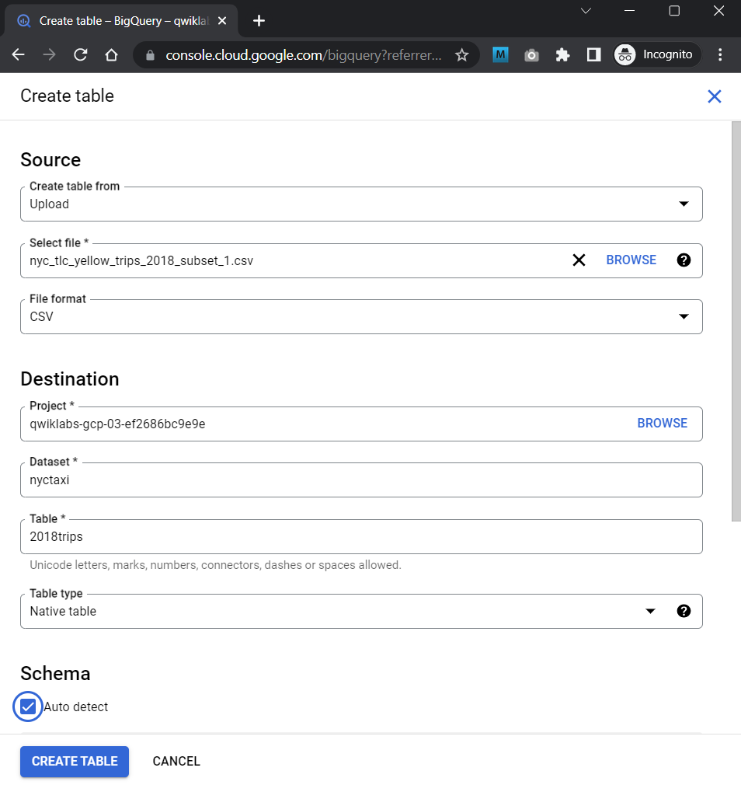
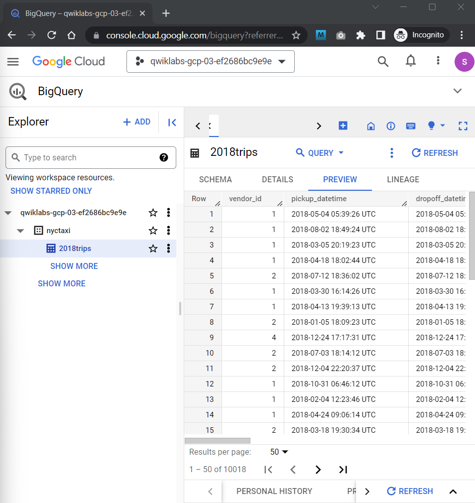
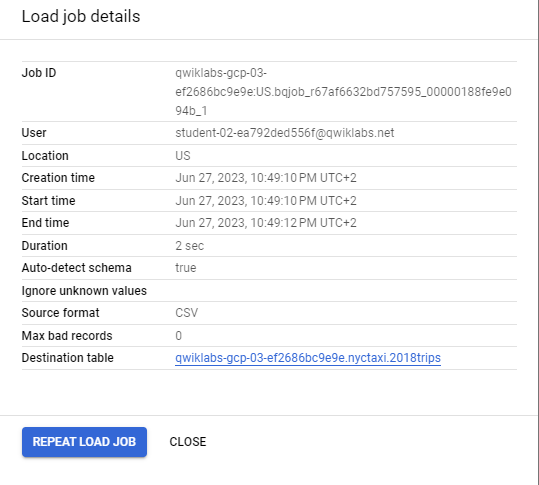
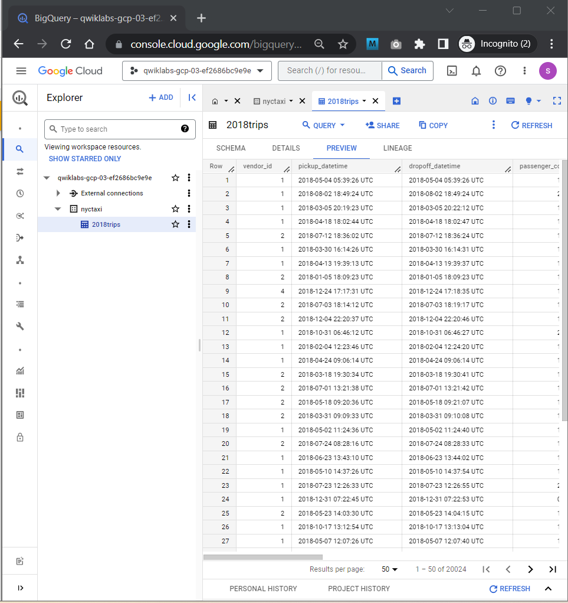

# <https§§§www.cloudskillsboost.google§course_sessions§3724532§labs§382275>

> [https://www.cloudskillsboost.google/course_sessions/3724532/labs/382275](https://www.cloudskillsboost.google/course_sessions/3724532/labs/382275)


# Loading data into BigQuery

 


## Task 1. Create a new dataset to store tables

 

## Task 2. Ingest a new dataset from a CSV

 

 


## Task 3. Ingest a new dataset from Google Cloud Storage


```bash
bq load \
--source_format=CSV \
--autodetect \
--noreplace  \
nyctaxi.2018trips \
gs://cloud-training/OCBL013/nyc_tlc_yellow_trips_2018_subset_2.csv
```


 

now we have

20k rows

 


## Task 4. Create tables from other tables with DDL


```bash

#standardSQL
CREATE TABLE
  nyctaxi.january_trips AS
SELECT
  *
FROM
  nyctaxi.2018trips
WHERE
  EXTRACT(Month
  FROM
    pickup_datetime)=1;


-- and
#standardSQL
SELECT
  *
FROM
  nyctaxi.january_trips
ORDER BY
  trip_distance DESC
LIMIT
  1
```
