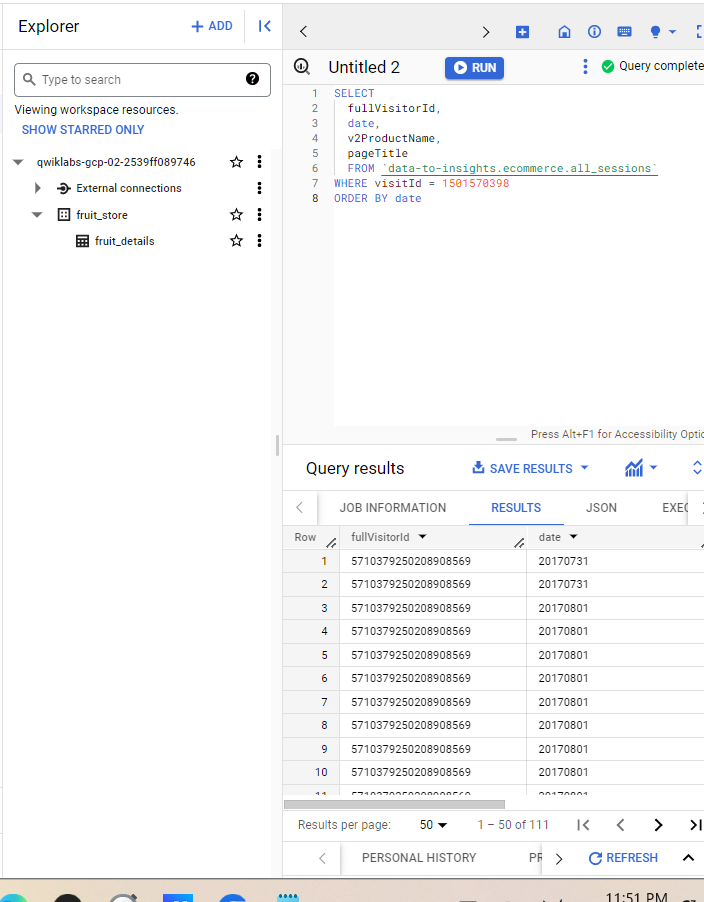
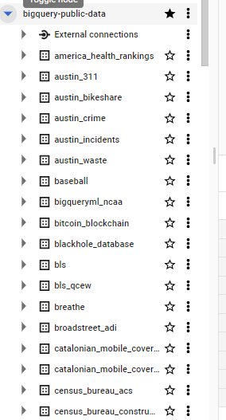

# <https§§§www.cloudskillsboost.google§course_sessions§3724532§labs§382283>

> [https://www.cloudskillsboost.google/course_sessions/3724532/labs/382283](https://www.cloudskillsboost.google/course_sessions/3724532/labs/382283)


# Working with JSON and Array data in BigQuery 2.5


 


## Task 1. Create a new dataset to store our tables


 


## Task 2. Practice working with Arrays in SQL

 


use array

 

or

 


```
#standardSQL
SELECT
['raspberry', 'blackberry', 'strawberry', 'cherry'] AS fruit_array
```

 


```
#standardSQL
SELECT
['raspberry', 'blackberry', 'strawberry', 'cherry', 1234567] AS fruit_array
```

 


> Data in an array [ ] must all be the same type


 


### Loading semi-structured JSON into BigQuery


`data-insights-course/labs/optimizing-for-performance/shopping_cart.json`


 


 


## Task 3. Creating your own arrays with ARRAY_AGG()

SELECT

 


Now, we will use the `ARRAY_AGG()` function to aggregate our string values into an array

 


or

 

array_length

```
SELECT
  fullVisitorId,
  date,
  ARRAY_AGG(v2ProductName) AS products_viewed,
  ARRAY_LENGTH(ARRAY_AGG(v2ProductName)) AS num_products_viewed,
  ARRAY_AGG(pageTitle) AS pages_viewed,
  ARRAY_LENGTH(ARRAY_AGG(pageTitle)) AS num_pages_viewed
  FROM `data-to-insights.ecommerce.all_sessions`
WHERE visitId = 1501570398
GROUP BY fullVisitorId, date
ORDER BY date
```

 


```

SELECT
  fullVisitorId,
  date,
  ARRAY_AGG(DISTINCT v2ProductName) AS products_viewed,
  ARRAY_LENGTH(ARRAY_AGG(DISTINCT v2ProductName)) AS distinct_products_viewed,
  ARRAY_AGG(DISTINCT pageTitle) AS pages_viewed,
  ARRAY_LENGTH(ARRAY_AGG(DISTINCT pageTitle)) AS distinct_pages_viewed
  FROM `data-to-insights.ecommerce.all_sessions`
WHERE visitId = 1501570398
GROUP BY fullVisitorId, date
ORDER BY date
```

jsut 8 distinct

```json
[{
  "fullVisitorId": "5710379250208908569",
  "date": "20170731",
  "products_viewed": ["Google Snapback Hat Black", "Google Women\u0027s Lightweight Microfleece Jacket"],
  "distinct_products_viewed": "2",
  "pages_viewed": ["Google RFID Journal", "Google Snapback Hat Black"],
  "distinct_pages_viewed": "2"
}, {
  "fullVisitorId": "5710379250208908569",
  "date": "20170801",
  "products_viewed": ["Android Hard Cover Journal", "Suitcase Organizer Cubes", "Google Flashlight", "Google 5-Panel Snapback Cap", "Google Blackout Cap", "Android Sticker Sheet Ultra Removable", "Windup Android", "Compact Selfie Stick", "Google Sunglasses", "Recycled Mouse Pad", "8 pc Android Sticker Sheet", "Android 17oz Stainless Steel Sport Bottle", "Android RFID Journal", "YouTube Twill Cap", "Galaxy Screen Cleaning Cloth", "Google 5-Panel Cap", "Electronics Accessory Pouch", "Google 2200mAh Micro Charger", "Android Rise 14 oz Mug", "Android Wool Heather Cap Heather/Black", "Google Men\u0027s 100% Cotton Short Sleeve Hero Tee White", "Google Bib White", "Keyboard DOT Sticker", "Google Twill Cap", "Google Kick Ball", "Google Device Holder Sticky Pad", "Badge Holder", "Four Color Retractable Pen", "Google Doodle Decal", "Basecamp Explorer Powerbank Flashlight", "Gunmetal Roller Ball Pen", "SPF-15 Slim \u0026 Slender Lip Balm", "Maze Pen", "Google Car Clip Phone Holder", "Waze Dress Socks", "Plastic Sliding Flashlight", "Google Stylus Pen w/ LED Light", "1 oz Hand Sanitizer", "Switch Tone Color Crayon Pen", "Metal Texture Roller Pen", "Ballpoint Stylus Pen", "Android Luggage Tag", "Rubber Grip Ballpoint Pen 4 Pack", "Google Device Stand", "Google Luggage Tag", "22 oz Android Bottle", "Seat Pack Organizer", "YouTube Custom Decals", "Google Snapback Hat Black", "Android Lunch Kit", "Google Laptop and Cell Phone Stickers", "Rocket Flashlight", "Google 4400mAh Power Bank", "Google Bib Red", "Satin Black Ballpoint Pen", "Colored Pencil Set", "Waze Pack of 9 Decal Set", "Micro Wireless Earbud", "Pen Pencil \u0026 Highlighter Set", "Android Twill Cap", "Ballpoint LED Light Pen"],
  "distinct_products_viewed": "61",
  "pages_viewed": ["Office | Google Merchandise Store", "Accessories | Google Merchandise Store", "Electronics | Google Merchandise Store", "Writing Instruments | Office | Google Merchandise Store", "Apparel | Google Merchandise Store", "Shop by Brand | Google Merchandise Store", "Fun | Accessories | Google Merchandise Store", "Other | Office | Google Merchandise Store"],
  "distinct_pages_viewed": "8"
}]
```


 


## Task 4. Querying datase

## ts that already have ARRAYs

 


```json
SELECT
  *
FROM `bigquery-public-data.google_analytics_sample.ga_sessions_20170801`
WHERE visitId = 1501570398
```


The grayed out cells are visual placeholders to make it possible to show each item in an array type column on its own row within the context of a row in the result set

```json
SELECT
  visitId,
  hits.page.pageTitle
FROM `bigquery-public-data.google_analytics_sample.ga_sessions_20170801`
WHERE visitId = 1501570398
```

 

UNNEST


```json
SELECT DISTINCT
  visitId,
  h.page.pageTitle
FROM `bigquery-public-data.google_analytics_sample.ga_sessions_20170801`,
UNNEST(hits) AS h
WHERE visitId = 1501570398
LIMIT 10
```

 

 


## Task 5. Introduction to STRUCTs

https://cloud.google.com/bigquery/docs/reference/standard-sql/data-types#struct-type

 


`bigquery-public-data`

 


```json
SELECT
  visitId,
  totals.*,
  device.*
FROM `bigquery-public-data.google_analytics_sample.ga_sessions_20170801`
WHERE visitId = 1501570398
LIMIT 10
```

The `.*` syntax tells BigQuery to return all fields for that STRUCT (much like it would if totals.* was a separate table we joined against).

```json
[{
  "visitId": "1501570398",
  "visits": "1",
  "hits": "11",
  "pageviews": "11",
  "timeOnSite": "731",
  "bounces": null,
  "transactions": null,
  "transactionRevenue": null,
  "newVisits": "1",
  "screenviews": null,
  "uniqueScreenviews": null,
  "timeOnScreen": null,
  "totalTransactionRevenue": null,
  "sessionQualityDim": "8",
  "browser": "Chrome",
  "browserVersion": "not available in demo dataset",
  "browserSize": "not available in demo dataset",
  "operatingSystem": "Android",
  "operatingSystemVersion": "not available in demo dataset",
  "isMobile": "true",
  "mobileDeviceBranding": "not available in demo dataset",
  "mobileDeviceModel": "not available in demo dataset",
  "mobileInputSelector": "not available in demo dataset",
  "mobileDeviceInfo": "not available in demo dataset",
  "mobileDeviceMarketingName": "not available in demo dataset",
  "flashVersion": "not available in demo dataset",
  "javaEnabled": null,
  "language": "not available in demo dataset",
  "screenColors": "not available in demo dataset",
  "screenResolution": "not available in demo dataset",
  "deviceCategory": "tablet"
}]
```

 


## Task 6. Practice with STRUCTs and ARRAYs

```json
#standardSQL
SELECT STRUCT("Rudisha" as name, 23.4 as split) as runner
```


Store each split time as an element in an ARRAY of splits


```json
#standardSQL
SELECT STRUCT("Rudisha" as name, [23.4, 26.3, 26.4, 26.1] as splits) AS runner
```

 

 


### Practice ingesting JSON data

 

```json
[

    {
        "name": "race",
        "type": "STRING",
        "mode": "NULLABLE"
    },
    {
        "name": "participants",
        "type": "RECORD",
        "mode": "REPEATED",
        "fields": [
            {
                "name": "name",
                "type": "STRING",
                "mode": "NULLABLE"
            },
            {
                "name": "splits",
                "type": "FLOAT",
                "mode": "REPEATED"
            }
        ]
    }
]
```

 


the `participants.splits` field is an array of floats inside of the parent `participants` struct.


### Practice querying nested and repeated fields

```json
#standardSQL
SELECT * FROM racing.race_results
```

 
