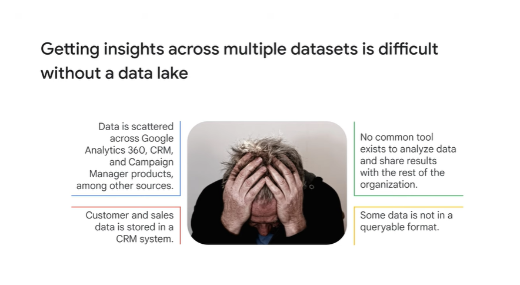
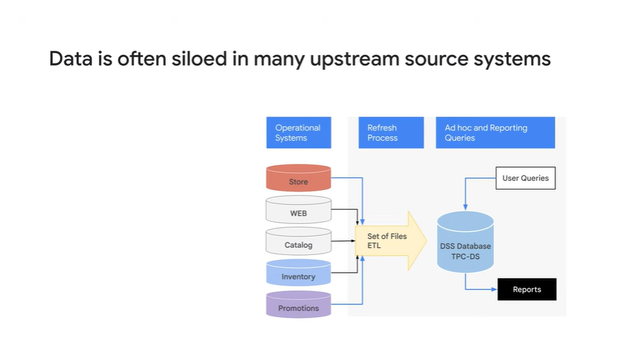
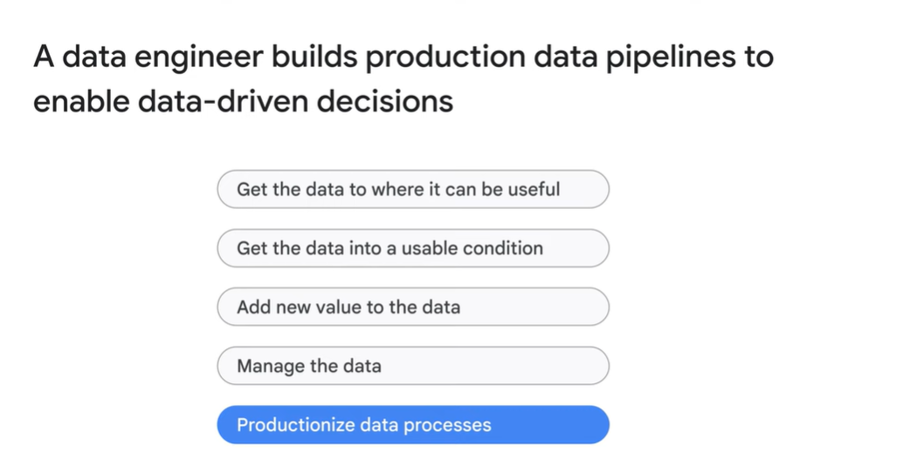
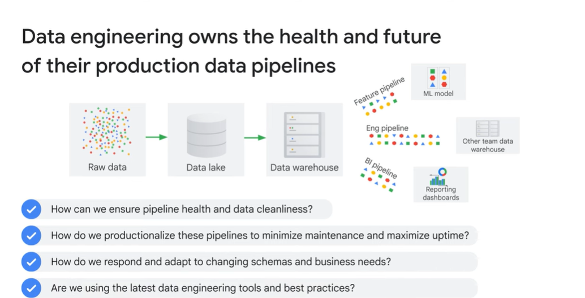

# <https§§§www.cloudskillsboost.google§course_sessions§3724532§video§382243>

> [https://www.cloudskillsboost.google/course_sessions/3724532/video/382243](https://www.cloudskillsboost.google/course_sessions/3724532/video/382243)

# Module introduction

role of data eng and why to be done in the cloud

data pipliena nd their prupose

challenege in the data eng and cloud solution

bq intro

def datalakes and dataw

transactional databases

how to partner with the other teams

data governace

prod and monitoring

user case study

# The role of a data engineer

a ta eng build data pipeline to get data to  help biz to take data drive decisions

data lake bring data from enterprise and store raw data in datalake in single location

ex is to store in gcloud bucket

consideration

- datalka fits in cloud bucket or cloudsql
- scale to meet demand
- does it support high trougguput

cloud storage is blob storage so think about granularity access

bucket is good place to land raw data and then ingest in other places

storing data in buckets is durable and reliable

you can query the bucket data from bq

loading data needs etl

extract tranform and load them

batch pipeline in this case

store data in pub sub - transform it in datflow and store in bq

# Data engineering challenges

challenges

- diffucult access data
- quality of raw data is low
- tranf to refine data need resources
- challenge query perfomance

ex compute cost of acquring a customer,  data scattered in crm and other system

data access is difficult as data is silos inside departments

you need to know how tio combine data and each one has diff way to be accessed

so it can be challenge

dwh place where the data is in some form where easy to joina and query the data

dl raw is not easy to query

transform data from raw, etl the data and store in dwh

get raw data and then tranform to apply transf

if you need to do a lot of T a lot of resource can be necessary

etl jobs depends on data volume

eff of performnace

a lot of ovehead here, instead of focusing on insights

# Introduction to BigQuery

instead of the above you can use gcloud bq

ssas petascale dwh on gcloud

bq service replaces traditional dwh

dataset are like adata mart

data lake as bucket and cloudsql

def view as ansi 2011

iam grant

do more with less and avoid spending time on things not bringing value

avoid to previsions or tuning sresource

no need to provision reosurce

bq allocate resource as we consume as we add data to tables

queries use slot (cpu and ram resources)

# Data lakes and data warehouses

details on dwh and dl

we need to have data in usable form, raw data usually is not

consider key consideration about dwh  option

- dwh is a sink fed by batch or streaming
- will dwh scale to meet needs // def concurr query limits
- how data is organize catalogues and iam
- who pay for the query
- is perforance enough
- level of maintanance

- tradizional were limited hoe many ppl can use it
- you can share query results like looker
- bq lays foundation for ai

- bq allows analyse streaming data ingestion
- bq eliminates infrastarcture
- simplify iam and resource access

you can treat bq as simple query engine and query data stored in cloud sql or files in buckets and leave the data in place

# Transactional databases versus data warehouses

diff between db and dwh

you can migrate your db to cloud

a lot of reosurce per instance and autoscale with 0 downtime

avoid cloudsql for reporting

few  option for sql transaction //  opt for writes

bq is for analaysse // opt for reads

bq is column based storage so you can read individual columns

they serve 2 diff purposes

ex sql needs transactions

built on ref entegrity too

transactional systsme are raw data source on the left, these upstream get gathered togethers called dl

data is transformerd and stored in dwh and used by other systems and teams

# Partner effectively with other data teams

add new value to the data as ml

other teams partner with data eng core team working on dwh

- ml  enf
- data analyst and bi
- other data eng

earn trust making data discoverable, documented and easily accessable by toher teams

you can use bq ml to make ml in bq directly

other teams built dataset with clear schema def and perf to scale to concurrent dashborad

bq bi engine to speed up bi  app

instead of usingn  olap cube to have sub-sec response time, with intelligence caching and bq data access

how to scale and monitor the dwh

use of monitoring with alerts and notification on mterics

and track exp and cloud autdit log to see granular on execution query

# Manage data access and governance

def data access policy and how data would be used

- who can access
- pii handling
- acess to metadata

data catalofues helop to search the data,  in case of a lot of dataset for unified discovering

cloud data loss api helps to manage sensitive data

# Demo: Finding PII in your dataset with the DLP API

ex

identify pii  on tb of data

# Build production-ready pipelines

end to end and scalable processign data

use of workflow

aka cloud composer

you can call api endpoint

kick off datapip for you

# Google Cloud customer case study

data on hdfs copied to gcloud buckets

and give access to us from there

# Recap

https://github.com/priyankavergadia/google-cloud-4-words

# Lab Intro: Using BigQuery to do Analysis

# Using BigQuery to do Analysis

https://www.cloudskillsboost.google/course_sessions/3724532/labs/382256

# Quiz: Introduction to Data Engineering

 
