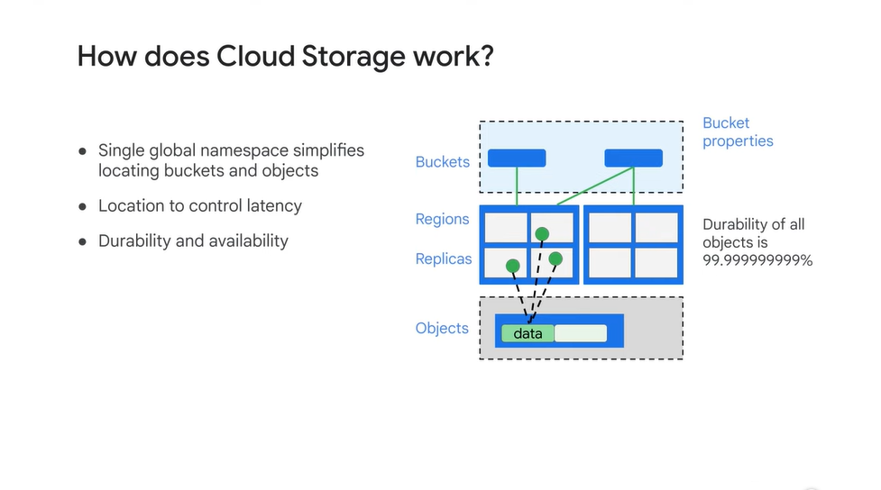

# <https§§§www.cloudskillsboost.google§course_sessions§3724532§video§382258>

> [https://www.cloudskillsboost.google/course_sessions/3724532/video/382258](https://www.cloudskillsboost.google/course_sessions/3724532/video/382258)

# Module Introduction

Welcome to the module on building a data lake.
00:03
We'll start by revisiting what data lakes are, and discuss your data storage and options for extracting, transforming, and loading your data into Google Cloud.
00:13
Then we'll do a deep dive into why Google Cloud Storage is a popular choice to serve as a data lake.
00:20
Securing your data lake running on Cloud Storage is of paramount importance.
00:25
We'll discuss the key security features that you need to know as a data engineer to control access to your objects.
00:31
Cloud Storage isn't your only choice when it comes to storing data in a data lake on Google Cloud.
00:37
So we'll look at the storing of different data types.
00:40
Finally, we'll look at Cloud SQL, the default choice for OLTP or Online Transaction Processing Workloads on Google Cloud.
00:48
You'll also do a hands-on lab where you'll practice creating a data lake for your relational data with Cloud SQL.

# Introduction to data lakes

  

dl central where to store raw data

cleanup  is rquired 

then in dwh

datapip  transf the data at scale with fresh data ready for analysis

above datapip is workflow to coordinate

regular or event driven 

 

analogy:

- build skyscraper
- need you have raw data from the source on the constuction site
- you cannot use them at easy // need to cut, shape
- data stored in dwh
- build the floors to have value
- worker do what data eng // a worker is a vm that tranform a small piece of data
- the building is your project // ml or some repository
- orch layer is like the manager on the site // do this do that when material arrives

 

In the data engineering world that’s your orchestration layer or overall workflow. So you might say “Everytime a new piece of CSV data drops into this Cloud Storage
04:30
bucket I want you to automatically pass it to our data pipeline for processing. AND, once it’s done processing, I want you -- the pipeline -- to stream it into the data
04:39
warehouse. AND, once it’s in the data warehouse, I will notify the machine learning model that new cleaned training data is available for training and direct it to start training a
04:49
new model version

 

arch solution diagr example

bq might be datal and datawh at the same time too

datal is consolidated durable staging area for raw data

as dataeng you need to know

def datal = all the aspects as producted by app as they are

 

adv is flexible but the problem too 

 

dwh after you  have use case and schema defined

get raw data and transf and store in dwh

data is used for report and ml

# Data storage and ETL options on Google Cloud

option for dqtal on gclud

it depeds on use case

decise what to use as 

 

- wher e data is
- 3Vs
- where it has to go  as data sink // dwh
- much transf need before it's useful // before or after the datal

el = simplest //data can be imported as it is, ingestable ex avro format and store in bq, extract and load as bq can load avro files 

you can even run federated queries via bq and not load at all

 

elt = transofmr when data need to be corrected // when tranf needed is not very high, in bq use sql to write data in a new table

etl = extr and applied tranform and then load in the gclous // tansf greately reduce the data size and use intermediate components, datapip tranfomerd in a datapip in dataflow before to be loaded in bq

# Build a data lake using Cloud Storage

deep dive incloud storgae

data there is persistent and inexpensive vs on compute

 

helpful state of app in cloudstorage and kill the vm when not needed

it's blob/obj storage

you can share data globally, encrypted, it s global service, data can be kept in ione region only 

 

buckets are container for data objects

buckets is uniq id

 

bucket is associated with regions

- latency min
- using region removes ingress charges
- replicas are managed for 9s durability

For a multi-region bucket, the objects are replicated across regions, and for a single region bucket, the objects are replicated across zones. I

 

obj are stored with metadata for acl and compression and lifecycle mng

you can set automatic deleting

def multiple class def on how long data is accessed

 

high pefromance in same region or data resiliance

 

low cost for not so often data access

ideal for data r/w once a month // bkp 

 

ideal for data at most once a quarter // disater recovery or legatory reasons

we have object lifecycle mng

 

bucket name + object 

 

like a fs path even if it's a sinle name

ex as path in  a normal fs

 

> moving files is exp operation has obj neeed to  be copied and deleted

you can use https on the web

 

you can set a retention policy on all objects in the bucket.
08:54
For example, the objects should expire after 30 days. You can also use versioning, so that multiple versions of an object are tracked and available if necessary. You might even set up lifecycle management, to automatically move objects that haven’t
09:08
been accessed in 30 days to Nearline and after 90 days to Coldline.

# Secure Cloud Storage

key feature to secure

 

iam and access control list

aim is set abucket level 

acl is applied at bucket level or for obj // more fine grain control

IAM provides project roles and bucket roles, including bucket reader, bucket writer and bucket owner. The ability to create or change access control lists is an IAM bucket role.aimm

And the ability to create and delete buckets and to set IAM policy is a project level role.

When you create a bucket, you are offered the option of disabling access lists and only using IAM.

ex

As an example, you might give some bob@example.com reader access to a bucket through IAM, and also give them write access to a specific file in that bucket through access control

 

gmek are managed are by google

kek are rotated 

you can manage the mek // customer managed

 

you can use 

 

 

log are immutable

def hold and lucked bucket so changes can occur

There are a whole host of special use cases supported by Cloud Storage. For example, decompressive coding. By default, the data you upload
04:51
is the same data you get back from Cloud Storage. This includes gzip archives, which usually are returned as gzip archives. However, if you tag an object properly in metadata,
05:05
you can cause Cloud Storage to decompress the file as it is being served. Benefits of the smaller compressed file are faster upload and lower storage costs compared with the uncompressed files.
05:18
You can set up a bucket to be requester pays on access. Normally, if data is accessed from a different region, you will have to pay network egress charges, but you can make the requester pay so that you pay only for data storage.
05:35
You can create a signed URL to anonymously share an object in Cloud Storage, and even have the URL expire after a period of time. It is possible to upload an object in pieces and create a composite object
05:50
without having to concatenate the pieces after upload

# Store all sorts of data types

 

You don’t want to use Cloud Storage for transactional workloads. Even though the latency of Cloud Storage is low, it is not low enough to support high-frequency writes. For transactional workloads, use Cloud SQL or Firestore depending on whether you want to use SQL or No-SQL. You also don’t want to use Cloud Storage for analytics on structured data.

If you do that, you will spend a significant amount of compute parsing data -- it is better to use Cloud Bigtable or BigQuery for analytics workloads on structured data, depending on the latency required

 

For example, in a banking system, depositing your salary to your account is a transaction.

An analytics workload, on the other hand, tends to read the entire dataset and is often used for planning or decision support

Analytical systems can be periodically populated from the operational systems.

Rather than load the data directly into BigQuery, it can be much more convenient to first load it to Cloud Storage and load from Cloud Storage to BigQuery.

Getting back to the discussion on transactional workloads, you have a few options for relational databases. The default choice here is Cloud SQL, but if you require a globally distributed database, then use Cloud Spanner.

If our database is many gigabytes, you need a distributed database. The scalability of Spanner is very appealing for this use case. Other than that, you’d use Cloud SQL because it is more cost-effective.
04:13
For analytics workloads, the default choice is BigQuery. However, if you require high-throughput inserts, more than millions of rows per second, or if you require low latency, on the order of milliseconds, use Cloud Bigtable.
04:26
Other than that, you’d use BigQuery because it is more cost-effective

# Cloud SQL as a relational data lake

Cloud SQL, we said, is the default choice for OLTP, or online transaction processing, workloads on Google Cloud.

 

hand off to Google the mundane, but necessary and often time-consuming tasks like applying patches and updates, managing backups, and configuring replications

 

 

 

For the special case of failover, Cloud SQL supports this. Cloud SQL instances can be configured with a failover
03:46
replica in a different zone in the same region. Then, Cloud SQL data is replicated across zones within a region for durability. In the unlikely event of a datacentre outage,
03:58
a Cloud SQL instance will automatically become available in another zone

 

You can use the failover replica as a read replica to offload read operations from the primary.

 

 

 

all serverless, data prod is amanged

# Lab Intro: Loading Taxi Data into Google Cloud SQL

 

In this next lab, you practice creating a data lake and bringing in all of your relational data from outside the cloud into a Google Cloud SQL-hosted environment.
00:11
Specifically, you'll first create a Google Cloud SQL instance which can hold multiple databases.
00:18
After the instance is up, you'll create a new Cloud SQL database, and then import some text data into Cloud SQL.

# Loading Taxi Data into Google Cloud SQL 2.5

https://www.cloudskillsboost.google/course_sessions/3724532/labs/382266
