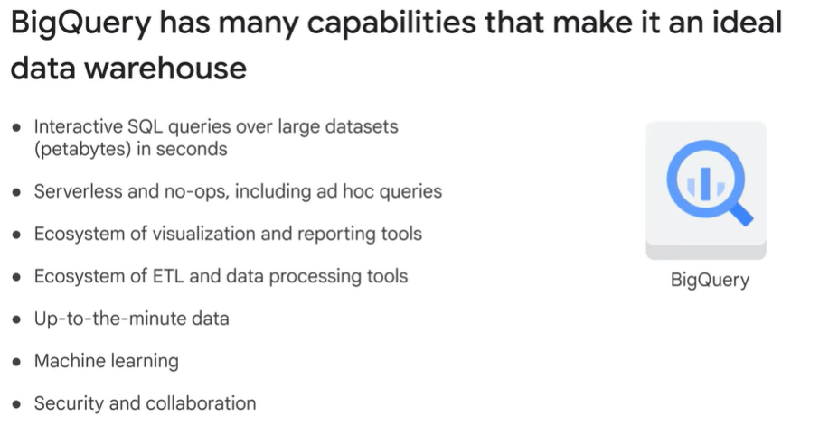
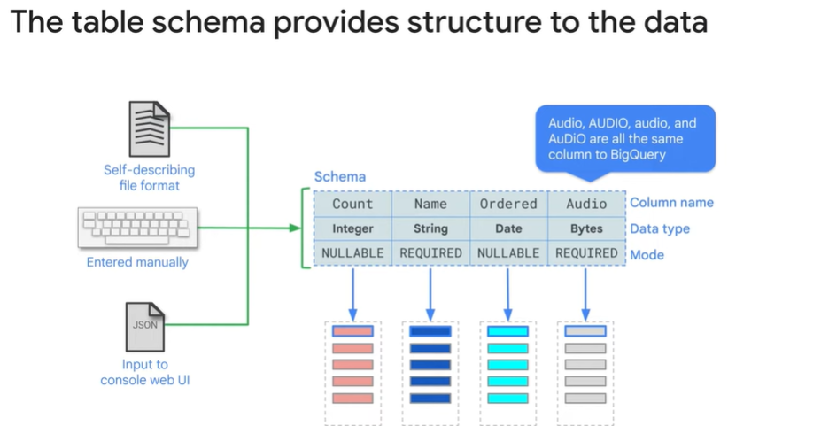
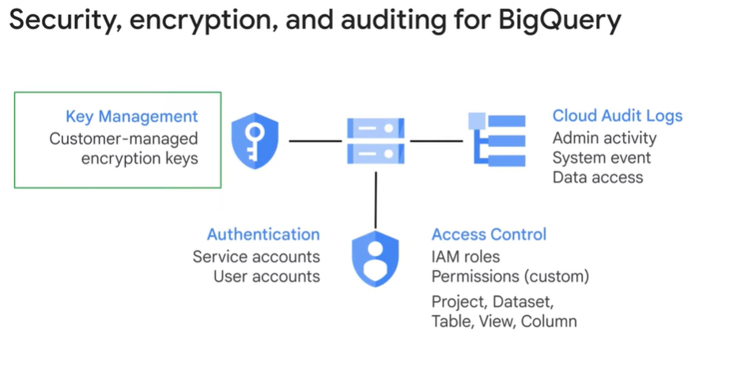
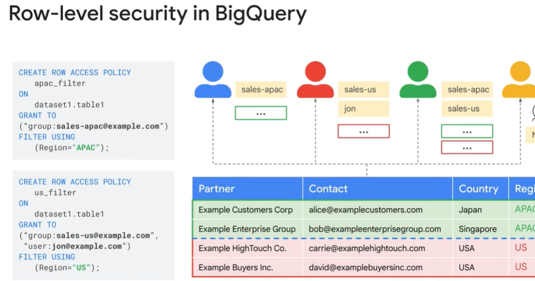
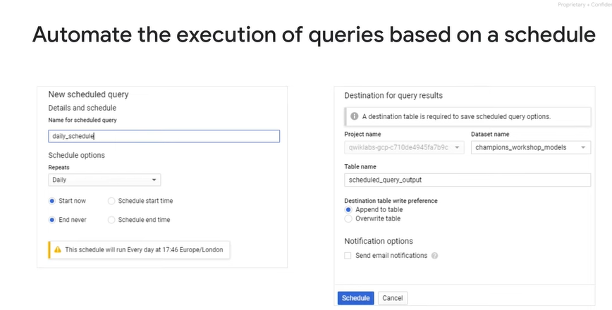
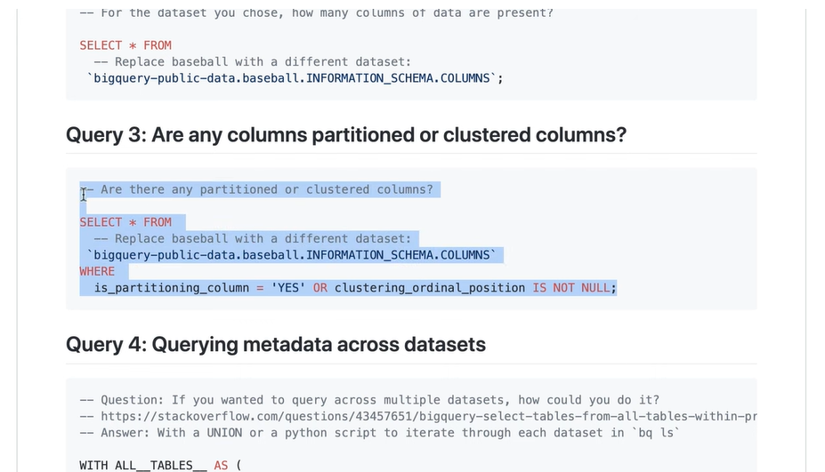
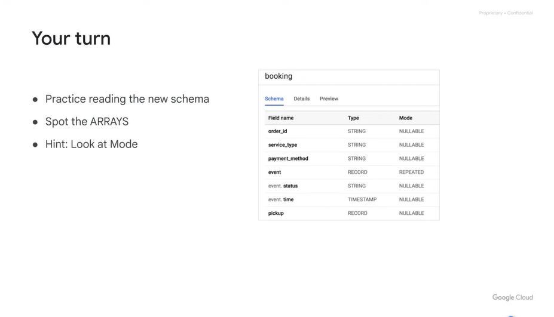
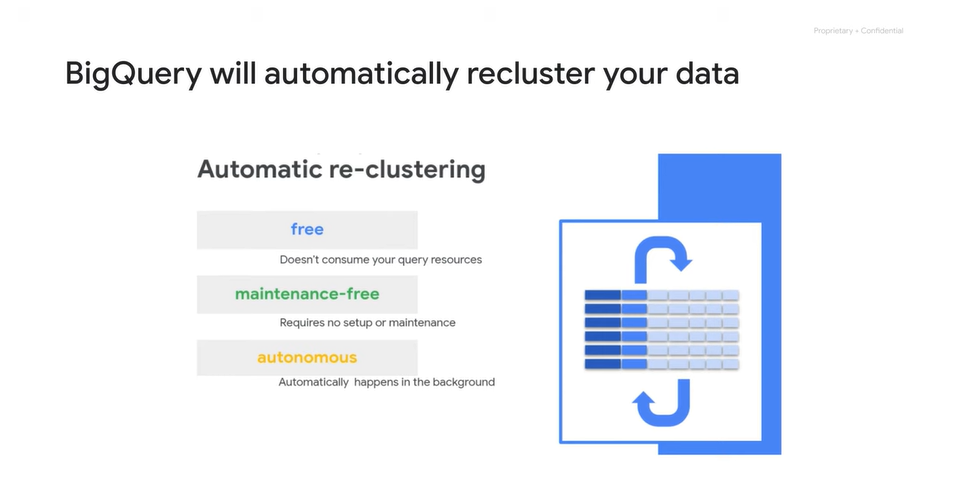
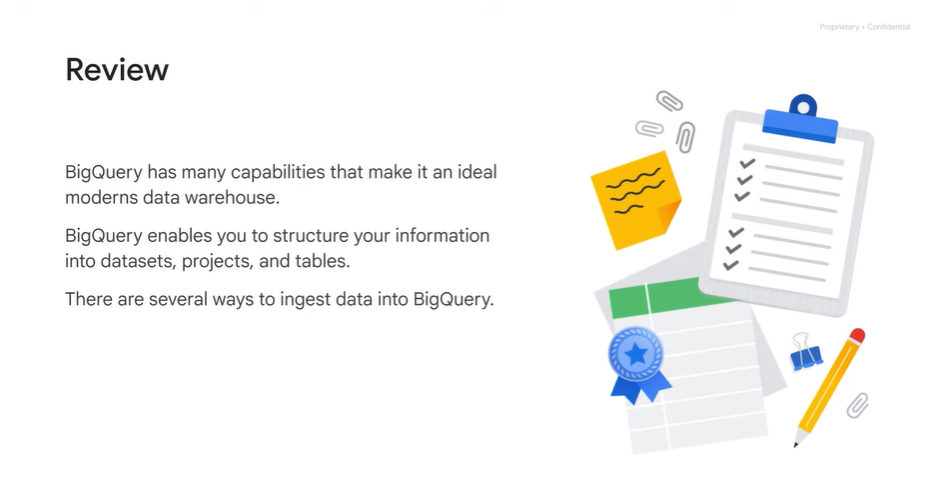

# <https§§§www.cloudskillsboost.google§course_sessions§3724532§video§382268>

> [https://www.cloudskillsboost.google/course_sessions/3724532/video/382268](https://www.cloudskillsboost.google/course_sessions/3724532/video/382268)

# Module Introduction


Hello and welcome to the Building a Data Warehouse module. This is the third module in the course, Modernizing Data Lakes and Data Warehouses with Google Cloud. We'll start by describing what makes a modern data warehouse.
00:14
We'll also talk about what distinguishes a data lake from an enterprise data warehouse. Then we're going to introduce BigQuery, a data warehouse solution on Google Cloud. Once you're familiar with the basics of BigQuery,
00:29
we'll talk about how BigQuery organizes your data and then how to load new data into BigQuery. You'll also have the opportunity to load data into BigQuery through a hands-on lab.
00:41
Finally, we'll dive into the world of data warehouse schemas. We'll talk about efficient data warehouse schema design and take a closer look at BigQuery support for nested and repeated fields
00:54
and why this is such a popular schema design for enterprises. You'll get some experience working with JSON and array data in BigQuery through a hands-on lab. We'll end by discussing how you can optimize
01:05
the tables in your data warehouse with partitioning and clustering.

# The modern data warehouse

edw consolidates data from manz sources

datal is diff as it is not consolidate

dwh has it

data must be cleand and consistent

datal  stores data, edw does the rest so data becomes info

dwh is modern if

+ deal dataset of Pb of data
+ no silos
+ one edw that can scale
+ ssas and nops and avoid idx to fine tune
+ support reach visualiyation tools
+ constant refresh data
+ stream into dwh
+ support ml
+ strong security and data sharing with collaborators

# Introduction to BigQuery



no worries to archive data, just keep it there

stream data in

part of gclopud about security and share dataset

ansi sql 2011

ssas service


support table expiration

no idx needed


col oriented

olap system, opt read and append


2 servic

- storage //colossus
- compute //jupyter for networking


no need to prevision resources


slot

they can be diff


quotas

By default, each account has a quota limit of 2000 to BigQuery slots for on-demand querying. A flat rate pricing model is available that provides reserved slots for customers who want more predictable pricing.
If a single simple query is submitted that needs fewer slots than are available, the query will generally execute faster. If you've reserved 10,000 slots but you have 30 concurrent queries that together ask for 15,000 slots, the queries will not get all the slots they require. Instead, the slots are divided fairly among all the projects in the reservation and all the queries in the project.
This will generally result in each query executing more slowly.

# Demo: Querying TB of data in seconds


convert to clickable button

# Get started with BigQuery


dataset and tables

project level scoping to isolate

align projects to billing


The project is what the billing is associated with. For example, if you query a table that belongs to the BigQuery public data project, the storage costs are built in that data project

To run a query, you need to be logged into the Cloud console, you will run a query in your own Google Cloud project and the query charges are built to your project, not to the public data project


regional dataset

multi regional dataset

every tbale has a schema



data is encrypted



auth is using IAM


Remember that access control is at the level of datasets, tables, views or columns. When you provide access to a dataset, either read or write, you provide access to all the tables in that dataset

log are immutable


predefined roles for bq


access role to gmail or gworkspace

acl is equivalent to roles in traditional db



access policy

filter expression


auth view to share data but not underlying data tables


share dataset to  on board data analyst

cloud console to help using bq


use views for more refined access control called authorized view

same region of dataset

similar to a table

materialized views are views that re persisted

bq keeps the view updated


pre compute results using the materialized view to be performant

and save resources for common and repeated queries


bq query service is separated by bq storage service

managed tables have max perfomance

external tables queries are possible, called federated queries

tmp table is stored for 24h  and save time and resource

write query to detination and charged


calulcate the prices

use query validator and use it in the caluclator

on demand plan, for flat rate is fixed price


separate costs and sharin data

query built to their own project

By separating projects A and B, it's possible to share data
without giving access to run jobs. In this diagram, users one and two have access to run jobs and access the datasets in their own respective projects. If they run a query, that job is built to their own project.
What if user one needs the ability to access dataset D in Project B? The person who owns project B can allow user one to query project B dataset D
and the charges will go to project A when executed from Project A

In summary, the cost of a query is always assigned to the active project from where the query is executed.

BigQuery offers one TB of querying for free every month

# Load data into BigQuery


el  just load

batch load into bq


load can be on compressed files

load determine the data schema dep on the format

- avro // easy
- json and csv // auto but validate it

some limits ońthe size of load file

use cf to automate jobs to lunch bq load job


use api as well to load data into bq

bq tansfer service provide connector to load from various service


common practive to schedule queries as well




query a point in time of table of the status // up to 7 days

use cmd line tools


managed service so no  extra effort

late arrival date can be managed with bg transfer service // handle gaps


use for periodic transfer service using connector + template to tranform and scheduling


move data between regions if needed


BigQuery Data Transfer Service runs BigQuery jobs that transform reports from SaaS sources into BigQuery Tables and Views. Google offers several connectors, including Campaign Manager, Cloud Storage, Amazon S3,
Google Ad Manager, Google Ads, Google Play transfers, YouTube channel, YouTube content owner, Teradata migration, and over 100 other connectors through partners.


simple transformation can be done inside bq with sql


dont treat bq as oltp


support of ddl as usual


you can create your user defined functions using sql or js

you can use perm functions

# Lab Intro: Loading Data into BigQueryhelp_outline


use cmd line and the console and use ddl

# Loading data into BigQuery

https://www.cloudskillsboost.google/course_sessions/3724532/labs/382275

# Demo: Exploring Schemas

Mark as Completed


```
__TABLES__ as metadata
```





# Schema design


Normalizing increases the orderliness of the data, it is useful for saving space.

Denormalizing is the strategy of allowing duplicate field values for a column in a table in the data to gain processing performance.

Flattened data takes more storage, but the flattened non-relational organization makes queries more efficient because they can be processed in parallel using columnar processing.

Specifically, denormalizing data enables BigQuery to more efficiently distribute processing among slots resulting in more parallel processing and better query performance.

You would usually denormalize data before loading it into BigQuery.


However, there are cases where denormalizing data is bad for performance.

Specifically, if you have to group by a column with a one to many relationship.

> Fortunately, BigQuery supports a method to improve the situation.

BigQuery supports columns with nested and repeated data.


Order ID is a repeated field.
Because this is declared in advance, BigQuery can store and process the data respecting some of the original organization in the data.

> all order details for each order are co-located, which makes retrieval of the whole order more efficient.

For this reason, nested and repeated fields are useful for working with data that originates in relational databases.

Turning the relation into a nested or repeated field improves BigQuery Performance.

Look for nested and repeated fields whenever BigQuery is used in a hybrid solution in conjunction with traditional databases.

# Nested and repeated fields


for single order a lot of related msg

store all dat in edw, query pb data of data


fully  denormalized route

order_id and a lot of event column


be careful data at each level of granularity

but issue when aggregating back => use nested and repeated fields


ex array ts for the evnts

ex


struct type field - std data types


Structs are standard SQL data types and BigQuery just supports them really well. Structs you can think of as pre-joined tables within a table. So instead of having a separate table for event and pickup and destination,you simply nest them within your main table.

You can go deep into a single field and have it be more granular than the rest by using an array data type like you see here for status and time.

And you can have really wide schemas by using structs which allow you to have multiple fields of the same or different data types within them, much like a separate table would.

> So instead of having a separate table for event and pickup and destination, you simply nest them within your main table. So let's recap. You can go deep into a single field and have it be more granular than the rest by using an array data type like you see here for status and time.

Remember that BigQuery is column based storage

ex


record = struct




repeated values


arrays of (status, time)

A critical point I like to make here is that struct and array data types in SQL can be absolutely independent of each other


a strcut can have struct inside

So you're probably wondering what to do with your existing star schema, snowflake and third normal form data. The great news is that BigQuery also works well with those schema types.
Use arrays and structs when your data naturally arrives in that format, and you'll benefit immediately from optimal performance. For the other schema types, bring them directly to BigQuery and you'll likely be pleased with the performance.

# Demo: Nested and repeated fields


[training-data-analyst/courses/data-engineering/demos/nested.md at master · GoogleCloudPlatform/training-data-analyst · GitHub](https://github.com/GoogleCloudPlatform/training-data-analyst/blob/master/courses/data-engineering/demos/nested.md)

half tb


diff granularity in diff levels


already part of the table, no need of join


use of struct


much less data is shufled,  not gb any more


for given transation multiple outputs

we need unpack/unnest


# Design the optimal schema for BigQuery


Let's recap some of the ways to design the schema of tables to improve query performance and lower query costs. It's much more efficient to define your schema to use nested repeated fields instead of joins.
Suppose you have orders and purchase items for each order. In a traditional relational database system, you'd have two tables, one table for purchase items, and another for orders with a foreign key
to connect the two tables. In BigQuery, it's much more efficient if you store each order in a row and have a nested repeated column called purchase_item. Arrays are a native type in BigQuery. Learn to think in terms of arrays.
When you have dimension tables that are smaller than 10 gigabytes, keep them normalized. The exception to this is if the table rarely goes through update and delete operations. If you cannot define your schema in terms of nested repeated fields,
you have to make a decision on whether to keep the data in two tables or denormalize the tables into one big flattened table. As a datasets tables increase in size,
the performance impact of a join increases. At some point, it can be better to denormalize your data. The crossover point is around 10 gigabytes.

> If your tables are less than 10 gigabytes, keep the tables separate and do a join.

# Lab Intro: Working with JSON and Array data in BigQuery


# Working with JSON and Array data in BigQuery 2.5

https://www.cloudskillsboost.google/course_sessions/3724532/labs/382283


# Optimize with partitioning and clustering

 

Next up is optimizing with partitioning and clustering. In a table partitions by a date or a timestamp column, each partition contains a single day of data. When the data is stored,
BigQuery ensures that all the data in a block belongs to a single partition. A partition's table maintains these properties across all operations that modify it, query jobs, data manipulation language, DML statements

 

One of the ways you can optimize the tables in your data warehouse is to reduce the cost and amount of data read by partitioning your tables. For example, assume we have partitioned this table by the event date column.
BigQuery will then change its internal storage so the dates are stored in separate shards. Now, when you run a query with a WHERE clause that looks for dates between 01-03 and 01-04,
BigQuery will have to read only two fifths of the full dataset. This can lead to dramatic cost and time savings

 

You enable partitioning during the table creation process. This slide shows how to migrate an existing table
to an ingestion time partitioned table. Using a destination table, it will cost you one table scan. As new records are added to the table, they will be put into the right partition.
BigQuery creates new date based partitions automatically with no need for additional maintenance. In addition, you can specify an expiration time for data in the partitions. Partitioning can be set by ingestion time on a timestamp,
date or date time column, or based on a range of an integer column

 

The good practice is to require that queries always include the partition filter, make sure that the partition field is isolated on the left side, because that's the only way BigQuery can quickly discard unnecessary partitions.


custering


These values are used to organize the data into multiple blocks in BigQuery storage


When you submit a query containing a clause that filters data based on the clustering columns,
BigQuery uses the sorted blocks to eliminate scans of unnecessary data. Similarly, when you submit a query that aggregates data based on the values and the clustering columns, performance is improved,
because the sorted blocks co-locate rows with similar values.

 

order is important

 

The great news is that BigQuery now periodically does auto re-clustering for you. So you don't need to worry about your clusters getting out of date as you get new data

 


Clustering provides additional cost and performance benefits in addition to the partitioning benefits. BigQuery supports clustering for both partitioned and non-partitioned tables.


 

Clustering provides additional cost and performance benefits in addition to the partitioning benefits. BigQuery supports clustering for both partitioned and non-partitioned tables. When you use clustering and partitioning together,
the data can be partitioned by a date, date time or timestamp column, and then clustered on a different set of columns. In this case, data in each partition is clustered based on the values of the clustering columns.
Partitioning provides a way to obtain accurate cost estimates for queries.

> if you don't have partitioned columns, and you want the benefits of clustering, you can create a fake underscore date column of type date
> and have all the values be null.


# Review

 

00:00
I started by describing what makes a modern data warehouse and what distinguishes a data lake from an enterprise data warehouse.
00:08
You were then introduced to BigQuery, a scalable data warehouse solution on Google Cloud.
00:14
You don't need to provision resources before using BigQuery unlike with many relational database systems.
00:20
BigQuery allocates storage and query resources dynamically based on your usage patterns.
00:27
BigQuery enables you to structure your information into datasets, projects, and tables.
00:33
You can use multiple datasets to separate tables pertaining to different analytical domains.
00:39
And you can use project level scoping to isolate datasets from each other according to your business needs.
00:45
Also, you can align projects to billing and use datasets for access control.
00:51
BigQuery allows you to batch load source data into a BigQuery table in a single batch operation.
00:58
For example, the data source could be a CSV file, an external database, or a set of log files.
01:05
BigQuery Data Transfer Service enables you to run batch transfers on a schedule.
01:11
Streaming allows you to continually send smaller batches of data in real time, so the data is available for querying as it arrives.
01:20
You can also use SQL to generate data and store the results in BigQuery.
01:25
Also, some third party applications and services provide connectors that can ingest data into BigQuery.
01:33
The table schema provides structure to the data.
01:36
Remember that every table has a schema which you can enter manually or provide a JSON file with the structure.
01:44
Those table schemas can also have array data types, which makes them repeated and or struct data types, which makes them nested.
01:53
This type of denormalization will often give you a performance boost because it avoids intensive joins.
01:58
You can also setup table partitioning and clustering to reduce the amount of data scanned and speed up your queries.


# Building a Data Warehouse

 
