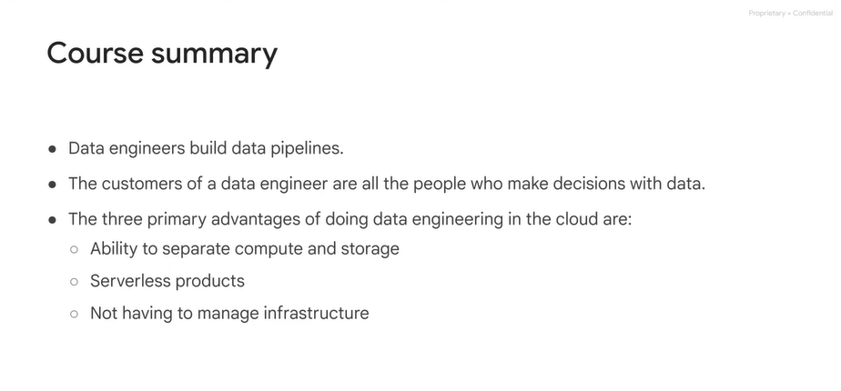
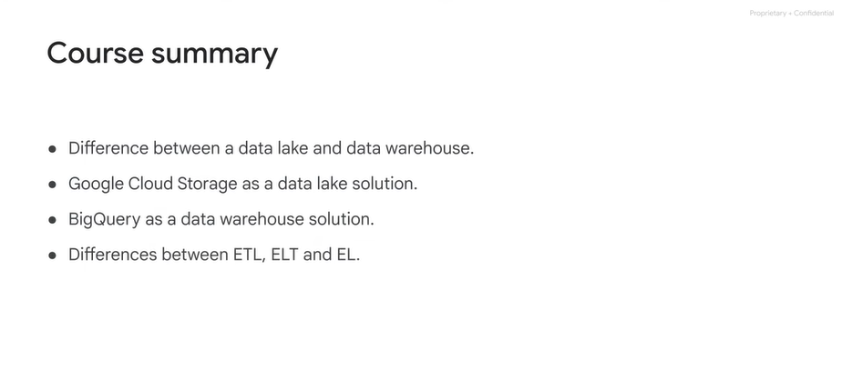
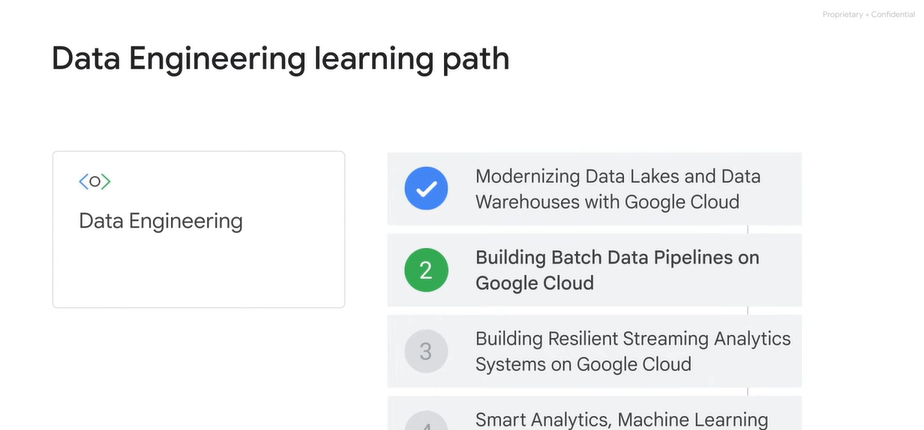

# <https§§§www.cloudskillsboost.google§course_sessions§3724532§video§382287>

> [https://www.cloudskillsboost.google/course_sessions/3724532/video/382287](https://www.cloudskillsboost.google/course_sessions/3724532/video/382287)

# Course Summary

Let's review some key concepts we covered in this course on data lakes and data warehouses. The primary role of a data engineer is to build data pipelines. The ultimate purpose of a data pipeline
00:13
is to enable stakeholders in an organization to use data to make faster and better decisions. While the role of a data engineer is not new, being able to build data pipelines entirely in the Cloud is relatively new.
00:28
We argue that doing data engineering in the cloud is advantageous because you can separate compute from storage, and you don't have to worry about managing infrastructure and even software.
00:39
This allows you to spend more time on what matters, getting insights from data. We introduced data lakes and data warehouses and discussed the key differences between the two. At a high level, a data lake is a place to store unprocessed data,
00:56
while a data warehouse is a place to store transformed data that you ultimately want to use for analytics, machine learning and dashboards. Next, we discussed Cloud storage as the data lake solution
01:09
on Google Cloud in some technical depth. We also presented other Google Cloud solutions for low latency requirements, transactional workloads, and structured data. We introduced BigQuery as the data warehouse solution on Google Cloud.
01:26
We discussed partitioning and clustering in BigQuery as techniques for improving query performance. Also, we talked about EL, ELT, and ETL, and how these relate to data lakes and warehouses.
01:41
Finally, we presented some reference architectures on Google Cloud for streaming and batch data pipelines. The hope is that these reference architectures serve as a starting point for your data pipeline.
01:54
Congratulations on completing modernizing data lakes and data warehouses with Google Cloud. Building batch data pipelines on Google Cloud is the second course of the data engineering on Google Cloud core series. We hope to see you there.

