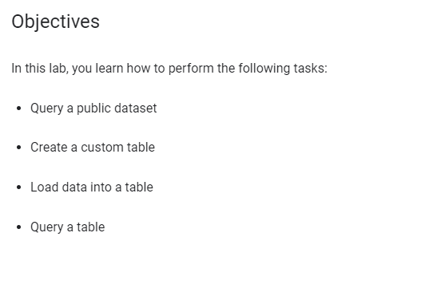
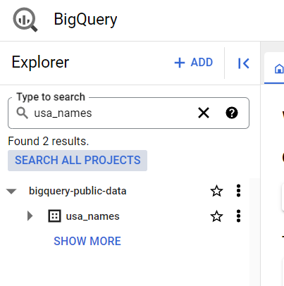
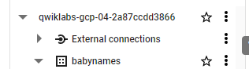
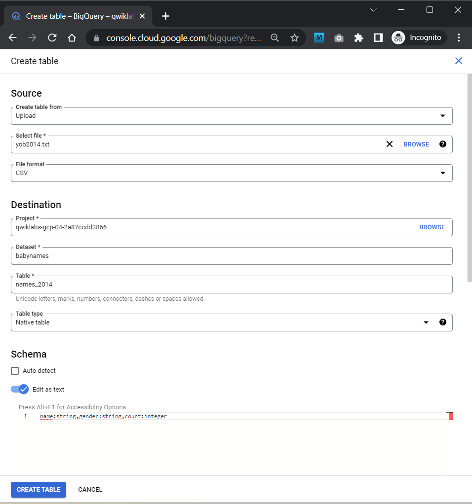
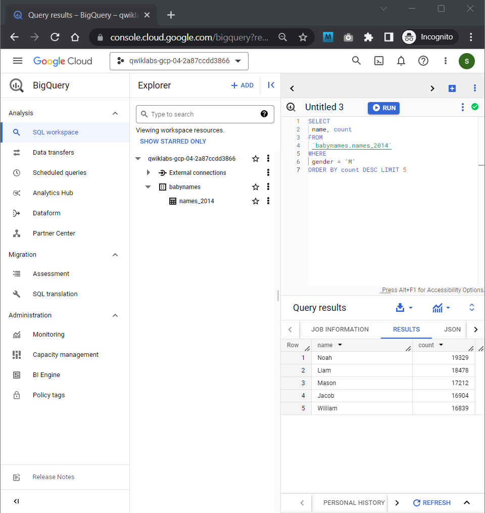
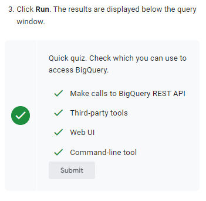

# <https§§§www.cloudskillsboost.google§course_sessions§3751705§labs§383335>

> [https://www.cloudskillsboost.google/course_sessions/3751705/labs/383335](https://www.cloudskillsboost.google/course_sessions/3751705/labs/383335)

# Exploring a BigQuery Public Dataset

## Overview

https://cloud.google.com/bigquery/docs/introduction

https://cloud.google.com/bigquery/docs/bq-command-line-tool

https://cloud.google.com/bigquery/docs/reference/rest

https://cloud.google.com/bigquery/docs/reference/libraries



## Task 1. Query a public dataset



```
SELECT
  name, gender,
  SUM(number) AS total
FROM
  `bigquery-public-data.usa_names.usa_1910_2013`
GROUP BY
  name, gender
ORDER BY
  total DESC
LIMIT
  10
```

## Task 2. Create a custom table

https://www.ssa.gov/OACT/babynames/names.zip

https://www.ssa.gov/OACT/babynames/background.html

Note the location of the `yob2014.txt` file so that you can find it later.

## Task 3. Create a dataset

 


## Task 4. Load the data into a new table



## Task 5. Query the table

```
SELECT
 name, count
FROM
 `babynames.names_2014`
WHERE
 gender = 'M'
ORDER BY count DESC LIMIT 5
```

 


 
